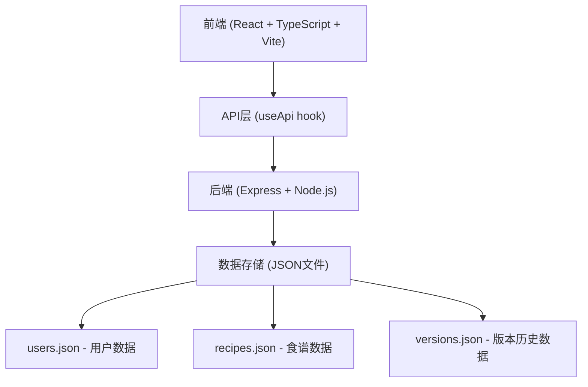
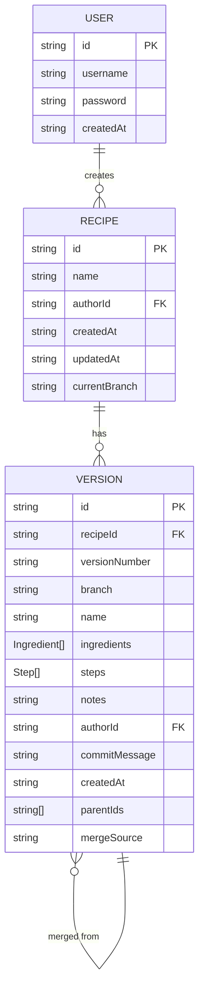

## 1. 架构设计



## 2. 技术描述

- **前端框架**：React 18 + TypeScript
- **构建工具**：Vite 5（开发服务器端口3000）
- **路由**：react-router-dom v6
- **状态管理**：React Hooks + 本地状态
- **后端框架**：Express 4
- **数据存储**：本地JSON文件（文件系统持久化）
- **图标库**：lucide-react
- **日期处理**：dayjs
- **差异对比**：diff
- **唯一ID**：uuid
- **CORS处理**：cors中间件
- **DAG可视化**：d3-force（力导向布局）

## 3. 项目结构

```
.
├── package.json
├── vite.config.js
├── tsconfig.json
├── index.html
├── src/
│   ├── types.ts          # TypeScript接口定义
│   ├── App.tsx           # 路由和主布局组件
│   ├── main.tsx          # 应用入口
│   ├── components/
│   │   ├── RecipeEditor.tsx      # 食谱编辑器
│   │   ├── VersionGraph.tsx      # 版本DAG图
│   │   ├── RecipeCard.tsx        # 食谱卡组件
│   │   ├── RecipeList.tsx        # 食谱列表
│   │   ├── Navbar.tsx            # 导航栏
│   │   ├── Login.tsx             # 登录注册组件
│   │   └── DiffViewer.tsx        # 版本差异对比
│   ├── hooks/
│   │   └── useApi.ts             # API交互封装
│   ├── utils/
│   │   └── versionUtils.ts       # 版本号计算工具
│   └── styles/
│       └── global.css            # 全局样式
├── server/
│   ├── index.js                  # Express入口
│   ├── data/                     # JSON数据存储
│   │   ├── users.json
│   │   ├── recipes.json
│   │   └── versions.json
│   └── routes/
│       ├── auth.js               # 用户认证路由
│       ├── recipes.js            # 食谱CRUD路由
│       └── versions.js           # 版本管理路由
```

## 4. 路由定义

| 路由 | 页面 | 说明 |
|------|------|------|
| /login | 登录页 | 用户登录注册 |
| / | 首页 | 食谱列表 + 编辑区 |
| /recipes/:id | 食谱详情 | 编辑器视图 |
| /recipes/:id/versions | 版本历史 | DAG图视图 |
| /recipes/:id/card | 食谱卡 | 食谱卡预览打印 |

## 5. API 定义

### 5.1 用户认证接口

```typescript
// POST /api/auth/register
interface RegisterRequest {
  username: string;
  password: string;
}
interface RegisterResponse {
  success: boolean;
  user: User;
}

// POST /api/auth/login
interface LoginRequest {
  username: string;
  password: string;
}
interface LoginResponse {
  success: boolean;
  user: User;
  token: string;
}
```

### 5.2 食谱接口

```typescript
// GET /api/recipes
// 获取当前用户的所有食谱
interface RecipesResponse {
  recipes: Recipe[];
}

// POST /api/recipes
// 创建新食谱
interface CreateRecipeRequest {
  name: string;
  ingredients: Ingredient[];
  steps: Step[];
  notes: string;
  authorId: string;
}
interface CreateRecipeResponse {
  success: boolean;
  recipe: Recipe;
  version: Version;
}

// GET /api/recipes/:id
// 获取食谱详情
interface RecipeResponse {
  recipe: Recipe;
  currentVersion: Version;
}

// PUT /api/recipes/:id
// 更新食谱（创建新版本）
interface UpdateRecipeRequest {
  name: string;
  ingredients: Ingredient[];
  steps: Step[];
  notes: string;
  commitMessage: string;
  branch: string;
}
interface UpdateRecipeResponse {
  success: boolean;
  recipe: Recipe;
  newVersion: Version;
}
```

### 5.3 版本接口

```typescript
// GET /api/recipes/:id/versions
// 获取食谱所有版本
interface VersionsResponse {
  versions: Version[];
}

// GET /api/recipes/:id/versions/:versionId
// 获取特定版本详情
interface VersionResponse {
  version: Version;
}

// POST /api/recipes/:id/versions/:versionId/branch
// 从指定版本创建分支
interface CreateBranchRequest {
  branchName: string;
  commitMessage: string;
}
interface CreateBranchResponse {
  success: boolean;
  newVersion: Version;
}

// POST /api/recipes/:id/versions/merge
// 合并分支到主分支
interface MergeRequest {
  sourceVersionId: string;
  targetBranch: string;
  commitMessage: string;
}
interface MergeResponse {
  success: boolean;
  mergedVersion: Version;
}

// GET /api/recipes/:id/versions/diff
// 比较两个版本差异
interface DiffRequest {
  versionId1: string;
  versionId2: string;
}
interface DiffResponse {
  diff: {
    ingredients: DiffChange[];
    steps: DiffChange[];
    name: DiffChange;
    notes: DiffChange;
  };
}
```

## 6. 数据模型

### 6.1 数据模型定义



### 6.2 TypeScript 类型定义

```typescript
// src/types.ts

export interface User {
  id: string;
  username: string;
  password: string;
  createdAt: string;
}

export interface Ingredient {
  name: string;
  quantity: string;
  unit: string;
}

export interface Step {
  order: number;
  description: string;
}

export interface Recipe {
  id: string;
  name: string;
  authorId: string;
  createdAt: string;
  updatedAt: string;
  currentBranch: string;
}

export interface Version {
  id: string;
  recipeId: string;
  versionNumber: string; // e.g., "v1", "v2", "v2.1", "v4"
  branch: string; // "main" or branch name
  name: string;
  ingredients: Ingredient[];
  steps: Step[];
  notes: string;
  authorId: string;
  commitMessage: string;
  createdAt: string;
  parentIds: string[]; // 父版本ID，合并时有多个
  mergeSource?: string; // 合并来源分支名
}

export interface DiffChange {
  type: 'added' | 'removed' | 'modified' | 'unchanged';
  oldValue?: any;
  newValue?: any;
}
```

### 6.3 JSON 数据文件初始化

**server/data/users.json:**
```json
[]
```

**server/data/recipes.json:**
```json
[]
```

**server/data/versions.json:**
```json
[]
```

## 7. 核心算法

### 7.1 版本号生成算法

- 主分支版本号：`v` + 递增数字（v1, v2, v3...）
- 分支版本号：基于父版本号 + `.` + 分支内递增（v2.1, v2.2...）
- 合并版本号：主分支版本号递增，标记为合并节点

### 7.2 DAG 布局算法

使用 d3-force 力导向布局：
- 节点斥力：-300
- 连线距离：100
- 重力：0.1
- 布局预计算：500次迭代冷却

### 7.3 合并规则

简单覆盖策略：保留分支的最新修改，合并时分支内容覆盖主分支内容，生成合并版本。

## 8. 性能优化

1. **DAG 虚拟滚动**：超过50个节点时使用虚拟滚动
2. **diff 防抖**：版本对比使用防抖避免频繁计算
3. **组件懒加载**：大组件使用 React.lazy 动态导入
4. **memo 优化**：使用 React.memo 避免不必要重渲染
5. **力导向图冷却**：布局稳定后停止力模拟，减少CPU占用
