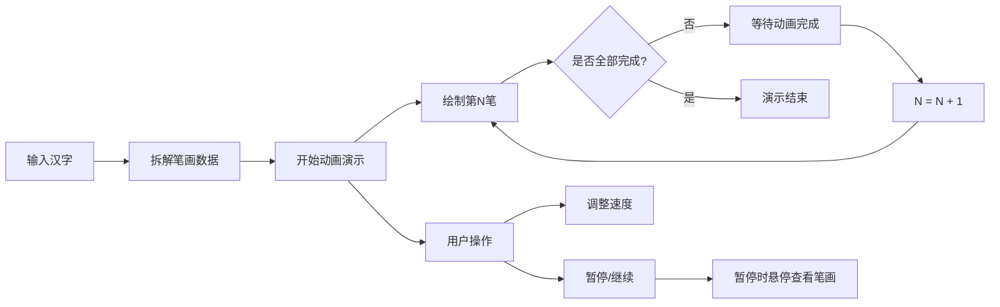

## 1. 产品概述

交互式手写汉字笔顺演示工具，帮助学中文的小朋友或外国人正确掌握汉字书写顺序，通过动画清晰展示每笔的起笔、落笔和先后顺序。

- 核心价值：将抽象的汉字笔顺规则转化为直观的动画演示，降低汉字书写学习门槛
- 目标用户：学习中文的儿童、外国汉语学习者、汉字书法初学者

## 2. 核心功能

### 2.1 功能模块

1. **汉字输入模块**：支持输入最多4个简体汉字，实时响应并展示
2. **笔画动画演示模块**：逐笔流畅绘制，标注笔顺编号，区分已完成/待完成笔画
3. **全字预览模块**：左下角缩略图展示整体字形和书写进度
4. **播放控制模块**：速度调节（慢/中/快三档）、暂停/继续按钮
5. **笔画交互模块**：暂停时悬停查看笔画编号和方向提示

### 2.2 功能详情

| 模块名称 | 功能描述 |
|---------|---------|
| 汉字输入 | 输入框支持最多4个简体汉字，输入后立即拆解笔画并开始演示 |
| 笔画动画 | 每笔约0.5秒绘制，黑色细线（3px，圆形末端），完成后变灰色#9e9e9e |
| 笔顺编号 | 深蓝#1565c0小圆点标记在每笔起笔位置，显示数字序号 |
| 全字预览 | 80x80px缩略图，浅灰背景#f5f5f5，浅色标注已完成笔画比例 |
| 进度提示 | 显示"第X笔 / 共Y笔"文字，14px，颜色#424242 |
| 速度控制 | 三档滑块：慢(0.8s/笔)、中(0.5s/笔)、快(0.3s/笔) |
| 暂停/继续 | 按钮控制播放状态，暂停时可交互查看笔画详情 |
| 悬停交互 | 暂停时鼠标悬停笔画显示编号和方向提示（如"横"、"竖撇"），带0.2s缩放和颜色变化 |

## 3. 核心流程

用户在输入框输入汉字 → 系统拆解笔画序列 → 自动开始逐笔动画演示 → 用户可随时调整速度或暂停 → 暂停时可悬停查看笔画详情 → 全部笔画完成后停止

## 4. 用户界面设计

### 4.1 设计风格

- **主体背景**：淡米色 #faf3e0，营造温暖舒适的学习氛围
- **操作栏**：白色背景，高度64px，底部2px细边框 #e0d8c8
- **主画布**：宽640px高480px，白色背景，8px淡灰#e0d8c8内阴影
- **主色调**：暖棕色系 #8d6e63（按钮），悬浮态 #6d4c41
- **强调色**：深蓝色 #1565c0（笔顺编号点）
- **中性色**：灰色系 #9e9e9e（已完成笔画）、#424242（文字）

### 4.2 页面布局

| 区域 | 位置 | 元素 |
|-----|------|-----|
| 顶部操作栏 | 页面顶部，通栏 | 汉字输入框、速度滑块、暂停/继续按钮 |
| 主画布区 | 页面中央 | 640x480px白色画布，居中显示 |
| 缩略图区 | 画布左下角 | 80x80px全字预览缩略图 + 进度文字 |

### 4.3 组件样式

- **输入框**：圆角8px，边框1px solid #d4c5a9，聚焦时边框变#8d6e63
- **按钮**：圆角6px，填充色#8d6e63，悬浮变#6d4c41，白色文字
- **画布**：四周8px内阴影 #e0d8c8

### 4.4 响应式设计

- **移动端适配**：操作栏高度变为56px，画布宽度自动缩放到96%
- **桌面端优先**：以桌面端设计为基准，向下兼容移动端
- **触摸优化**：按钮和可交互区域保证足够的触摸尺寸

## 5. 性能要求

- 笔画动画帧率 ≥ 50fps
- 输入汉字后拆解和渲染响应时间 ≤ 200ms
- 内存占用控制合理，无明显内存泄漏
