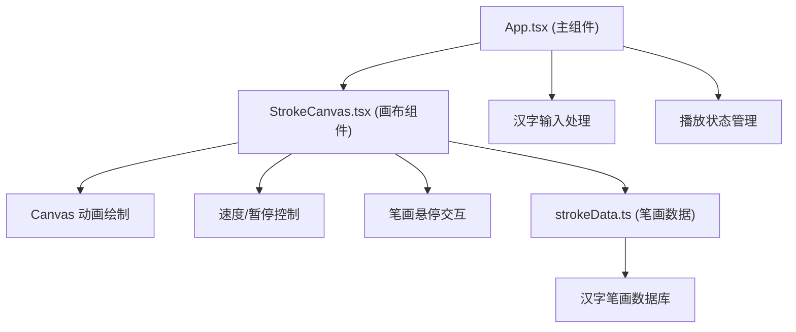

## 1. 架构设计



## 2. 技术栈

- **前端框架**：React 18 + TypeScript
- **构建工具**：Vite 5.x
- **渲染方式**：HTML5 Canvas 2D
- **开发服务器端口**：3000

## 3. 项目结构

```
src/
├── App.tsx                    # 主组件，管理输入、播放状态
├── components/
│   └── StrokeCanvas.tsx       # 画布组件，动画绘制与交互
└── utils/
    └── strokeData.ts          # 笔画数据工具模块
```

## 4. 核心模块说明

### 4.1 App.tsx (主组件)

- 管理输入的汉字字符串
- 管理播放状态（播放/暂停）
- 管理速度档位
- 持有画布组件引用
- 布局：顶部操作栏 + 中央画布区

### 4.2 StrokeCanvas.tsx (画布组件)

- 接收汉字字符串，调用 strokeData 获取笔画数据
- 使用 requestAnimationFrame 实现流畅动画
- 支持暂停/继续、速度调节
- 处理鼠标悬停交互（暂停时）
- 绘制笔顺编号点、笔画、缩略图

### 4.3 strokeData.ts (数据模块)

- 维护汉字笔画数据库（至少10个常用汉字）
- 提供函数：`getStrokeData(char: string): Stroke[]`
- 每个笔画包含：起点坐标、终点坐标（或路径点）、方向描述、笔顺编号
- 坐标系：基于 100x100 的归一化坐标系，方便缩放

### 4.4 数据类型定义

```typescript
interface Point {
  x: number;  // 0-100 归一化坐标
  y: number;
}

interface Stroke {
  id: number;           // 笔顺编号，从1开始
  points: Point[];      // 笔画路径点（至少起点和终点）
  direction: string;    // 方向描述，如"横"、"竖撇"
}
```

## 5. 动画实现方案

- 使用 Canvas 2D API 绘制
- requestAnimationFrame 驱动动画循环
- 每笔绘制进度 0-1，线性插值计算当前绘制点
- 线宽3px，lineCap: 'round'
- 已完成笔画：灰色 #9e9e9e
- 正在绘制笔画：黑色 #000000
- 待绘制笔画：不显示或极浅灰色

## 6. 性能优化

- 只在需要时重绘画布（动画进行中每帧重绘）
- 暂停时停止动画循环
- 笔画数据预先计算，避免运行时解析
- 使用离屏画布或缓存已完成笔画

## 7. 内置汉字库

至少包含以下10个常用汉字：
大、小、上、下、中、人、水、火、山、石

每个汉字提供完整的笔画路径数据，基于 100x100 归一化坐标系。
