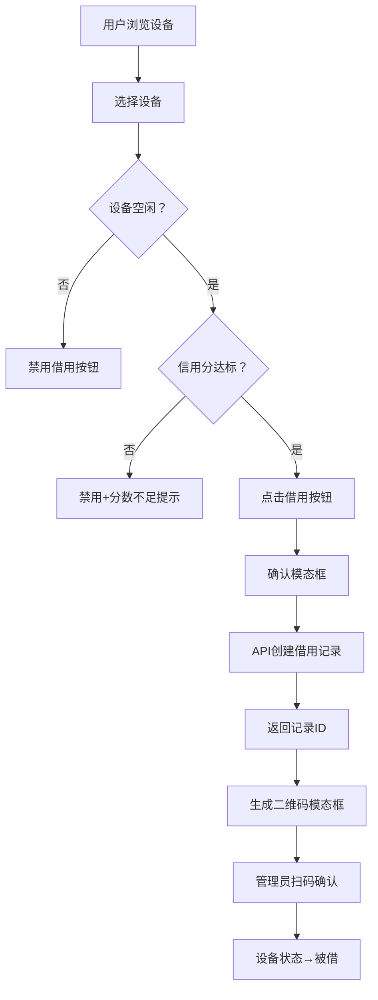

## 1. 产品概述

共享办公空间设备借用与信用评级应用，解决自由职业者临时借用设备（显示器、耳机、投影仪等）时缺乏统一登记系统的痛点，实现设备借还全流程数字化管理与信用体系建设。

- 目标用户：共享办公空间的自由职业者（普通用户）和设备管理员
- 核心价值：设备透明可查、借还流程规范、信用评级驱动行为、减少设备丢失与纠纷

## 2. 核心功能

### 2.1 用户角色

| 角色 | 核心权限 |
|------|----------|
| 普通用户 | 浏览设备、发起借用、扫码确认归还、查看个人信用分与借用历史 |
| 设备管理员 | 管理设备清单、查看所有借用记录、标记归还、处理超时情况 |

### 2.2 功能模块

1. **设备总览页**：网格展示所有设备卡片，支持筛选、状态标识、快速借用
2. **设备详情页**：设备大图、技术参数、历史借用记录、借用按钮
3. **用户档案页**：头像、信用评分进度条、个人借用历史表格
4. **管理员面板**：全量借用记录列表、归还操作、超时处理

### 2.3 页面详情

| 页面名称 | 模块名称 | 功能描述 |
|---------|---------|---------|
| 设备总览页 | 顶部导航栏 | Logo、导航链接（总览/我的档案/管理面板）、当前页下划线高亮 |
| 设备总览页 | 设备卡片网格 | 4/3/2列响应式布局，卡片悬浮抬升+阴影加深，每张卡片含缩略图、名称、类型标签、状态徽章、借用按钮 |
| 设备总览页 | 借用确认模态框 | 用户确认借用操作，防止误触 |
| 设备总览页 | 二维码模态框 | 生成借用记录ID二维码，供管理员扫码确认 |
| 设备详情页 | 设备大图区 | 100%宽度、圆角8px的设备图片 |
| 设备详情页 | 技术参数区 | 展示设备完整参数、当前状态、最低信用分要求 |
| 设备详情页 | 历史记录列表 | 用户名首字母、借用时间、归还时间 |
| 设备详情页 | 借用按钮 | 与卡片状态联动，信用分不足或设备非空闲时禁用 |
| 用户档案页 | 用户信息区 | 圆形头像、用户名、信用分圆形进度条（红→绿渐变） |
| 用户档案页 | 借用历史表格 | 设备名称、借用时间、归还时间、状态色块 |
| 管理员面板 | 全量记录列表 | 所有用户借用记录，每行含标记归还按钮 |

## 3. 核心流程

### 借用流程
用户浏览设备总览→点击目标设备卡片（或进入详情页）→判断设备状态是否空闲+用户信用分是否达标→满足条件则显示借用按钮→点击后弹出确认模态框→确认后调用后端API创建借用记录→返回记录ID→前端生成二维码模态框→管理员扫码确认→设备状态更新为"被借"

### 归还流程
管理员扫码或在管理面板找到对应记录→点击"标记归还"→系统判断是否超时（超过借用时间24小时）→按时归还→用户信用分+1；超时归还→用户信用分-5→更新记录归还时间与状态→设备状态更新为"空闲"

### 信用分机制
初始信用分100分→按时归还+1分/次→超时归还-5分/次→信用分<80分禁止借用要求≥80分的设备

## 4. 用户界面设计

### 4.1 设计风格

- **主色调**：深蓝 #1e293b（导航栏、主按钮）、渐变蓝 #3b82f6（当前页下划线、强调色）
- **背景色**：灰白 #f8fafc（页面背景）、纯白 #ffffff（卡片背景）
- **状态色**：绿色 #22c55e（空闲/按时归还）、黄色 #eab308（被借/超时归还）、红色 #ef4444（维修/未归还）
- **禁用色**：#94a3b8
- **按钮风格**：圆角8px、深蓝填充、悬浮加深色值
- **卡片风格**：圆角12px、白色背景、阴影0 2px 8px rgba(0,0,0,0.08)、悬浮上移4px+阴影0 8px 24px rgba(0,0,0,0.15)、过渡0.3s ease-in-out
- **字体**：现代无衬线字体，4-5级字号体系
- **布局风格**：卡片式栅格布局、顶部固定导航

### 4.2 页面设计概览

| 页面名称 | 模块名称 | UI元素 |
|---------|---------|---------|
| 设备总览页 | 导航栏 | 高度60px、深色背景、左侧Logo文字、右侧导航链接带下划线高亮 |
| 设备总览页 | 卡片网格 | 间距24px、4/3/2列响应式、卡片尺寸240px×320px（小屏100%宽自适应） |
| 设备总览页 | 二维码模态框 | 半透明背景#00000080、居中白色卡片圆角12px、二维码256px、留白16px、右上角关闭按钮 |
| 设备详情页 | 图片区 | 宽度100%、圆角8px |
| 用户档案页 | 信用进度条 | 圆形、0-100分、红→绿渐变 |
| 用户档案页 | 表格 | 状态列彩色色块标识 |

### 4.3 响应式

- Desktop-first 设计
- ≥1024px：4列卡片
- 768-1023px：3列卡片
- <768px：2列卡片，卡片宽度100%、高度自适应
- 触摸优化：按钮最小点击区域44px×44px

### 4.4 性能要求

- 首次加载 ≤ 2秒
- API响应 ≤ 500ms（目标300ms内）
- 页面切换流畅度 60fps
- 操作→视觉反馈延迟 ≤ 100ms
- 列表虚拟滚动，每页最多20个DOM节点
