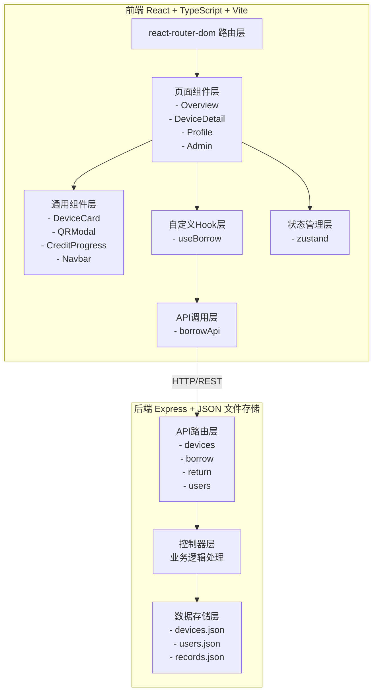
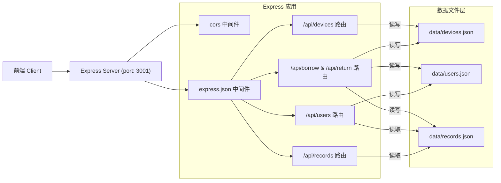
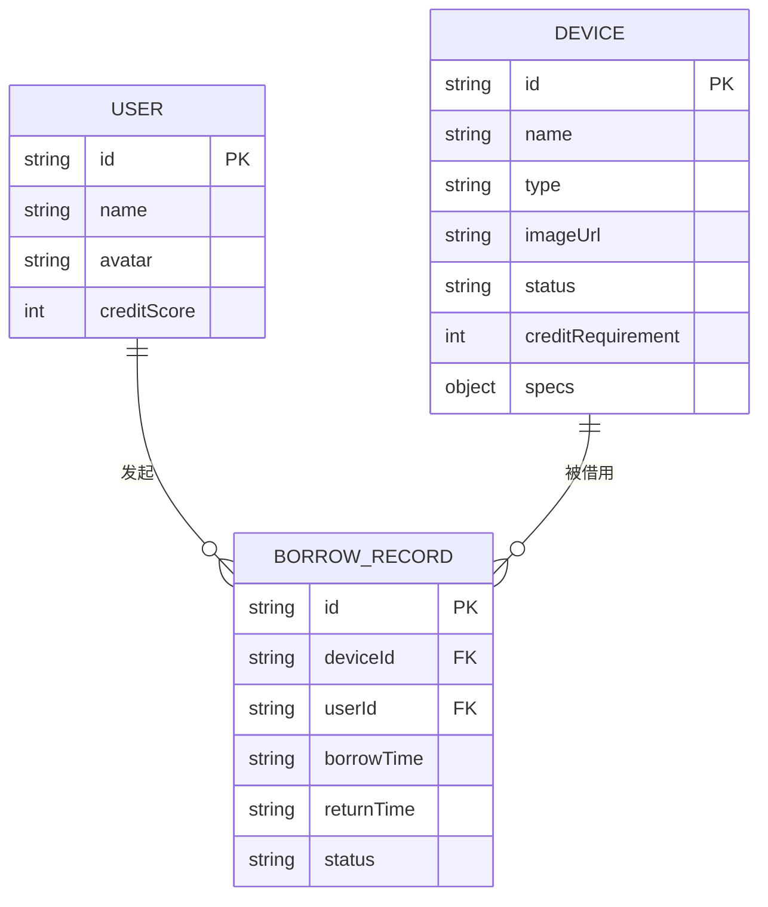

## 1. 架构设计



## 2. 技术描述

- **前端框架**：React 18 + TypeScript
- **构建工具**：Vite（开发端口3000）
- **路由**：react-router-dom v6
- **状态管理**：zustand
- **HTTP请求**：原生 fetch API
- **二维码生成**：qrcode.react
- **日期处理**：dayjs
- **唯一ID**：uuid
- **后端**：Express 4 + CORS
- **数据库**：本地JSON文件（data/devices.json、data/users.json、data/records.json）
- **代码质量**：TypeScript严格模式

## 3. 路由定义

| 路由 | 页面组件 | 用途 |
|------|---------|------|
| /overview | Overview | 设备总览页（默认首页） |
| /device/:id | DeviceDetail | 设备详情页 |
| /profile | Profile | 用户档案页 |
| /admin | Admin | 管理员面板 |

## 4. API 定义

### 4.1 类型定义

```typescript
// 设备状态
type DeviceStatus = 'available' | 'borrowed' | 'maintenance';

// 借用状态
type RecordStatus = 'borrowing' | 'returned_on_time' | 'returned_overdue';

// 设备对象
interface Device {
  id: string;
  name: string;
  type: string;
  imageUrl: string;
  status: DeviceStatus;
  creditRequirement: number;
  specs: Record<string, string>;
}

// 用户对象
interface User {
  id: string;
  name: string;
  avatar: string;
  creditScore: number;
}

// 借用记录
interface BorrowRecord {
  id: string;
  deviceId: string;
  userId: string;
  borrowTime: string;
  returnTime?: string;
  status: RecordStatus;
}

// 借用记录（含关联信息）
interface BorrowRecordWithDetails extends BorrowRecord {
  deviceName: string;
  userName: string;
  userInitial: string;
}
```

### 4.2 接口定义

| 方法 | 路径 | 请求体 | 响应 | 说明 |
|------|------|--------|------|------|
| GET | /api/devices | - | Device[] | 获取所有设备列表 |
| GET | /api/devices/:id | - | Device & { borrowHistory: BorrowRecordWithDetails[] } | 获取设备详情+借用历史 |
| GET | /api/users/:id | - | User & { borrowHistory: BorrowRecordWithDetails[] } | 获取用户信息+借用历史 |
| POST | /api/borrow | { deviceId, userId } | BorrowRecord | 创建借用记录 |
| POST | /api/return | { recordId } | { success: boolean, creditChanged: number } | 确认归还，更新信用分 |
| GET | /api/records | - | BorrowRecordWithDetails[] | 获取全量借用记录（管理员） |

## 5. 后端服务架构



## 6. 数据模型

### 6.1 实体关系图



### 6.2 初始数据（JSON文件内容）

**data/devices.json** - 初始设备清单（至少8台设备，覆盖显示器、耳机、投影仪等类型）

**data/users.json** - 初始用户数据（2-3个用户，含信用分）

**data/records.json** - 初始借用记录（部分历史数据用于展示）

### 6.3 数据流向说明

1. **前端启动**：Vite开发服务器(3000) → 通过API层请求后端(3001)
2. **设备浏览**：`useBorrow` Hook → `borrowApi.getDevices()` → GET /api/devices → 读取 devices.json → 返回 Device[] → 更新 zustand store
3. **发起借用**：DeviceCard 点击 → `useBorrow.borrow()` → `borrowApi.submitBorrow()` → POST /api/borrow → 更新 records.json + devices.json → 返回 BorrowRecord → 生成二维码
4. **确认归还**：Admin面板 → `borrowApi.confirmReturn()` → POST /api/return → 检查超时（24h规则）→ 更新 records.json + devices.json + users.json（信用分变更）
5. **用户档案**：Profile页面 → `borrowApi.getUser()` → GET /api/users/:id → 关联查询 records.json → 返回含借用历史的用户信息
