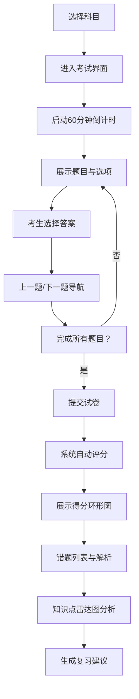

## 1. 产品概述

职业资格在线模拟考试系统，为考生提供多科目限时模拟考试服务，支持自动评分、错题分析与复习建议，帮助考生高效备考。

- 主要用途：为职业资格考试考生提供在线模拟练习，涵盖Java基础、项目管理、网络安全等科目
- 目标用户：准备职业资格考试的考生、培训机构学员
- 产品价值：通过限时模拟、智能评分和个性化错题分析，提升备考效率和考试通过率

## 2. 核心功能

### 2.1 用户角色

| 角色 | 注册方式 | 核心权限 |
|------|----------|----------|
| 考生 | 无需注册，匿名使用 | 选择科目考试、查看成绩历史、错题分析 |
| 管理员 | 直接访问/admin路径 | 查看所有考生成绩、添加新题目 |

### 2.2 功能模块

1. **科目选择页**：展示可选考试科目列表，点击进入考试
2. **考试主界面**：展示题目、倒计时计时器、选项交互、导航按钮
3. **结果展示页**：得分环形图、错题列表、知识点雷达图、复习建议
4. **历史成绩页**：展示过去10次考试记录
5. **管理员后台**：成绩汇总表格、添加题目表单

### 2.3 页面详情

| 页面名称 | 模块名称 | 功能描述 |
|---------|----------|----------|
| 科目选择页 | 科目卡片 | 展示科目名称、题目数量，点击开始考试 |
| 考试主界面 | 计时器 | 60分钟倒计时，红色monospace字体，精确到秒 |
| 考试主界面 | 题目展示 | 显示当前题号（如3/30）、题目文本、四个选项按钮 |
| 考试主界面 | 选项交互 | 选中时背景变为蓝色，白色文字，过渡动画 |
| 考试主界面 | 导航按钮 | 上一题/下一题按钮，边界条件时禁用置灰 |
| 结果展示页 | 得分环形图 | 红色到绿色渐变，1.5s动画，分数居中显示 |
| 结果展示页 | 错题列表 | 浅红背景展示错题，包含正确答案和解析 |
| 结果展示页 | 雷达图 | 五维知识点分析（基础知识、逻辑分析、代码理解、安全规范、项目管理） |
| 结果展示页 | 复习建议 | 基于错题自动生成三条复习建议 |
| 历史成绩页 | 成绩卡片 | 横向卡片展示日期、科目、得分、用时，悬停上浮效果 |
| 管理员后台 | 成绩表格 | 展示所有考生考试记录 |
| 管理员后台 | 添加题目表单 | 支持添加题目、选项、正确答案、所属科目 |

## 3. 核心流程

### 3.1 考生考试流程

考生选择科目 → 进入考试界面 → 开始60分钟倒计时 → 逐题作答并使用上/下一题导航 → 完成所有题目后提交 → 系统自动评分 → 展示得分和错题分析 → 生成复习建议

### 3.2 流程图

## 4. 用户界面设计

### 4.1 设计风格

- **主色调**：蓝色#3182ce、青色#00b5d8
- **背景色**：浅蓝灰#f7fafc
- **卡片样式**：白色背景，轻阴影（0 2px 8px rgba(0,0,0,0.08)），圆角12px
- **按钮样式**：圆角8px，选中时背景#3182ce白色文字，过渡0.2s ease，点击时scale 0.97反馈（0.1s）
- **字体**：倒计时使用monospace字体，红色#e53e3e
- **布局**：考试界面单栏居中（最大宽度800px），结果页两栏布局，移动端自适应堆叠

### 4.2 页面设计概述

| 页面名称 | 模块名称 | UI元素 |
|---------|----------|--------|
| 科目选择页 | 科目卡片网格 | 背景色渐变、悬停放大效果、图标展示 |
| 考试主界面 | 顶部状态栏 | 题号、倒计时器、科目名称 |
| 考试主界面 | 选项按钮组 | 四个选项，选中状态高亮，过渡动画 |
| 考试主界面 | 底部导航栏 | 上一题/下一题按钮，提交按钮 |
| 结果展示页 | 左侧得分区 | 环形进度动画、分数大字显示、考试信息 |
| 结果展示页 | 雷达图区域 | 半透明网格、蓝色数据线、填充色 |
| 结果展示页 | 右侧错题列表 | 可滚动区域，错题卡片浅红背景 |
| 历史成绩页 | 卡片列表 | 横向排列，悬停上浮阴影加深 |
| 管理员后台 | 数据表格 | 斑马纹、排序、分页 |
| 管理员后台 | 表单区域 | 输入框、下拉选择、提交按钮 |

### 4.3 响应式设计

- **桌面端**（≥768px）：结果页两栏布局，左侧得分雷达图，右侧错题列表
- **移动端**（<768px）：两栏变单栏堆叠，卡片和按钮自适应宽度，触摸优化
- **触摸优化**：按钮最小高度48px，确保点击区域足够

### 4.4 动画与交互

- **页面切换**：淡入淡出过渡，0.3s ease
- **按钮点击**：scale 0.97 → 1.0，0.1s
- **选项选中**：背景色过渡，0.2s ease
- **得分动画**：环形进度1.5s ease-out，数字滚动递增
- **卡片悬停**：上浮4px，阴影加深，0.2s
- **计时器**：最后5分钟闪烁提醒
