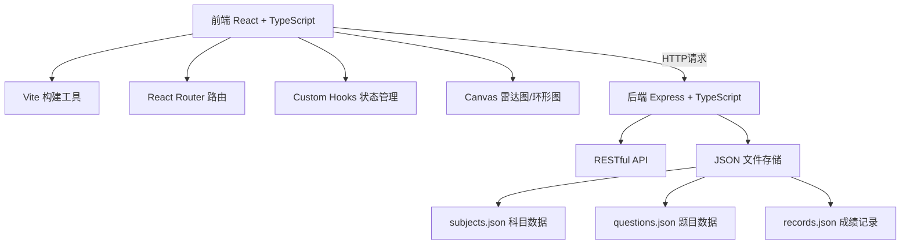
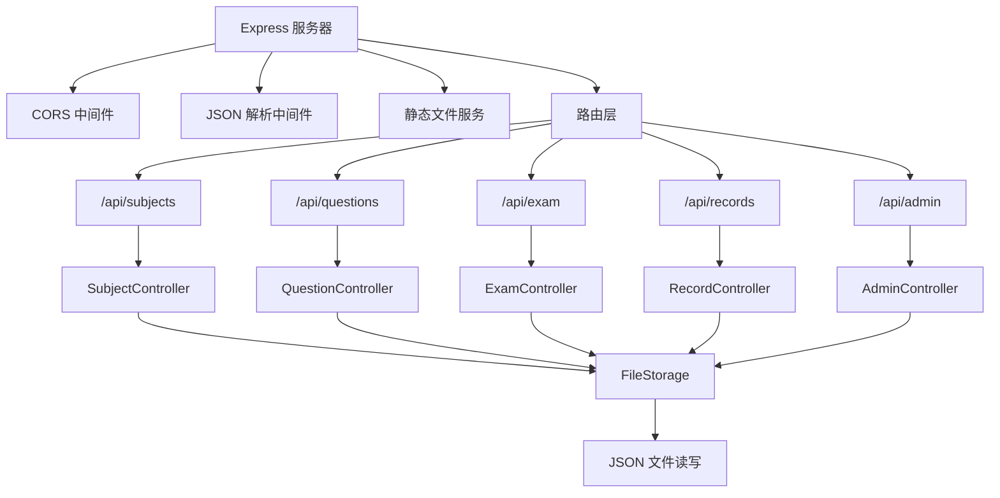
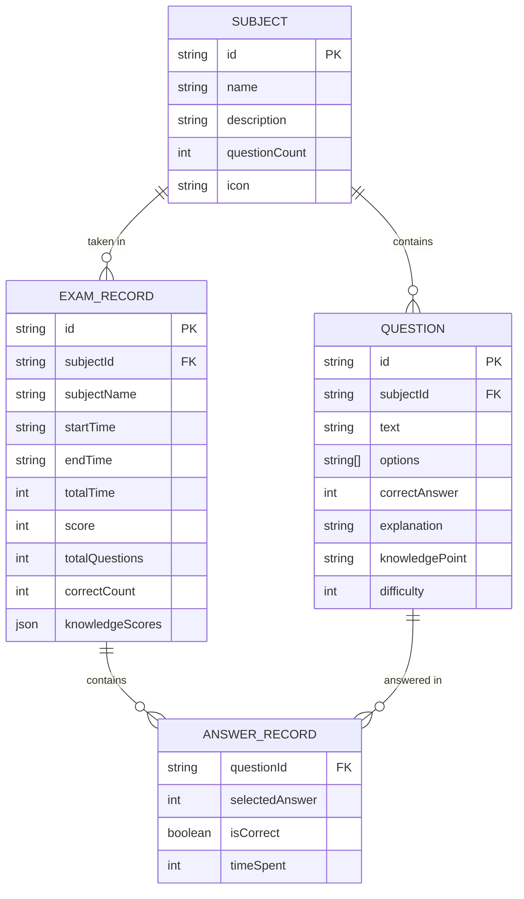

## 1. 架构设计



## 2. 技术描述

- **前端**：React@18 + TypeScript + Vite
- **路由**：react-router-dom@6
- **构建工具**：Vite@5，开发服务器端口3000
- **后端**：Express@4 + TypeScript
- **HTTP客户端**：fetch API（原生）
- **数据存储**：JSON文件（server/data目录）
- **工具库**：uuid（唯一ID）、dayjs（时间处理）、cors（跨域处理）
- **图表**：Canvas 2D API（自定义绘制环形图、雷达图）

## 3. 路由定义

| 路由 | 用途 |
|------|------|
| / | 科目选择首页 |
| /exam/:subjectId | 考试界面 |
| /result/:recordId | 考试结果展示页 |
| /history | 历史成绩页 |
| /admin | 管理员后台 |

## 4. API 定义

### 4.1 TypeScript 类型定义

```typescript
// 科目
interface Subject {
  id: string;
  name: string;
  description: string;
  questionCount: number;
  icon: string;
}

// 题目
interface Question {
  id: string;
  subjectId: string;
  text: string;
  options: string[];
  correctAnswer: number; // 0-3
  explanation: string;
  knowledgePoint: 'basic' | 'logic' | 'code' | 'security' | 'management';
  difficulty: number; // 1-5
}

// 答题记录
interface AnswerRecord {
  questionId: string;
  selectedAnswer: number | null;
  isCorrect: boolean;
  timeSpent: number; // 秒
}

// 考试记录
interface ExamRecord {
  id: string;
  subjectId: string;
  subjectName: string;
  startTime: string;
  endTime: string;
  totalTime: number; // 秒
  answers: AnswerRecord[];
  score: number;
  totalQuestions: number;
  correctCount: number;
  knowledgeScores: {
    basic: number;
    logic: number;
    code: number;
    security: number;
    management: number;
  };
}

// 考试结果
interface ExamResult {
  recordId: string;
  score: number;
  totalQuestions: number;
  correctCount: number;
  wrongQuestions: Array<{
    question: Question;
    selectedAnswer: number | null;
    correctAnswer: number;
  }>;
  knowledgeScores: {
    basic: number;
    logic: number;
    code: number;
    security: number;
    management: number;
  };
  suggestions: string[];
}
```

### 4.2 API 接口

| 方法 | 路径 | 描述 | 请求参数 | 响应 |
|------|------|------|----------|------|
| GET | /api/subjects | 获取科目列表 | - | Subject[] |
| GET | /api/questions/:subjectId | 获取指定科目题目 | - | Question[] |
| POST | /api/exam/submit | 提交考试答案 | { answers: AnswerRecord[], subjectId: string, startTime: string, endTime: string } | ExamResult |
| GET | /api/records/:recordId | 获取单个考试记录 | - | ExamRecord |
| GET | /api/records | 获取最近10条考试记录 | limit=10 | ExamRecord[] |
| GET | /api/admin/records | 获取所有考试记录 | - | ExamRecord[] |
| POST | /api/admin/questions | 添加新题目 | Question（无id） | { id: string, success: boolean } |

## 5. 服务器架构



## 6. 数据模型

### 6.1 数据模型定义



### 6.2 初始数据

**subjects.json**

```json
[
  {
    "id": "java",
    "name": "Java基础",
    "description": "涵盖Java语法、面向对象、集合框架等核心知识",
    "questionCount": 30,
    "icon": "☕"
  },
  {
    "id": "pm",
    "name": "项目管理",
    "description": "包含项目生命周期、风险管理、质量管理等内容",
    "questionCount": 30,
    "icon": "📋"
  },
  {
    "id": "security",
    "name": "网络安全",
    "description": "涉及网络协议、加密技术、安全漏洞防护等",
    "questionCount": 30,
    "icon": "🔒"
  }
]
```

**questions.json** 包含每个科目30道题目，覆盖五个知识维度：
- basic: 基础知识
- logic: 逻辑分析  
- code: 代码理解
- security: 安全规范
- management: 项目管理

### 6.3 文件结构

```
d:\demo-Solo\tasks\auto29\
├── package.json
├── vite.config.js
├── tsconfig.json
├── index.html
├── src/
│   ├── App.tsx
│   ├── components/
│   │   ├── ExamPanel.tsx
│   │   ├── ResultDashboard.tsx
│   │   ├── SubjectSelector.tsx
│   │   ├── HistoryPage.tsx
│   │   └── AdminPage.tsx
│   ├── hooks/
│   │   └── useExam.ts
│   ├── utils/
│   │   ├── radarChart.ts
│   │   ├── ringChart.ts
│   │   └── scoring.ts
│   ├── types/
│   │   └── index.ts
│   └── main.tsx
└── server/
    ├── index.ts
    ├── data/
    │   ├── subjects.json
    │   ├── questions.json
    │   └── records.json
    ├── controllers/
    │   ├── subjectController.ts
    │   ├── questionController.ts
    │   ├── examController.ts
    │   ├── recordController.ts
    │   └── adminController.ts
    └── utils/
        └── fileStorage.ts
```
