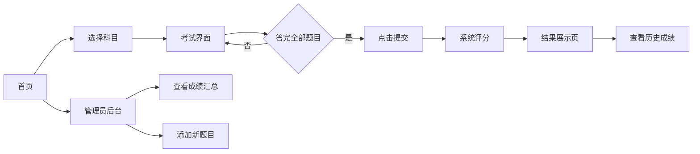

## 1. 产品概述
职业资格在线模拟考试系统是一款面向考生的在线考试练习平台，支持多科目选择、限时答题、自动评分和智能错题分析。
- 主要目的：帮助考生进行职业资格认证的模拟练习，提升考试通过率
- 目标用户：准备职业资格考试的考生、培训机构学员
- 核心价值：提供真实模拟环境、精准错题分析、个性化复习建议

## 2. 核心功能

### 2.1 用户角色
| 角色 | 访问方式 | 核心权限 |
|------|----------|----------|
| 考生 | 直接访问 | 选择科目、参加考试、查看成绩、查看历史记录 |
| 管理员 | /admin路径 | 查看所有成绩汇总、添加新题目 |

### 2.2 功能模块
1. **首页/科目选择页**：科目卡片列表、历史成绩入口、管理员入口
2. **考试界面**：题目展示、计时器、选项交互、导航按钮、提交功能
3. **结果展示页**：得分环形图、错题列表、知识点雷达图、复习建议
4. **历史成绩页**：最近10次考试记录卡片列表
5. **管理员后台**：成绩汇总表格、添加题目表单

### 2.3 页面详情
| 页面名称 | 模块名称 | 功能描述 |
|-----------|-------------|---------------------|
| 首页 | 科目选择卡片 | 展示可选科目（Java基础、项目管理、网络安全），点击进入对应考试 |
| 首页 | 历史成绩入口 | 跳转至历史成绩页面 |
| 首页 | 管理员入口 | 跳转至/admin后台 |
| 考试界面 | 题目进度 | 显示当前题号/总题数（如3/30） |
| 考试界面 | 倒计时器 | 60分钟精确到秒，红色monospace字体 |
| 考试界面 | 选项按钮 | 4个选项，圆角8px，选中高亮蓝色 |
| 考试界面 | 导航按钮 | 上一题/下一题，边界置灰禁用 |
| 考试界面 | 提交按钮 | 所有题目完成后可提交 |
| 结果页 | 得分环形图 | 动画展示分数，红到绿渐变 |
| 结果页 | 错题列表 | 浅红背景展示错题、正确答案、解析 |
| 结果页 | 雷达图 | 五维度知识点分析（Canvas绘制） |
| 结果页 | 复习建议 | 自动生成3条个性化建议 |
| 历史页 | 成绩卡片 | 横向卡片，悬停上浮效果，展示日期、科目、得分、用时 |
| 管理后台 | 成绩表格 | 所有考生成绩汇总表格 |
| 管理后台 | 添加题目表单 | 题目文本、4选项、正确答案、科目选择 |

## 3. 核心流程
用户选择科目 → 进入考试界面 → 逐题作答（可前后导航）→ 完成所有题目 → 点击提交 → 系统评分 → 展示结果（得分、错题、雷达图、建议）→ 可查看历史成绩

## 4. 用户界面设计
### 4.1 设计风格
- 主色调：蓝色 #3182ce，青色 #00b5d8
- 背景色：浅蓝灰 #f7fafc
- 卡片样式：白色背景 + 轻阴影 0 2px 8px rgba(0,0,0,0.08)，圆角 12px
- 按钮交互：点击时 scale 0.97 再恢复，0.1s 过渡
- 字体：系统默认无衬线字体，倒计时使用 monospace

### 4.2 页面设计概述
| 页面名称 | 模块名称 | UI 元素 |
|-----------|-------------|-------------|
| 首页 | 科目卡片 | 卡片网格布局，3列，悬停阴影加深 |
| 考试界面 | 布局 | 最大宽度800px居中单栏 |
| 考试界面 | 选项按钮 | 宽100%高48px圆角8px，选中蓝底白字0.2s过渡 |
| 结果页 | 布局 | 两栏布局（左：得分+雷达图，右：错题列表） |
| 结果页 | 环形图 | 居中数字，1.5s ease-out动画，红到绿渐变 |
| 结果页 | 雷达图 | Canvas绘制，五边形，5维度，蓝线半透明填充 |
| 历史页 | 成绩卡片 | 宽320px高80px圆角12px，横向布局，悬停上浮4px |
| 管理后台 | 表格 | 标准数据表格，斑马纹 |

### 4.3 响应式
- 桌面优先，移动端（<768px）两栏变单栏堆叠
- 卡片和按钮自适应宽度
- 触摸操作优化，按钮最小48px高

### 4.4 性能要求
- 题目切换响应时间 ≤ 200ms
- 评分计算与雷达图生成 ≤ 500ms
