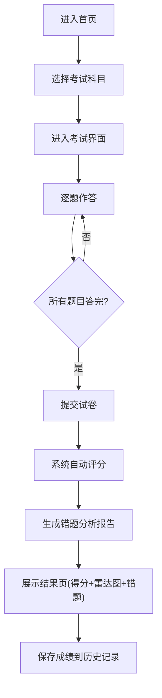

## 1. 产品概述

职业资格在线模拟考试系统，为考生提供多科目限时模拟考试服务，支持自动评分、错题分析与知识点薄弱项诊断，帮助考生高效备考。

- 目标用户：准备职业资格考试的考生、培训机构学员
- 核心价值：通过限时模拟、智能评分和错题分析，提升备考效率

## 2. 核心功能

### 2.1 用户角色
| 角色 | 访问方式 | 核心权限 |
|------|----------|----------|
| 考生 | 直接访问 | 选择科目、参加考试、查看成绩、历史记录 |
| 管理员 | `/admin` 路径 | 查看成绩汇总、添加题目 |

### 2.2 功能模块
1. **科目选择页**：展示可选考试科目列表
2. **考试界面**：限时答题、题目导航、选项交互
3. **结果展示页**：得分环形图、错题列表、雷达图分析
4. **历史记录页**：查看近10次考试成绩
5. **管理员后台**：成绩汇总表格、题目添加表单

### 2.3 页面详情
| 页面名称 | 模块名称 | 功能描述 |
|----------|----------|----------|
| 首页/科目选择 | 科目卡片 | 展示Java基础、项目管理、网络安全等科目 |
| 考试界面 | 题目展示区 | 显示题目序号、倒计时、题目文本、选项按钮 |
| 考试界面 | 导航控制 | 上一题/下一题按钮、提交按钮 |
| 结果页 | 得分展示 | 环形进度动画、得分数字 |
| 结果页 | 错题列表 | 错题详情、正确答案、解析 |
| 结果页 | 雷达图 | 五维度知识点得分分析 |
| 结果页 | 复习建议 | 三条智能生成的复习建议 |
| 历史记录页 | 成绩卡片 | 日期、科目、得分、用时 |
| 管理员页 | 成绩表格 | 所有考生成绩汇总 |
| 管理员页 | 添加题目 | 题目录入表单 |

## 3. 核心流程

## 4. 用户界面设计

### 4.1 设计风格
- 主题色：蓝色 `#3182ce`、青色 `#00b5d8`
- 背景色：浅蓝灰 `#f7fafc`
- 卡片：白色背景 + 轻阴影 `0 2px 8px rgba(0,0,0,0.08)` + 圆角12px
- 按钮：选中时背景变蓝、文字变白，过渡0.2s ease
- 微交互：点击缩放 0.97 恢复，0.1s
- 字体：倒计时使用 monospace 字体

### 4.2 页面设计概览
| 页面名称 | 模块名称 | UI元素 |
|----------|----------|--------|
| 科目选择 | 科目卡片网格 | 卡片悬停上浮、图标、科目名称 |
| 考试界面 | 题目卡片 | 单栏居中布局（max-width:800px） |
| 结果页 | 两栏布局 | 左侧得分+雷达图，右侧错题列表 |
| 历史记录 | 横向卡片列表 | 320x80px卡片，悬停上浮4px |

### 4.3 响应式设计
- 桌面端（≥768px）：两栏布局
- 移动端（<768px）：单栏堆叠，卡片自适应宽度
- 触控优化：按钮最小高度48px，确保可点击区域

### 4.4 性能要求
- 题目切换响应时间 ≤ 200ms
- 评分计算与雷达图生成 ≤ 500ms
