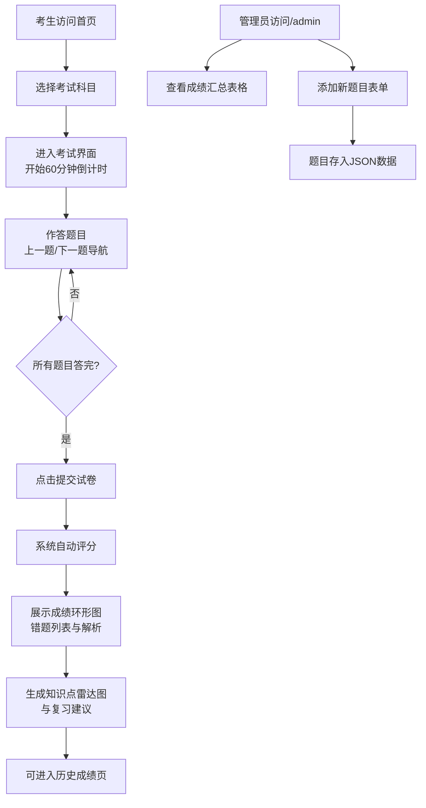

## 1. 产品概述
职业资格在线模拟考试系统，为考生提供多科目限时模拟考试、智能评分与错题分析服务，帮助考生高效备考。
- 核心目标：让考生通过在线模拟考试熟悉题型、发现知识薄弱点，获得针对性复习建议
- 目标用户：准备各类职业资格考试的考生、培训学员
- 核心价值：即时反馈、智能分析、数据驱动的复习指导

## 2. 核心功能

### 2.1 用户角色
| 角色 | 进入方式 | 核心权限 |
|------|----------|----------|
| 考生 | 默认访问 | 选择科目参加考试、查看成绩与错题分析、查看历史成绩 |
| 管理员 | 访问 /admin 路径 | 查看所有考生成绩汇总、添加新题目 |

### 2.2 功能模块
1. **首页/科目选择**：科目卡片展示、历史成绩入口、管理员入口
2. **考试界面**：题目展示、倒计时、选项交互、导航控制、提交按钮
3. **成绩结果页**：得分环形图、错题列表、知识点雷达图、复习建议
4. **历史成绩页**：最近10次考试记录卡片列表
5. **管理员后台**：成绩汇总表格、添加题目表单

### 2.3 页面详情
| 页面名称 | 模块名称 | 功能描述 |
|---------|---------|---------|
| 首页 | 科目选择卡片 | 展示Java基础、项目管理、网络安全三个科目卡片，点击进入对应考试 |
| 首页 | 历史成绩入口 | 按钮跳转至历史成绩页面 |
| 首页 | 管理员入口 | 链接跳转至/admin管理后台 |
| 考试界面 | 头部状态栏 | 显示题目序号(如3/30)、60分钟倒计时(红色monospace字体#e53e3e) |
| 考试界面 | 题目展示区 | 题目文本、四个选项按钮(圆角8px，宽100%高48px，选中背景#3182ce) |
| 考试界面 | 底部导航栏 | 上一题/下一题按钮(边界禁用置灰)、提交按钮 |
| 成绩结果页 | 得分展示区 | 环形进度动画(1.5s ease-out，红到绿渐变)，分数居中 |
| 成绩结果页 | 错题列表 | 浅红背景#fff5f5，显示正确选项与解析 |
| 成绩结果页 | 知识点雷达图 | Canvas绘制五边形雷达图(5个维度)，数据线#3182ce宽2px，填充透明度0.2 |
| 成绩结果页 | 复习建议 | 三条自动生成的针对性复习建议 |
| 历史成绩页 | 成绩卡片列表 | 横向卡片(320x80px，圆角12px)，悬停上浮4px阴影加深，显示日期/科目/得分/用时 |
| 管理员后台 | 成绩汇总表格 | 展示所有考生成绩记录 |
| 管理员后台 | 添加题目表单 | 题目文本、四个选项、正确答案、所属科目输入 |

## 3. 核心流程

### 3.1 考生考试流程
考生进入首页 → 选择科目 → 进入考试界面(开始计时) → 逐题作答 → 提交试卷 → 系统自动评分 → 展示成绩、错题分析、雷达图与复习建议 → 可查看历史成绩

### 3.2 管理员流程
访问/admin路径 → 查看成绩汇总表格 → 可添加新题目(填写表单提交) → 题目存入后端JSON数据

## 4. 用户界面设计

### 4.1 设计风格
- **主题色**：主色蓝色#3182ce，辅色青色#00b5d8，背景浅蓝灰#f7fafc
- **卡片风格**：白色背景 + 轻阴影(0 2px 8px rgba(0,0,0,0.08))，圆角12px
- **按钮样式**：圆角8px，点击缩放反馈(scale 0.97，0.1s)，选中状态背景#3182ce文字白色，过渡0.2s ease
- **字体**：倒计时使用monospace字体红色#e53e3e，正文使用现代无衬线字体
- **布局风格**：考试界面单栏居中(最大宽度800px)，结果页两栏布局(左侧得分雷达图/右侧错题)
- **动效**：环形得分动画1.5s ease-out，按钮过渡0.2s ease，卡片悬停上浮4px

### 4.2 页面设计概览
| 页面名称 | 模块名称 | UI元素 |
|---------|---------|--------|
| 首页 | 科目卡片 | 三张科目卡片并排，图标+标题+描述，悬停阴影加深，点击缩放反馈 |
| 考试界面 | 头部状态栏 | 左侧题目序号(大字号粗体)，右侧倒计时(monospace红色#e53e3e，大号字体) |
| 考试界面 | 题目区 | 题目文本(较大字号，行高1.6)，四个选项垂直排列(间距16px)，选中高亮 |
| 考试界面 | 底部导航 | 三按钮布局：上一题(左)/提交(中)/下一题(右)，边界按钮置灰禁用 |
| 成绩结果页 | 左侧得分区 | 环形图居中(直径240px)，分数显示在圆心，下方标题与用时信息 |
| 成绩结果页 | 左侧雷达图 | 五边形雷达图(300x300px)，五个维度标签，半透明填充 |
| 成绩结果页 | 左侧复习建议 | 三条建议卡片，带序号图标，文字简洁有力 |
| 成绩结果页 | 右侧错题列表 | 标题+数量，每条错题卡片浅红背景，正确答案绿色高亮，解析灰色小字 |
| 历史成绩页 | 成绩卡片 | 网格排列横向卡片，左：日期+科目，右：得分+用时，悬停上浮 |
| 管理员后台 | 成绩表格 | 标准表格，斑马纹，表头蓝色背景 |
| 管理员后台 | 添加题目表单 | 分组表单，输入框圆角8px，提交按钮蓝色 |

### 4.3 响应式设计
- **桌面优先**，移动端(小于768px)两栏变单栏堆叠
- 卡片宽度自适应容器，按钮宽度100%
- 字号在移动端适度缩小，间距调整
- 雷达图与环形图按视口比例缩放

### 4.4 性能要求
- 题目切换响应时间 ≤ 200ms
- 评分计算与雷达图生成 ≤ 500ms
