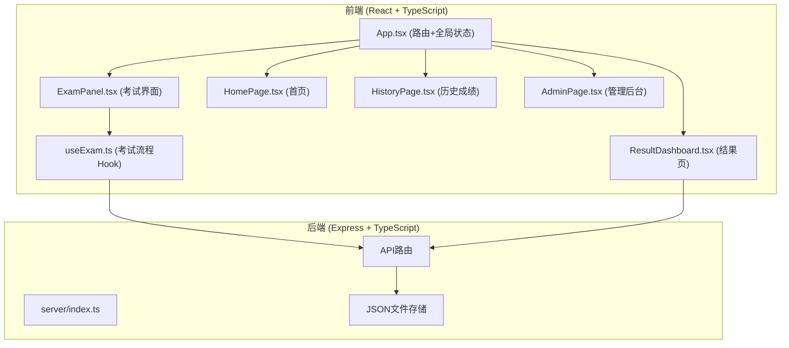
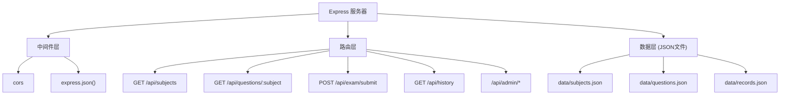
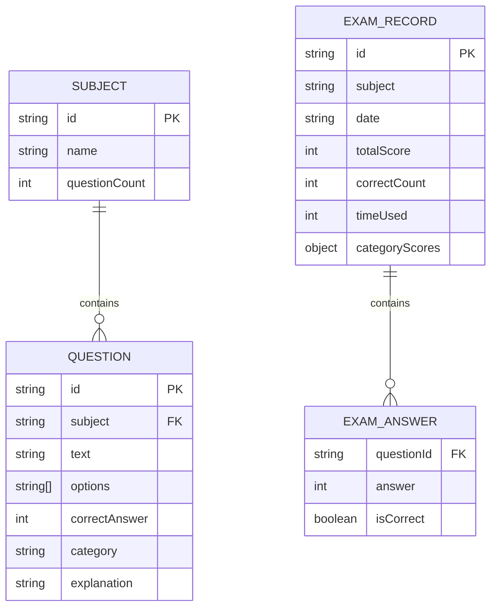

## 1. 架构设计



## 2. 技术描述
- 前端：React@18 + TypeScript + Vite + react-router-dom
- 构建工具：Vite，开发服务器端口 3000
- 后端：Express@4 + TypeScript + CORS
- 数据存储：JSON文件（无需数据库）
- 工具库：uuid（生成ID）、dayjs（日期处理）
- 图表：Canvas原生绘制（环形图、雷达图）

## 3. 路由定义
| 路由 | 用途 |
|-------|---------|
| / | 首页：科目选择 + 入口导航 |
| /exam/:subject | 考试界面：对应科目的答题页面 |
| /result/:examId | 结果展示页：得分、错题、雷达图、建议 |
| /history | 历史成绩页：最近10次考试记录 |
| /admin | 管理后台：成绩汇总 + 添加题目 |

## 4. API 定义

### 类型定义
```typescript
interface Subject {
  id: string;
  name: string;
  icon: string;
  questionCount: number;
}

interface Question {
  id: string;
  subject: string;
  text: string;
  options: string[];
  correctAnswer: number; // 0-3 索引
  category: '基础' | '逻辑分析' | '代码理解' | '安全规范' | '项目管理';
  explanation: string;
}

interface ExamAnswer {
  questionId: string;
  answer: number | null;
  isCorrect: boolean;
}

interface ExamRecord {
  id: string;
  subject: string;
  date: string;
  totalScore: number;
  totalQuestions: number;
  correctCount: number;
  timeUsed: number; // 秒
  answers: ExamAnswer[];
  categoryScores: Record<string, number>;
}

interface AdminQuestionInput {
  text: string;
  options: string[];
  correctAnswer: number;
  subject: string;
  category: string;
  explanation: string;
}
```

### API端点
| 方法 | 路径 | 描述 |
|-------|------|------|
| GET | /api/subjects | 获取科目列表 |
| GET | /api/questions/:subject | 获取指定科目的题目 |
| POST | /api/exam/submit | 提交答案并评分，返回成绩记录 |
| GET | /api/exam/:examId | 获取指定考试记录详情 |
| GET | /api/history | 获取最近10次历史成绩 |
| GET | /api/admin/scores | 获取所有考生成绩汇总 |
| POST | /api/admin/questions | 添加新题目 |

## 5. 服务器架构



## 6. 数据模型

### 6.1 数据结构


### 6.2 初始数据
- subjects.json：预置3个科目（Java基础、项目管理、网络安全）
- questions.json：每个科目预置30道题目，覆盖5个知识维度
- records.json：初始为空数组
