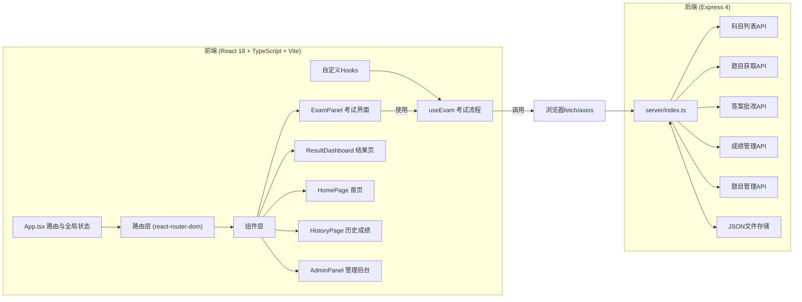
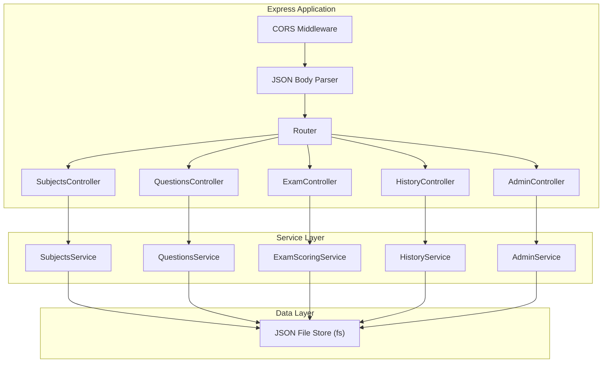
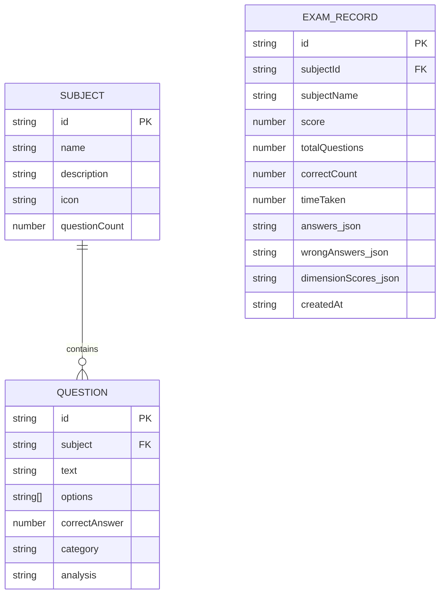

## 1. 架构设计



## 2. 技术说明
- **前端**：React 18 + TypeScript 5 + Vite 5 + react-router-dom 6 + dayjs + uuid
- **构建工具**：Vite 5，开发端口3000
- **后端**：Express 4 + CORS 中间件，开发端口独立(如3001)
- **数据存储**：本地JSON文件(server/data/*.json)，无需数据库
- **图表实现**：Canvas原生绘制(环形进度图、雷达图)，不引入第三方图表库
- **样式方案**：CSS Modules + 全局CSS变量，用户需求精确指定了颜色/尺寸/圆角，精确还原

## 3. 路由定义
| 路由 | 页面组件 | 用途 |
|------|---------|------|
| `/` | HomePage | 首页：科目选择、历史成绩入口、管理员入口 |
| `/exam/:subjectId` | ExamPanel | 考试界面：限时答题 |
| `/result/:examId` | ResultDashboard | 成绩结果：环形图、错题、雷达图、建议 |
| `/history` | HistoryPage | 历史成绩：最近10次记录 |
| `/admin` | AdminPanel | 管理后台：成绩汇总、添加题目 |
| `*` | NotFound | 404页面 |

## 4. API 定义

### 4.1 类型定义
```typescript
// 题目类型
interface Question {
  id: string;
  subject: string; // 科目ID: java/pm/security
  text: string;
  options: string[]; // 长度为4
  correctAnswer: number; // 0-3 正确选项索引
  category: 'basic' | 'logic' | 'code' | 'security' | 'management'; // 知识点维度
  analysis: string; // 解析
}

// 科目类型
interface Subject {
  id: string;
  name: string;
  description: string;
  icon: string;
  questionCount: number;
}

// 考试记录
interface ExamRecord {
  id: string;
  subjectId: string;
  subjectName: string;
  score: number; // 0-100
  totalQuestions: number;
  correctCount: number;
  timeTaken: number; // 秒
  answers: Record<string, number>; // questionId -> 用户答案索引
  wrongAnswers: WrongAnswer[];
  dimensionScores: DimensionScores;
  createdAt: string; // ISO
}

// 错题
interface WrongAnswer {
  questionId: string;
  questionText: string;
  options: string[];
  userAnswer: number;
  correctAnswer: number;
  category: string;
  analysis: string;
}

// 五维得分
interface DimensionScores {
  basic: number;      // 基础知识 0-100
  logic: number;      // 逻辑分析 0-100
  code: number;       // 代码理解 0-100
  security: number;   // 安全规范 0-100
  management: number; // 项目管理 0-100
}

// 复习建议
interface ReviewSuggestion {
  dimension: keyof DimensionScores;
  dimensionName: string;
  message: string;
  priority: number;
}
```

### 4.2 接口列表

| 方法 | 路径 | 用途 | 请求体 | 响应 |
|------|------|------|--------|------|
| GET | `/api/subjects` | 获取科目列表 | - | `{ subjects: Subject[] }` |
| GET | `/api/questions?subject=:id` | 获取指定科目的题目(30道随机) | - | `{ questions: Question[] }` |
| POST | `/api/exam/submit` | 提交试卷并批改 | `{ subjectId, answers: {questionId: ansIdx}[] , timeTaken }` | `{ examId, score, correctCount, totalQuestions, wrongAnswers, dimensionScores }` |
| GET | `/api/exam/:id` | 获取某次考试详情 | - | `ExamRecord` |
| GET | `/api/history` | 获取最近10次历史成绩 | - | `{ records: ExamRecord[] }` |
| GET | `/api/admin/scores` | 管理员获取所有成绩 | - | `{ records: ExamRecord[] }` |
| POST | `/api/admin/questions` | 添加新题目 | `Question (不含id)` | `{ success: true, id: string }` |

## 5. 服务器架构图



## 6. 数据模型

### 6.1 存储文件结构
- `server/data/subjects.json`：科目列表
- `server/data/questions.json`：题目库
- `server/data/exam-records.json`：考试记录

### 6.2 实体关系图



### 6.3 初始Mock数据
- **3个科目**：Java基础、项目管理、网络安全
- **每个科目30道题目**：覆盖5个维度
- **3条考试记录**：用于历史成绩页展示
