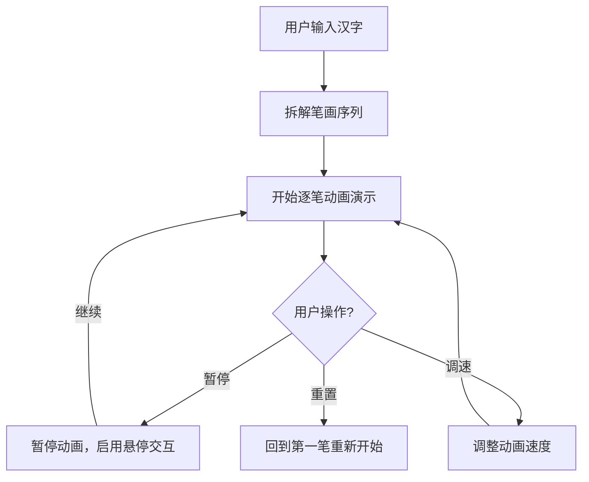

## 1. 产品概述
交互式手写汉字笔顺演示工具，帮助学中文的小朋友或外国人正确掌握汉字的书写顺序，通过动画清晰展示每个笔画的起笔、落笔和先后顺序。

- 核心用途：汉字笔顺教学与学习
- 目标用户：学中文的儿童、外国汉语学习者
- 产品价值：通过直观的动画演示降低汉字书写学习门槛

## 2. 核心功能

### 2.1 用户角色
无需用户登录，所有访问者均可使用全部功能。

### 2.2 功能模块
1. **汉字输入模块**：输入框支持最多4个简体汉字输入
2. **笔画演示模块**：Canvas画布逐笔动画展示书写过程
3. **播放控制模块**：速度滑块（慢/中/快）、暂停/继续按钮
4. **预览提示模块**：全字缩略图预览、当前笔画进度提示
5. **交互反馈模块**：暂停时鼠标悬停查看笔画信息

### 2.3 页面详情
| 页面名称 | 模块名称 | 功能描述 |
|-----------|-------------|---------------------|
| 主页 | 顶部操作栏 | 汉字输入框、演示控制按钮组（播放/暂停/重置） |
| 主页 | 主画布区域 | 640x480px透明画布，逐笔演示书写动画 |
| 主页 | 左下角信息区 | 80x80px全字预览缩略图、笔画进度文字提示 |
| 主页 | 速度控制区 | 三档速度滑块，0.8s/0.5s/0.3s每笔 |

## 3. 核心流程
用户在输入框输入汉字 → 系统拆解笔画序列 → 自动开始逐笔动画演示 → 可通过控制按钮暂停/继续/调整速度 → 暂停时可悬停查看笔画详情

## 4. 用户界面设计

### 4.1 设计风格
- 主体背景：淡米色 #faf3e0
- 操作栏：白色背景，底部2px边框 #e0d8c8，高度64px（移动端56px）
- 主画布：白色背景，宽640px高480px，8px淡灰色 #e0d8c8 内阴影
- 主色调：棕色系 #8d6e63，悬停加深 #6d4c41
- 笔画：黑色细线3px，末端圆形cap，完成后变灰色 #9e9e9e
- 笔顺编号：深蓝色 #1565c0 小圆点标记在起笔位置
- 缩略图：80x80px，浅灰背景 #f5f5f5

### 4.2 页面设计概述
| 页面名称 | 模块名称 | UI Elements |
|-----------|-------------|-------------|
| 主页 | 顶部操作栏 | 64px高白色栏，左侧输入框（圆角8px，边框1px #d4c5a9），右侧控制按钮组（圆角6px，#8d6e63填充） |
| 主页 | 主画布 | 640x480px白色画布居中，8px内阴影，黑色笔画动画，蓝色起笔标记点 |
| 主页 | 左下角预览区 | 80x80px缩略图，右侧14px #424242 文字显示"第X笔 / 共Y笔" |
| 主页 | 速度控制 | 三档滑块，标签"慢/中/快" |

### 4.3 交互反馈
- 输入框聚焦：边框变为 #8d6e63
- 按钮悬停：背景色变为 #6d4c41
- 笔画完成：颜色从黑色变为 #9e9e9e
- 暂停时悬停笔画：0.2s缩放动画，显示笔顺编号和方向提示（如"横"、"竖撇"）

### 4.4 响应式设计
- 桌面端：画布640x480px，操作栏64px高
- 移动端：操作栏56px高，画布宽度缩放到96%

### 4.5 性能指标
- 笔画动画帧率 ≥ 50fps
- 汉字拆解渲染响应时间 ≤ 200ms
