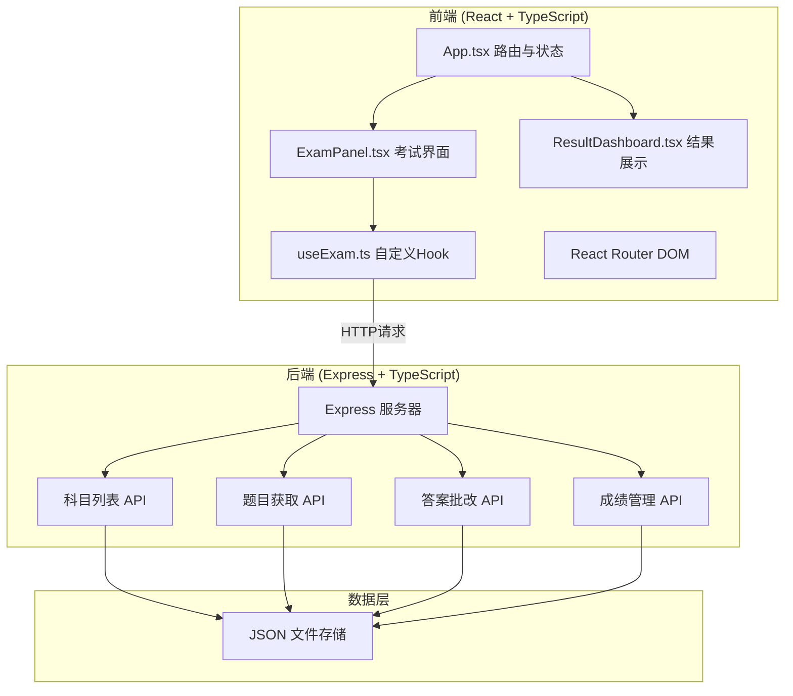
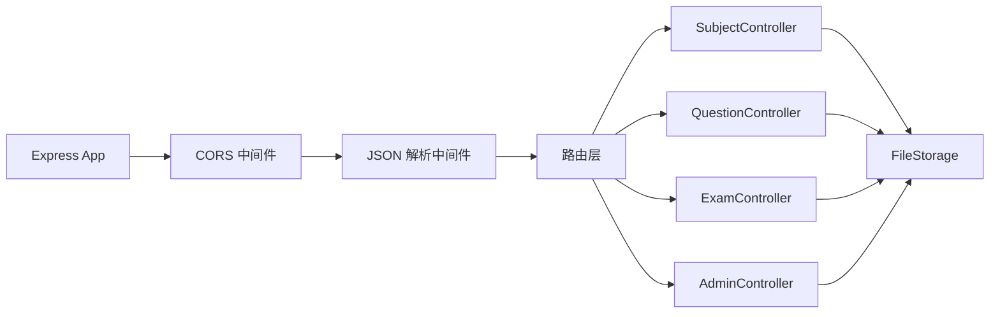

## 1. 架构设计



## 2. 技术描述

- 前端框架：React 18 + TypeScript
- 构建工具：Vite
- 路由：react-router-dom v6
- 状态管理：自定义 Hook (useExam)
- 后端框架：Express 4 + TypeScript
- 数据存储：JSON 文件（server/data/）
- 日期处理：dayjs
- 唯一ID：uuid
- 跨域：cors

## 3. 路由定义

| 路由 | 页面组件 | 用途 |
|------|----------|------|
| `/` | 科目选择页 | 展示可选考试科目 |
| `/exam/:subjectId` | ExamPanel | 考试主界面 |
| `/result/:examId` | ResultDashboard | 考试结果与分析 |
| `/history` | 历史记录页 | 查看历史考试成绩 |
| `/admin` | 管理员后台 | 成绩汇总与题目管理 |

## 4. API 定义

### 4.1 类型定义

```typescript
interface Question {
  id: string;
  text: string;
  options: string[];
  correctAnswer: number; // 0-3 索引
  subject: string;
  dimension: string; // 知识点维度
  explanation: string;
}

interface Subject {
  id: string;
  name: string;
  description: string;
  questionCount: number;
  duration: number; // 分钟
}

interface ExamRecord {
  id: string;
  subjectId: string;
  subjectName: string;
  score: number;
  totalQuestions: number;
  correctCount: number;
  duration: number; // 实际用时(秒)
  answers: number[]; // 用户答案
  date: string; // ISO 日期
  dimensionScores: Record<string, number>;
}
```

### 4.2 接口列表

| 方法 | 路径 | 描述 | 请求体 | 响应 |
|------|------|------|--------|------|
| GET | `/api/subjects` | 获取科目列表 | - | Subject[] |
| GET | `/api/questions?subjectId=` | 获取某科目题目 | - | Question[] |
| POST | `/api/submit` | 提交答案评分 | { answers, subjectId } | { score, correctCount, wrongQuestions, dimensionScores } |
| GET | `/api/records` | 获取成绩记录 | - | ExamRecord[] |
| GET | `/api/records/:id` | 获取单条记录 | - | ExamRecord |
| POST | `/api/questions` | 添加新题目 | Question | Question |

## 5. 服务器架构图



## 6. 数据模型

### 6.1 数据文件结构
- `server/data/subjects.json` - 科目列表
- `server/data/questions.json` - 题库
- `server/data/records.json` - 考试记录

### 6.2 知识点维度
- 基础知识
- 逻辑分析
- 代码理解
- 安全规范
- 项目管理

### 6.3 初始数据
- 3个科目（Java基础、项目管理、网络安全）
- 每科目10-15道题目
- 题目涵盖5个知识维度
