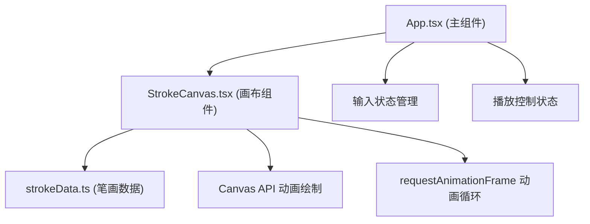

## 1. 架构设计



## 2. 技术描述
- 前端框架：React 18 + TypeScript
- 构建工具：Vite 5
- 开发服务器端口：3000
- 渲染技术：HTML5 Canvas API
- 动画方案：requestAnimationFrame
- 状态管理：React useState/useRef

## 3. 项目文件结构
```
d:\demo-Solo\tasks\auto3\
├── package.json          # 项目依赖和脚本
├── index.html            # 入口HTML
├── vite.config.js        # Vite配置
├── tsconfig.json         # TypeScript配置
└── src/
    ├── App.tsx           # 主组件，管理输入、播放状态
    ├── components/
    │   └── StrokeCanvas.tsx  # 画布组件，动画绘制与控制
    └── utils/
        └── strokeData.ts     # 笔画数据库与解析函数
```

## 4. 数据模型

### 4.1 笔画数据类型定义
```typescript
interface StrokePoint {
  x: number;
  y: number;
}

interface Stroke {
  id: number;
  startPoint: StrokePoint;
  endPoint: StrokePoint;
  controlPoints?: StrokePoint[];
  direction: string;
  strokeNumber: number;
  path: StrokePoint[];
}

interface CharacterStrokeData {
  character: string;
  strokes: Stroke[];
  totalStrokes: number;
}
```

### 4.2 内置汉字数据库
包含至少10个常用汉字的笔画数据：
'大'、'小'、'上'、'下'、'中'、'人'、'水'、'火'、'山'、'石'

每个汉字的笔画数据包含：
- 笔画起点、终点坐标（基于640x480画布坐标系）
- 笔画路径点序列（用于平滑绘制）
- 笔画方向描述（横、竖、撇、捺等）
- 笔顺编号

## 5. 核心功能实现要点

### 5.1 笔画动画绘制
- 使用 requestAnimationFrame 实现流畅动画（目标60fps）
- 每笔动画时长根据速度设置：慢0.8s、中0.5s、快0.3s
- 绘制时使用线性插值沿着预定义路径点逐步绘制
- 线宽3px，lineCap: 'round'

### 5.2 状态管理
- 播放状态：playing / paused / completed
- 当前笔画索引
- 动画进度（0-1）
- 速度档位

### 5.3 交互功能
- 鼠标位置追踪，暂停时检测鼠标是否在笔画路径附近
- 悬停反馈：0.2s缩放动画，颜色变化
- 速度滑块：三档切换

### 5.4 缩略图预览
- 独立的离屏Canvas或CSS绘制
- 实时更新已完成笔画的显示比例
- 80x80px固定尺寸

## 6. 性能优化
- 笔画数据预计算，输入后立即返回
- Canvas重绘时只重绘变化区域（必要时）
- requestAnimationFrame 回调中避免复杂计算
- 使用 useRef 存储Canvas上下文和动画帧ID
