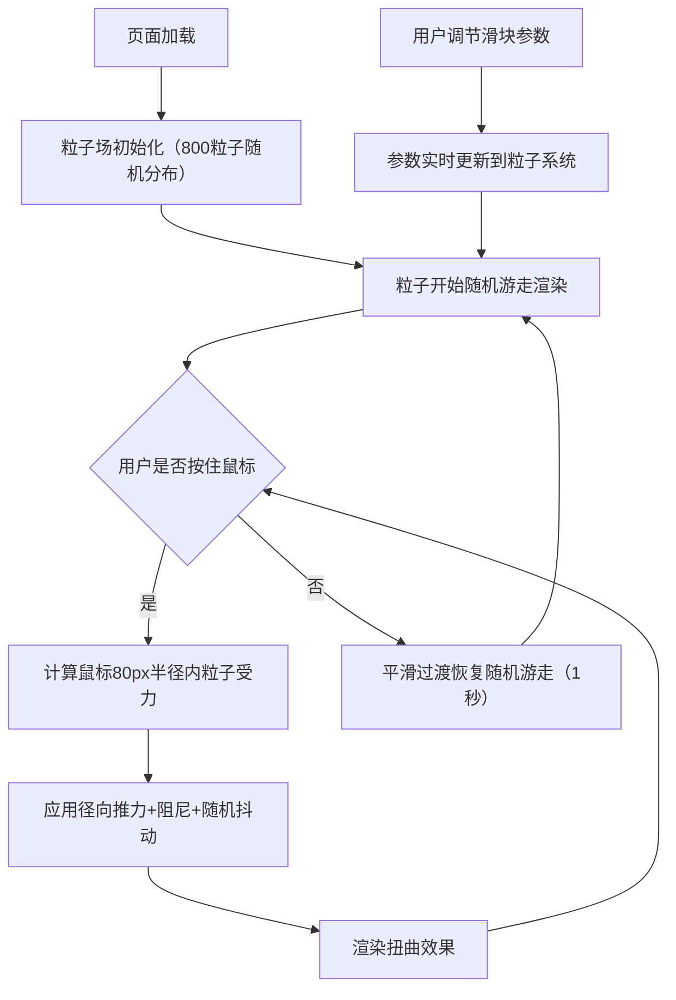

## 1. 产品概述

实时流体粒子扭曲特效展示项目，通过Canvas 3D渲染技术模拟粒子流体运动，用户可通过鼠标拖拽与粒子场进行实时交互，产生扭曲和漩涡效果。

- 主要用途：视觉艺术展示、交互体验演示、粒子系统技术 showcase
- 目标用户：前端开发者、视觉设计师、艺术爱好者
- 产品价值：展示高性能WebGL粒子渲染和实时物理模拟技术

## 2. 核心特性

### 2.1 功能模块

1. **粒子场渲染模块**：800个粒子的实时渲染、动态颜色、发光效果、粒子连线
2. **物理模拟模块**：粒子速度、位置更新、阻尼、随机抖动、鼠标交互力场
3. **控制面板模块**：推力强度、粒子大小、连线阈值的实时调节

### 2.2 页面详情

| 页面名称 | 模块名称 | 功能描述 |
|-----------|-------------|---------------------|
| 主页 | 粒子场画布 | 全屏黑色背景，Three.js渲染800个粒子，支持鼠标拖拽交互 |
| 主页 | 控制面板 | 左侧透明面板，三个滑块实时控制粒子行为参数 |

## 3. 核心流程

用户打开页面 → 粒子场自动初始化并开始随机游走 → 用户按住鼠标左键拖拽 → 半径80px内粒子受径向推力产生扭曲 → 用户释放鼠标 → 粒子平滑过渡回随机游走状态 → 用户可通过左侧滑块实时调整参数

## 4. 用户界面设计

### 4.1 设计风格

- **主色调**：深蓝 `#1565c0` → 青色 `#00bcd4` → 亮黄 `#fdd835`（粒子速度渐变）
- **背景色**：纯黑 `#000000`
- **面板背景**：半透明深色 `rgba(10,10,20,0.7)`，毛玻璃效果 `backdrop-filter: blur(12px)`
- **交互元素色**：亮黄 `#fdd835`（滑块）
- **布局风格**：全屏沉浸式画布 + 左侧浮动控制面板
- **圆角**：面板16px圆角
- **字体**：现代无衬线字体，简洁科技感

### 4.2 页面设计概览

| 页面名称 | 模块名称 | UI元素 |
|-----------|-------------|-------------|
| 主页 | 粒子场画布 | 全屏黑色、800个发光粒子、粒子间连线、鼠标交互扭曲动画 |
| 主页 | 控制面板 | 220px宽透明面板、三个自定义滑块（推力强度/粒子大小/连线阈值）、毛玻璃效果 |

### 4.3 响应式设计

- 桌面端优先：Canvas自适应窗口尺寸，控制面板固定左侧
- 鼠标交互：按住左键拖拽生效
- 不考虑移动端触屏优化（专注桌面体验）

### 4.4 3D场景指导

- **环境**：纯黑背景，无HDRI，极简沉浸感
- **光照**：粒子自发光（通过径向渐变纹理模拟），无需场景光源
- **相机**：正交相机，固定视角，正对粒子平面
- **粒子材质**：Points + ShaderMaterial，动态颜色混合
- **连线材质**：自定义ShaderMaterial，半透明白色细线
- **性能目标**：50FPS以上，800粒子 + 连线实时渲染
