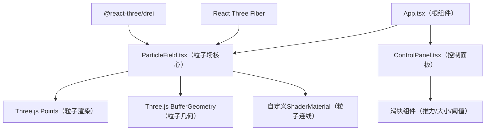

## 1. 架构设计



## 2. 技术说明

- **前端框架**：React@18 + TypeScript@5
- **3D渲染**：three@latest + @react-three/fiber@latest + @react-three/drei@latest
- **构建工具**：Vite@5 + @vitejs/plugin-react@latest
- **开发服务器端口**：3000

## 3. 项目结构

```
.
├── index.html                 # 入口HTML，全屏黑色背景
├── package.json               # 依赖配置
├── vite.config.js             # Vite构建配置
├── tsconfig.json              # TypeScript配置
└── src/
    ├── App.tsx                # 根组件，组合布局与事件
    ├── ParticleField.tsx      # 粒子场核心组件
    └── ControlPanel.tsx       # 左侧控制面板组件
```

## 4. 核心数据结构

### 粒子数据
```typescript
interface ParticleData {
  positions: Float32Array;    // 800 * 3 (x, y, z)
  velocities: Float32Array;   // 800 * 3 (vx, vy, vz)
  colors: Float32Array;       // 800 * 3 (r, g, b)
  sizes: Float32Array;        // 800 * 1 (size)
}
```

### 控制参数
```typescript
interface ControlParams {
  forceStrength: number;      // 推力强度 0.5 - 3.0
  particleSize: number;       // 粒子大小 1 - 6px
  linkThreshold: number;      // 连线阈值 10 - 60px
}
```

### 鼠标状态
```typescript
interface MouseState {
  isPressed: boolean;
  x: number;                  // NDC坐标 -1 ~ 1
  y: number;                  // NDC坐标 -1 ~ 1
  releaseTime: number;        // 释放时间戳，用于过渡动画
}
```

## 5. 核心算法

### 5.1 粒子颜色插值（基于速度）
```
速度归一化 speedNorm = clamp(|velocity| / maxSpeed, 0, 1)
if speedNorm < 0.5:
  color = lerp(#1565c0, #00bcd4, speedNorm * 2)
else:
  color = lerp(#00bcd4, #fdd835, (speedNorm - 0.5) * 2)
```

### 5.2 鼠标径向推力
```
distance = |particlePos - mousePos|
if distance < 80px:
  direction = normalize(particlePos - mousePos)
  falloff = 1 - distance / 80
  force = direction * falloff * forceStrength
  velocity += force
```

### 5.3 粒子更新循环（每帧）
```
velocity *= damping (0.9)
velocity += randomJitter * 1.2
if mousePressed:
  apply mouse force
else if timeSinceRelease < 1s:
  lerp force influence to 0 over 1s
position += velocity
apply color based on speed
update BufferGeometry attributes
```

### 5.4 粒子连线判断
```
for each particle pair (i, j):
  distance = |pos[i] - pos[j]|
  if distance < linkThreshold:
    draw line with rgba(255,255,255,0.1)
```
