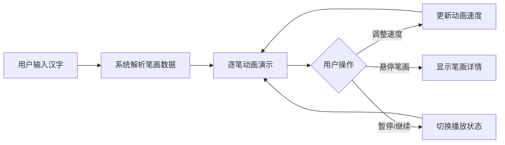

## 1. 产品概述
交互式手写汉字笔顺演示工具，帮助学中文的小朋友或外国人正确掌握汉字的书写顺序。
- 核心目标：通过动画清晰展示每个汉字的笔画起笔、落笔和先后顺序，提供交互式学习体验
- 目标用户：学习中文的儿童、外国汉语学习者、中文教师

## 2. 核心功能

### 2.1 功能模块
1. **主页面**：汉字输入区、演示画布区、控制面板、预览缩略图

### 2.2 页面详情
| 页面名称 | 模块名称 | 功能描述 |
|---------|---------|---------|
| 主页面 | 汉字输入框 | 支持输入最多4个简体汉字，实时解析并演示 |
| 主页面 | 笔顺演示画布 | 640x480px白色画布，逐笔动画演示，起笔位置显示笔顺编号，完成笔画变灰 |
| 主页面 | 速度控制 | 滑块三档速度（慢0.8s/中0.5s/快0.3s每笔） |
| 主页面 | 播放控制 | 暂停/继续按钮控制演示节奏 |
| 主页面 | 笔画悬停交互 | 暂停时鼠标悬停笔画显示笔顺编号和方向提示 |
| 主页面 | 全字预览缩略图 | 80x80px浅灰背景缩略图，显示已完成笔画比例 |
| 主页面 | 笔画进度提示 | 显示当前第几笔/总共多少笔 |

## 3. 核心流程
用户在输入框输入汉字 → 系统解析汉字笔画数据 → 在画布上逐笔动画演示 → 用户可通过速度滑块和暂停按钮控制演示 → 暂停时可悬停查看笔画详情

## 4. 用户界面设计

### 4.1 设计风格
- 主背景色：淡米色 #faf3e0
- 操作栏：白色背景，高度64px，底部边框2px #e0d8c8
- 主色调：棕色系 #8d6e63（按钮），深蓝 #1565c0（笔顺编号）
- 输入框：圆角8px，边框1px #d4c5a9，聚焦时边框 #8d6e63
- 按钮：圆角6px，填充色 #8d6e63，悬浮时 #6d4c41，白色文字
- 画布：宽640px高480px，白色背景，四周8px淡灰 #e0d8c8内阴影，居中放置
- 缩略图：80x80px，浅灰背景 #f5f5f5
- 笔画：黑色3px线宽，圆形末端，完成后变灰 #9e9e9e
- 字体：14px，颜色 #424242

### 4.2 页面设计概览
| 页面名称 | 模块名称 | UI元素 |
|---------|---------|-------|
| 主页面 | 顶部操作栏 | 汉字输入框、演示控制按钮、速度滑块 |
| 主页面 | 中央画布区 | 笔画动画演示画布、左下角缩略图+进度文字 |
| 主页面 | 交互反馈 | 0.2s缩放+颜色变化的悬停效果 |

### 4.3 响应式设计
- 桌面端优先设计
- 移动端：操作栏高度变为56px，画布宽度缩放到96%
- 触摸设备优化交互体验

## 4.4 性能要求
- 笔画动画帧率不低于50fps
- 输入汉字后拆解和渲染响应时间不超过200ms
