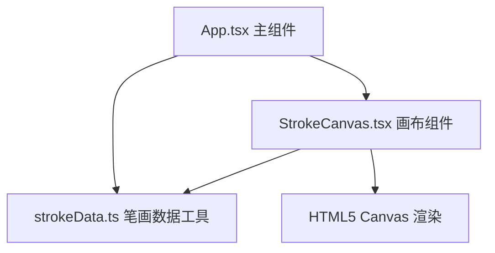

## 1. 架构设计



## 2. 技术说明
- 前端框架：React@18 + TypeScript@5
- 构建工具：Vite@5 + @vitejs/plugin-react
- 渲染技术：HTML5 Canvas API 实现笔画动画
- 状态管理：React Hooks（useState、useRef、useEffect、useCallback）
- 无后端，纯前端应用，笔画数据内置在工具模块中

## 3. 文件结构
| 文件路径 | 用途 |
|---------|------|
| package.json | 项目依赖和脚本配置 |
| index.html | 应用入口HTML |
| vite.config.js | Vite构建配置，开发服务器端口3000 |
| tsconfig.json | TypeScript严格模式配置，jsx: react-jsx，dom lib |
| src/App.tsx | 主组件，管理输入状态、播放状态和画布引用 |
| src/components/StrokeCanvas.tsx | 画布组件，负责笔画解析、动画绘制、暂停/速度控制 |
| src/utils/strokeData.ts | 笔画数据工具，提供汉字笔画数据库和解析函数 |

## 4. 数据模型

### 4.1 笔画数据结构
```typescript
interface StrokePoint {
  x: number;
  y: number;
}

interface Stroke {
  id: number;
  strokeNumber: number;
  direction: string;
  points: StrokePoint[];
}

interface CharacterStrokes {
  character: string;
  strokes: Stroke[];
}
```

### 4.2 内置汉字数据库
至少包含以下10个常用汉字的笔画数据：大、小、上、下、中、人、水、火、山、石

## 5. 动画实现方案
- 使用 requestAnimationFrame 实现高帧率动画
- 每笔动画通过插值计算在时间 t 内从起点描绘到终点
- 已完成笔画用灰色 #9e9e9e 渲染
- 当前正在绘制的笔画用黑色 #000000，3px线宽，圆形末端
- 笔顺编号用深蓝色 #1565c0 小圆点标记在起笔位置
