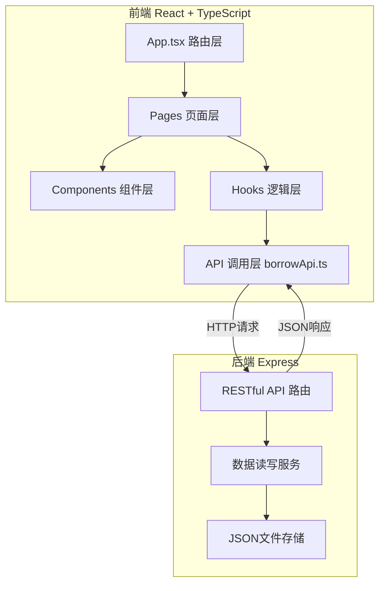
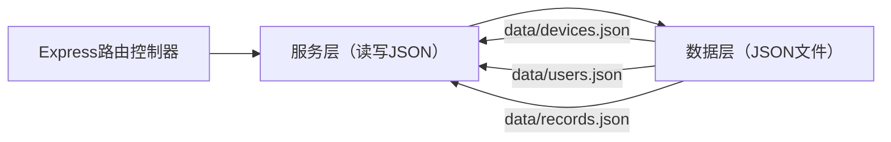
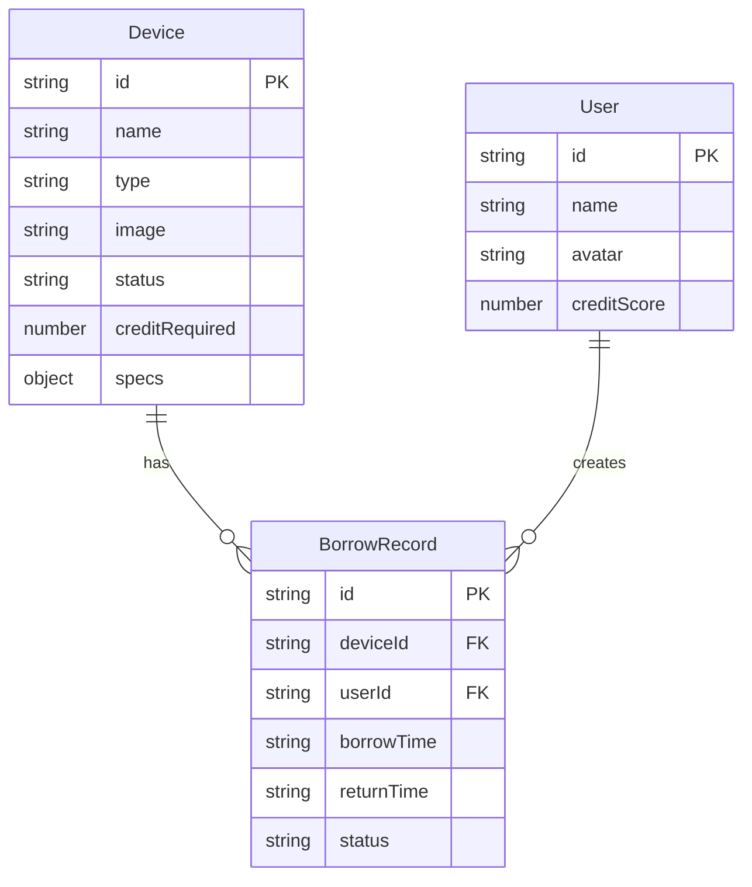

## 1. 架构设计



## 2. 技术说明
- 前端：React@18 + TypeScript + Vite + Tailwind CSS
- 初始化工具：vite-init（react-express-ts 模板）
- 后端：Express@4 + CORS
- 数据库：JSON文件存储（data/devices.json、data/users.json、data/records.json）
- 状态管理：Zustand
- 路由：react-router-dom
- 二维码：qrcode.react
- 时间处理：dayjs
- 唯一标识：uuid

## 3. 路由定义

| 路由 | 用途 |
|------|------|
| `/overview` | 设备总览页，网格展示所有设备卡片 |
| `/device/:id` | 设备详情页，展示设备大图、参数、借用记录 |
| `/profile` | 用户档案页，显示信用评分和借用历史 |
| `/admin` | 管理面板页，管理所有借用记录和设备 |

## 4. API定义

### 4.1 设备相关
- `GET /api/devices` → 返回所有设备列表 `Device[]`
- `GET /api/devices/:id` → 返回设备详情 `Device`

### 4.2 借用相关
- `POST /api/borrow` → 创建借用记录，body: `{ deviceId, userId }`，返回 `BorrowRecord`
- `POST /api/return` → 归还设备，body: `{ recordId }`，返回更新后的 `BorrowRecord`

### 4.3 用户相关
- `GET /api/users/:id` → 返回用户信息 `User`
- `GET /api/users/:id/records` → 返回用户借用记录 `BorrowRecord[]`

### 4.4 管理相关
- `GET /api/records` → 返回所有借用记录
- `PATCH /api/records/:id` → 更新借用记录状态

### 4.5 类型定义

```typescript
interface Device {
  id: string;
  name: string;
  type: string;
  image: string;
  status: 'available' | 'borrowed' | 'maintenance';
  creditRequired: number;
  specs: Record<string, string>;
}

interface User {
  id: string;
  name: string;
  avatar: string;
  creditScore: number;
}

interface BorrowRecord {
  id: string;
  deviceId: string;
  userId: string;
  borrowTime: string;
  returnTime: string | null;
  status: 'active' | 'returned_ontime' | 'returned_late';
}
```

## 5. 服务端架构图



## 6. 数据模型

### 6.1 数据模型定义



### 6.2 初始数据

devices.json 预置6台设备（显示器、耳机、投影仪等），users.json 预置2个用户（1普通+1管理员），records.json 预置3条借用记录（含按时归还、超时归还、进行中三种状态）。

## 7. 文件结构与调用关系

```
├── package.json
├── vite.config.js          → 构建配置，开发端口3000
├── tsconfig.json            → TypeScript严格模式
├── index.html               → 入口页面
├── data/
│   ├── devices.json         → 设备数据存储
│   ├── users.json           → 用户数据存储
│   └── records.json         → 借用记录存储
├── server/
│   └── index.js             → Express后端（被 borrowApi.ts 调用）
└── src/
    ├── App.tsx              → 根组件路由（调用 pages/*）
    ├── api/
    │   └── borrowApi.ts     → API调用模块（被 hooks/* 调用）
    ├── hooks/
    │   └── useBorrow.ts    → 借用状态Hook（被 components/* 调用）
    ├── components/
    │   └── DeviceCard.tsx   → 设备卡片组件（被 pages/* 调用）
    └── pages/
        ├── DeviceDetail.tsx → 设备详情页（调用 useBorrow、borrowApi）
        ├── Profile.tsx      → 用户档案页（调用 borrowApi）
        └── Admin.tsx        → 管理面板页（调用 borrowApi）
```

**数据流向**：
1. 用户操作 → Components/Pages → Hooks(useBorrow) → API(borrowApi) → HTTP请求
2. Express路由 → 读取/写入JSON文件 → 返回JSON响应
3. API响应 → Hooks状态更新 → Components重新渲染
