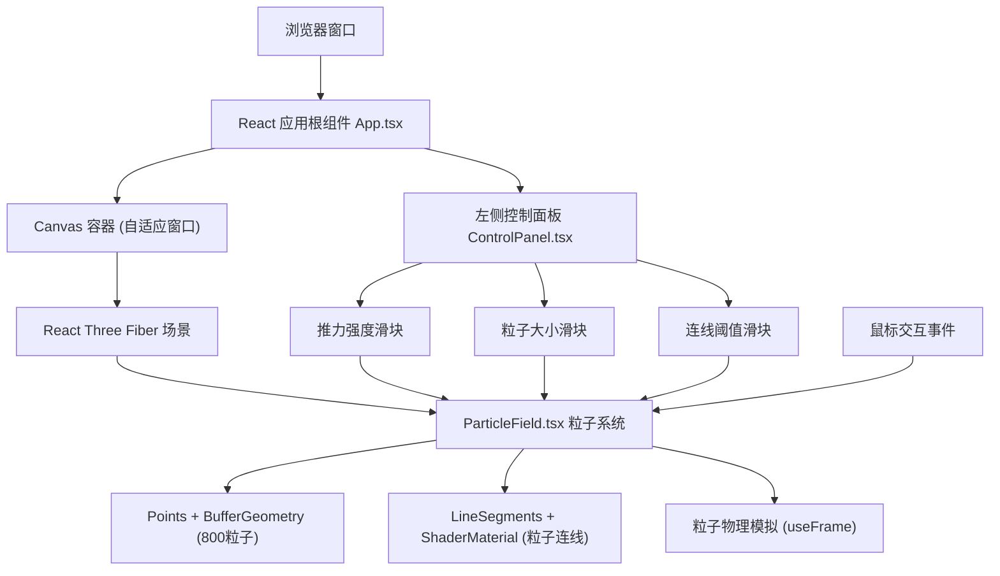

## 1. 架构设计



## 2. 技术描述
- 前端框架：React 18 + TypeScript 5 + Vite 5
- 3D渲染：Three.js + @react-three/fiber + @react-three/drei
- 构建工具：Vite（开发服务器端口3000）
- 无后端服务，纯前端静态项目

## 3. 项目文件结构

| 文件路径 | 用途 |
|----------|------|
| `/package.json` | 项目依赖与脚本配置 |
| `/vite.config.js` | Vite构建配置，开发端口3000 |
| `/tsconfig.json` | TypeScript严格模式配置 |
| `/index.html` | 入口HTML，全屏黑色背景 |
| `/src/ParticleField.tsx` | 核心粒子场组件，Three.js粒子系统与物理模拟 |
| `/src/ControlPanel.tsx` | 左侧控制面板UI，三个参数滑块 |
| `/src/App.tsx` | 根组件，组合子组件，处理鼠标事件与窗口自适应 |

## 4. 核心技术实现

### 4.1 粒子系统
- 使用 `THREE.Points` + `THREE.BufferGeometry` 管理800个粒子
- 粒子属性存储：position (Float32Array x2400)、velocity (内存数组 x2400)、color (Float32Array x2400)
- 粒子着色：自定义顶点片元ShaderMaterial，根据速度插值深蓝#1565c0→青色#00bcd4→亮黄#fdd835，径向渐变模拟发光

### 4.2 粒子连线
- 使用 `THREE.LineSegments` + `BufferGeometry` 动态生成连线
- 每帧计算所有粒子对距离，距离<阈值时记录线段顶点
- 连线颜色：rgba(255,255,255,0.1) 半透明白

### 4.3 物理模拟
- 每帧(useFrame)更新粒子：
  - 鼠标拖拽状态下：计算粒子到鼠标距离，80px内施加径向推力，推力随距离线性衰减
  - 阻尼系数：速度 *= 0.9
  - 随机抖动：速度 += (Math.random()-0.5) * 1.2
  - 鼠标释放后：1秒平滑过渡系数 blendFactor 从1→0，逐渐恢复纯随机游走
- 边界处理：粒子超出500x500区域从对侧环绕(wrap around)

### 4.4 参数控制
- 推力强度：0.5 - 3.0 步长0.1，默认1.5
- 粒子大小：1 - 6px 步长1，默认3
- 连线阈值：10 - 60px 步长5，默认30

### 4.5 性能优化
- 粒子位置/颜色使用 TypedArray 直接操作BufferAttribute，避免频繁GC
- 连线计算使用空间哈希预分组，减少O(n²)距离计算量
- 渲染目标稳定50FPS以上

## 5. 数据模型

### 5.1 粒子数据结构
```typescript
interface ParticleData {
  positions: Float32Array;   // 800 * 3 = 2400 (x, y, z=0)
  velocities: Float32Array;  // 800 * 3 = 2400 (vx, vy, vz=0)
  colors: Float32Array;      // 800 * 3 = 2400 (r, g, b)
  sizes: Float32Array;       // 800 (particle size in px)
}
```

### 5.2 控制参数
```typescript
interface ControlParams {
  forceStrength: number;   // 0.5 - 3.0
  particleSize: number;    // 1 - 6
  linkThreshold: number;   // 10 - 60
}
```

### 5.3 鼠标状态
```typescript
interface MouseState {
  isDragging: boolean;
  x: number;   // 归一化 -1 ~ 1
  y: number;   // 归一化 -1 ~ 1
}
```
