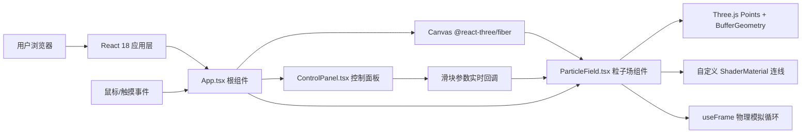

## 1. 架构设计



## 2. 技术描述
- 前端框架：React@18 + TypeScript
- 构建工具：Vite@5（开发端口3000）
- 3D渲染：Three.js + @react-three/fiber + @react-three/drei
- 样式方案：原生CSS（内联样式 + styled-jsx，不引入Tailwind）
- 项目初始化：Vite React+TS 模板手动配置依赖
- 后端服务：无（纯前端项目）

## 3. 路由定义
| 路由 | 用途 |
|------|------|
| / | 主页面，粒子场展示 + 控制面板 |

## 4. 文件结构
```
d:\demo-Solo\tasks\auto4\
├── package.json
├── vite.config.js
├── tsconfig.json
├── index.html
└── src/
    ├── main.tsx
    ├── App.tsx
    ├── ParticleField.tsx
    └── ControlPanel.tsx
```

## 5. 核心组件职责

### 5.1 App.tsx（根组件）
- 职责：组合Canvas渲染层与控制面板UI，处理窗口自适应与鼠标事件转发
- 状态：
  - mousePos: { x: number, y: number } 鼠标NDC坐标
  - isMouseDown: boolean 鼠标按下状态
  - thrustStrength: number 推力强度（0.5-3.0）
  - particleSize: number 粒子大小（1-6）
  - linkThreshold: number 连线阈值（10-60）
- 事件监听：pointerdown/pointermove/pointerup/pointerleave，resize

### 5.2 ParticleField.tsx（粒子场核心组件）
- 职责：管理800个粒子的位置/速度/颜色BufferAttribute，useFrame循环中执行物理模拟与渲染
- 关键常量：
  - PARTICLE_COUNT = 800
  - INITIAL_AREA = 500x500px
  - MOUSE_RADIUS = 80px
  - DAMPING = 0.9
  - JITTER = 1.2
  - RECOVERY_DURATION = 1000ms
- 数据结构：
  - positions: Float32Array(3*800) 粒子位置
  - velocities: Float32Array(3*800) 粒子速度
  - colors: Float32Array(3*800) 粒子颜色
  - baseVelocities: Float32Array(3*800) 基础随机游走速度
- 颜色映射：速度大小归一化 → 三色插值 lerp(#1565c0, #00bcd4, #fdd835)
- 连线：每帧遍历粒子对，距离<阈值时将线段顶点写入LineSegments的BufferGeometry

### 5.3 ControlPanel.tsx（控制面板）
- 职责：渲染三个自定义滑块组件，通过props回调将参数变化实时通知父组件
- 三个受控滑块：
  - 推力强度：min=0.5, max=3.0, step=0.1, default=1.5
  - 粒子大小：min=1, max=6, step=1, default=3
  - 连线阈值：min=10, max=60, step=5, default=30
- 自定义滑块样式：
  - track: 宽160px高4px，背景rgba(255,255,255,0.1)
  - track-active: 背景#fdd835
  - thumb: 直径14px圆形，背景#fdd835，box-shadow光晕效果

## 6. 性能优化策略
1. 使用Float32Array + BufferAttribute直接操作GPU显存，避免对象分配GC
2. 粒子颜色根据速度大小每帧重算并更新BufferAttribute，不重建Geometry
3. 连线使用空间划分或O(n^2)朴素算法但800粒子对实际只筛选近距离对，max连接数设上限避免爆炸
4. useFrame中只更新属性标记needsUpdate=true，不重创建Mesh
5. Points使用自定义ShaderMaterial生成圆形带径向渐变发光的精灵，贴图使用Canvas生成RadialGradient的DataTexture

## 7. 数据模型（内部状态）

### 7.1 控制参数类型
```typescript
interface ControlParams {
  thrustStrength: number;
  particleSize: number;
  linkThreshold: number;
}
```

### 7.2 鼠标状态类型
```typescript
interface MouseState {
  x: number;
  y: number;
  isDown: boolean;
  releaseTime: number;
}
```
