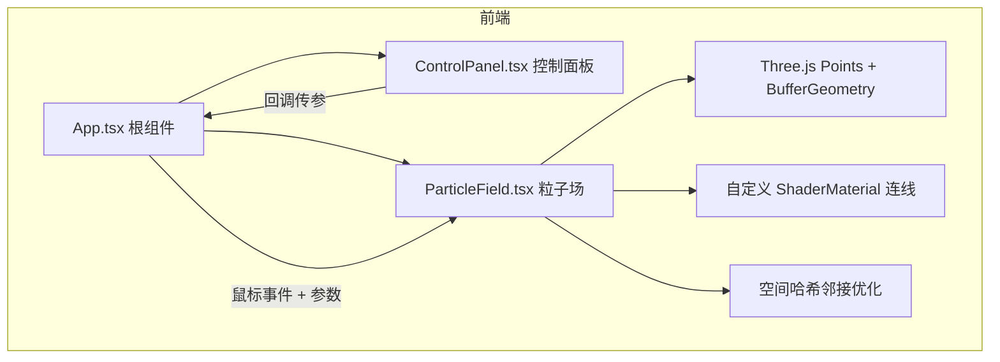

# 实时流体粒子扭曲特效 - 技术架构文档

## 1. 架构设计

## 2. 技术说明

- **前端**：React 18 + TypeScript + Three.js + @react-three/fiber + @react-three/drei
- **构建工具**：Vite（开发服务器端口 3000）
- **TypeScript**：严格模式，`jsx: react-jsx`，DOM lib
- **无后端**：纯前端交互可视化

## 3. 依赖清单

| 依赖 | 用途 |
|------|------|
| react / react-dom | UI 框架 |
| three | 3D/粒子渲染核心 |
| @react-three/fiber | React Three.js 绑定 |
| @react-three/drei | 辅助工具 |
| typescript | 类型安全 |
| vite / @vitejs/plugin-react | 构建与开发服务器 |
| @types/react / @types/react-dom / @types/three | 类型定义 |

## 4. 文件结构

| 文件 | 职责 |
|------|------|
| [package.json](file:///d:/demo-Solo/tasks/auto4/package.json) | 依赖与 `npm run dev` 脚本 |
| [vite.config.js](file:///d:/demo-Solo/tasks/auto4/vite.config.js) | Vite 配置，端口 3000 |
| [tsconfig.json](file:///d:/demo-Solo/tasks/auto4/tsconfig.json) | 严格模式 TS 配置 |
| [index.html](file:///d:/demo-Solo/tasks/auto4/index.html) | 全屏黑色入口 |
| [src/ParticleField.tsx](file:///d:/demo-Solo/tasks/auto4/src/ParticleField.tsx) | 800 粒子 BufferGeometry、速度色渐变、发光、ShaderMaterial 连线、空间哈希优化 |
| [src/ControlPanel.tsx](file:///d:/demo-Solo/tasks/auto4/src/ControlPanel.tsx) | 三滑块毛玻璃面板，回调传参 |
| [src/App.tsx](file:///d:/demo-Solo/tasks/auto4/src/App.tsx) | 组合组件、鼠标坐标转换、窗口 resize、FPS 保障 |

## 5. 关键参数

| 参数 | 值 |
|------|----|
| 粒子数量 | 800 |
| 分布区域 | 500×500px |
| 粒子大小 | 2-4px（可调 1-6） |
| 颜色渐变 | `#1565c0` → `#00bcd4` → `#fdd835` |
| 连线阈值 | 30px（可调 10-60） |
| 连线颜色 | `rgba(255,255,255,0.1)` |
| 鼠标推力半径 | 80px，线性衰减 |
| 推力强度 | 0.5-3.0（步长 0.1） |
| 阻尼系数 | 0.9 |
| 抖动幅度 | 1.2 |
| 恢复过渡 | 1 秒平滑 |
| 目标帧率 | ≥50 FPS |

## 6. 性能策略

- 使用空间哈希网格（cellSize = 连线阈值）仅检查邻近格子粒子对，将连线复杂度从 O(n²) 降至接近 O(n)。
- 粒子位置/速度存储于 `Float32Array`，每帧直接更新 BufferGeometry 的 `position` / `color` 属性并设 `needsUpdate`。
- 连线以动态 `LineSegments` + `BufferGeometry` 绘制，顶点数按实际连接数更新。
- `requestAnimationFrame` 主循环与 React Three Fiber 的渲染循环统一，保证 50+ FPS。
