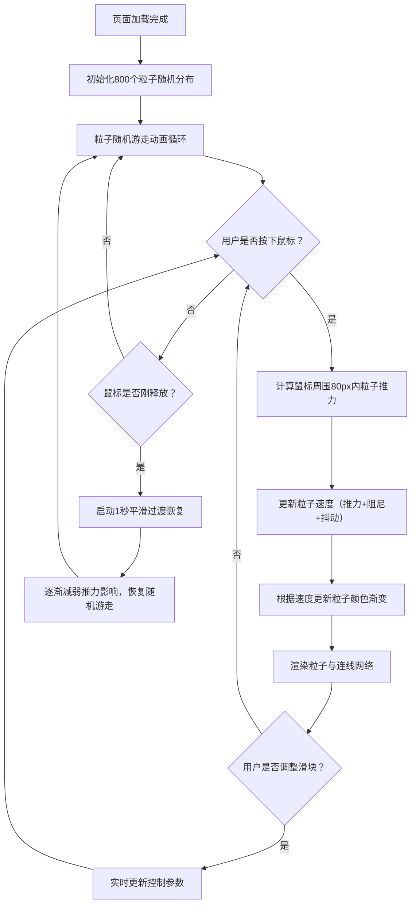

## 1. 产品概述
实时流体粒子扭曲特效展示项目，通过鼠标拖拽与800个粒子进行实时交互，营造流体扭曲与漩涡视觉效果。
- 主要用途：创意视觉展示、交互体验Demo、粒子物理效果演示
- 目标用户：前端开发者、视觉设计师、交互艺术爱好者

## 2. 核心特性

### 2.1 用户角色
| 角色 | 注册方式 | 核心权限 |
|------|----------|----------|
| 访客用户 | 无需注册 | 体验粒子交互效果、调整控制面板参数 |

### 2.2 功能模块
1. **粒子场主画布**：800个粒子渲染、动态颜色渐变、粒子连线网络
2. **鼠标交互系统**：拖拽推力效果、平滑过渡恢复
3. **参数控制面板**：推力强度、粒子大小、连线阈值实时调节

### 2.3 页面详情
| 页面名称 | 模块名称 | 功能描述 |
|----------|----------|----------|
| 主页面 | 粒子场画布 | Three.js渲染800个粒子，2-4px圆形，初始500x500px区域随机分布，颜色根据速度渐变（深蓝#1565c0→青色#00bcd4→亮黄#fdd835），径向渐变发光效果，粒子间30px阈值连线（半透明白色），稳定50FPS+ |
| 主页面 | 鼠标交互 | 按住左键拖拽时，以鼠标为中心80px半径内粒子受径向推力，线性距离衰减，0.9阻尼系数，1.2随机抖动幅度，松手后1秒平滑过渡恢复随机游走 |
| 主页面 | 控制面板 | 左侧220px宽透明面板（rgba(10,10,20,0.7)，16px圆角，blur(12px)毛玻璃），三个滑块：推力强度(0.5-3.0步长0.1)、粒子大小(1-6px步长1)、连线阈值(10-60px步长5)，滑块样式：160x4px条形，14px直径圆点，#fdd835亮黄色 |

## 3. 核心流程

用户打开页面 → 粒子随机游走动画自动播放 → 用户按住鼠标左键拖拽 → 粒子受推力产生扭曲漩涡 → 调整控制面板滑块 → 粒子参数实时响应 → 松开鼠标 → 粒子1秒内平滑恢复随机游走

## 4. 用户界面设计

### 4.1 设计风格
- 主色调：深黑背景(#000000)，粒子渐变三色（深蓝#1565c0、青色#00bcd4、亮黄#fdd835）
- 控制面板：半透明深色毛玻璃效果，16px大圆角营造现代科技感
- 滑块样式：细长条形+亮黄色圆点，与粒子快速状态颜色呼应
- 整体风格：赛博朋克/流体物理可视化，极简但富有动感
- 视觉重点：粒子动态扭曲效果为中心，控制面板悬浮左侧不干扰主体

### 4.2 页面设计概述
| 页面名称 | 模块名称 | UI元素 |
|----------|----------|--------|
| 主页面 | 粒子场画布 | 全屏黑色背景，500x500px初始粒子区域居中，800粒子动态渲染，发光径向渐变，30px连线网络 |
| 主页面 | 控制面板 | 左侧24px边距悬浮，220px宽，背景rgba(10,10,20,0.7)，圆角16px，backdrop-filter: blur(12px)，内边距20px，包含三组滑块控件（标签+数值显示+自定义滑块） |
| 主页面 | 滑块控件 | 标签文字白色14px，数值显示右对齐#fdd835黄色14px monospace字体，滑块轨道160x4px深灰rgba(255,255,255,0.1)，活动轨道#fdd835，滑块圆点14px直径带柔和阴影 |

### 4.3 响应式设计
- 桌面端优先设计，Canvas自适应窗口尺寸
- 控制面板固定左侧，不随窗口缩放改变位置
- 触控设备支持手指拖拽交互（touch事件兼容）

### 4.4 3D场景指导
- 渲染引擎：Three.js + @react-three/fiber
- 相机设置：正交相机，适配Canvas尺寸，Z轴固定
- 粒子系统：使用Points + BufferGeometry高性能渲染
- 粒子连线：自定义ShaderMaterial绘制线段，减少draw call
- 性能优化：BufferAttribute批量更新，避免每帧重建几何体，目标50FPS+
