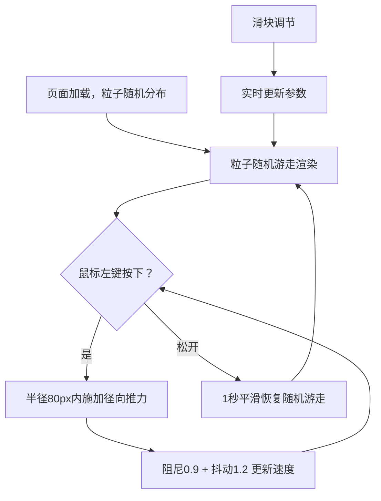

# 实时流体粒子扭曲特效 - 产品需求文档

## 1. 产品概述

实时流体粒子扭曲特效是一个基于 WebGL 的交互式可视化应用，用户通过拖拽鼠标在画布上"拨开"粒子流场，产生扭曲与漩涡效果。

- **核心目的**：提供一个高性能、高视觉表现力的粒子流体交互演示，展现鼠标驱动的实时流场扭曲。
- **目标用户**：前端可视化开发者、交互艺术爱好者、技术展示场景。
- **价值**：以 50+ FPS 的稳定帧率呈现 800 粒子的实时物理模拟，具备可调参数的实验性沙盒体验。

## 2. 核心功能

### 2.2 功能模块

1. **粒子场（ParticleField）**：800 个粒子的位置/速度管理、颜色速度渐变、发光、连线渲染。
2. **控制面板（ControlPanel）**：推力强度、粒子大小、连线阈值三个实时滑块。
3. **根容器（App）**：鼠标事件传递、画布自适应窗口尺寸、FPS 稳定保障。

### 2.3 页面详情

| 页面/区域 | 模块名称 | 功能描述 |
|-----------|----------|----------|
| 主画布 | 粒子系统 | 800 粒子随机分布在 500×500px，大小 2-4px，颜色按速度深蓝→青→亮黄渐变，径向发光，30px 阈值连线 |
| 主画布 | 鼠标交互 | 左键拖拽半径 80px 内粒子受径向推力，线性衰减，阻尼 0.9，抖动 1.2，放手 1s 平滑恢复 |
| 左侧面板 | 控制面板 | 宽 220px，毛玻璃背景，3 滑块自定义黄色圆点，实时无延迟响应 |

## 3. 核心流程

用户打开页面 → 粒子随机游走并以颜色/连线呈现 → 按住左键拖拽 → 鼠标半径 80px 内粒子受径向推力产生漩涡 → 松手 → 1 秒平滑过渡恢复随机游走 → 调节滑块实时改变推力/大小/连线阈值。

## 4. 用户界面设计

### 4.1 设计风格

- **主色调**：深黑背景 `#000000`，粒子速度色阶 `#1565c0`（深蓝）→ `#00bcd4`（青）→ `#fdd835`（亮黄）。
- **连线**：半透明白 `rgba(255,255,255,0.1)`。
- **控制面板**：`rgba(10,10,20,0.7)` 背景，圆角 16px，`backdrop-filter: blur(12px)` 毛玻璃。
- **滑块**：宽 160px、高 4px 细条，圆点直径 14px，统一亮黄 `#fdd835`。
- **布局**：画布全屏铺满，控制面板固定左侧。

### 4.2 页面设计概览

| 页面名称 | 模块名称 | UI 元素 |
|----------|----------|---------|
| 主画布 | 粒子场 | 全屏黑色画布，800 发光粒子，白色细连线，速度色渐变 |
| 左侧面板 | 控制面板 | 毛玻璃浮层，3 个黄色圆点自定义滑块，标题与数值显示 |

### 4.3 响应式

桌面优先，画布通过 resize 监听自适应窗口尺寸；控制面板固定定位不随画布缩放。

### 4.4 3D/着色器指导

- 使用 Three.js `Points` + `BufferGeometry` 渲染粒子，自定义 `ShaderMaterial` 绘制连线（按阈值筛点对）。
- 粒子发光通过着色器径向渐变模拟；空间哈希优化连线邻接查询以稳定 50+ FPS。
- 相机正交/固定，聚焦 500×500 区域，交互坐标需转换到画布空间。
