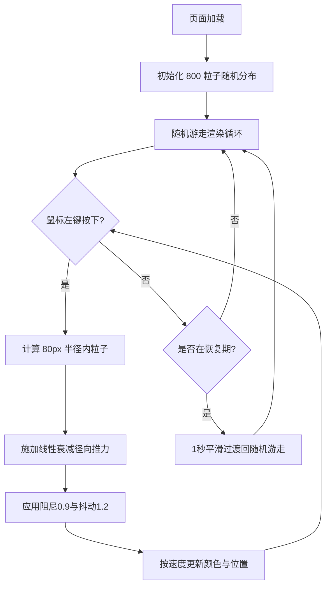

# 实时流体粒子扭曲特效展示 - 产品需求文档 (PRD)

## 1. 产品概述
本项目是一个基于 WebGL 的实时流体粒子扭曲特效展示页面，用户通过鼠标拖拽在画布中拨动粒子流场，产生类似"无形之手拨开流体"的扭曲与漩涡视觉反馈。
- 核心目的：呈现高帧率、高质感的交互式粒子流体效果，强调鼠标推力与粒子运动之间的实时物理响应
- 目标用户：前端开发者、视觉创意爱好者、交互艺术鉴赏者

## 2. 核心功能

### 2.1 用户角色
本项目为单页可视化展示，无角色区分，所有访客均为体验者。

### 2.2 功能模块
1. **粒子场主画面**：800 个发光粒子的渲染、连线、速度着色与物理更新
2. **鼠标交互层**：左键拖拽产生径向推力，松手后平滑恢复随机游走
3. **控制面板**：左侧毛玻璃面板，提供推力强度、粒子大小、连线阈值三个滑块

### 2.3 页面详情
| 页面区域 | 模块名称 | 功能描述 |
|----------|----------|----------|
| 主画布 | 粒子系统 | 800 个 2-4px 圆形粒子，随机分布在 500x500px 区域，颜色随速度由 #1565c0 → #00bcd4 → #fdd835 渐变，带径向发光，粒子间距 ≤30px 时绘制半透明白连线 |
| 主画布 | 鼠标推力 | 按住左键拖拽时，以鼠标为中心半径 80px 内粒子受指向鼠标的径向推力，推力线性衰减；阻尼 0.9、抖动 1.2；松手后 1 秒内平滑恢复随机游走 |
| 左侧面板 | 控制面板 | 宽 220px，背景 rgba(10,10,20,0.7)，圆角 16px，毛玻璃 blur(12px)；三个自定义滑块：推力强度(0.5-3.0, 步长0.1)、粒子大小(1-6px, 步长1)、连线阈值(10-60px, 步长5)；滑块为细长条(160x4px)配 14px 黄色圆点 |

## 3. 核心流程
用户打开页面后看到随机游走的发光粒子流场；按住鼠标左键在画布上拖动，鼠标周围 80px 内的粒子被径向推开形成漩涡扭曲；调节左侧滑块可实时改变推力强度、粒子大小与连线密度；松开鼠标后粒子在 1 秒内平滑回到随机游走状态。

## 4. 用户界面设计

### 4.1 设计风格
- 主色调：深空黑底(#000000) + 粒子速度渐变(深蓝 #1565c0 / 青 #00bcd4 / 亮黄 #fdd835)
- 强调色：亮黄 #fdd835（用于滑块圆点与高亮交互元素）
- 控件风格：毛玻璃半透明面板，细长滑块配发光圆点
- 布局：全屏画布 + 左侧悬浮控制面板
- 字体：等宽科技感字体（用于滑块数值标签）

### 4.2 页面设计概览
| 页面区域 | 模块名称 | UI 元素 |
|----------|----------|---------|
| 全屏背景 | 画布容器 | 纯黑背景，Three.js 全屏 Canvas，自适应窗口 |
| 左侧 | 控制面板 | rgba(10,10,20,0.7) 毛玻璃背景，16px 圆角，含 3 个 160x4px 滑块 + 14px 黄色圆点 + 数值标签 |
| 主画面 | 粒子层 | 800 粒子带发光径向渐变，速度着色，半透明白连线 |

### 4.3 响应式
- 桌面优先设计，Canvas 自适应窗口尺寸
- 鼠标事件坐标需根据 Canvas 实际尺寸换算到粒子坐标系

### 4.4 3D 场景指引
- 环境：纯黑背景，无环境光依赖（粒子用 ShaderMaterial 自发光）
- 相机：正交相机或固定透视相机正对 XY 平面，无运动
- 粒子渲染：Three.js Points + BufferGeometry，自定义 ShaderMaterial 实现圆形发光粒子与速度着色
- 连线渲染：自定义 ShaderMaterial 绘制 LineSegments，阈值内连线
- 性能预算：50+ FPS 稳定，800 粒子 + 连线场景
