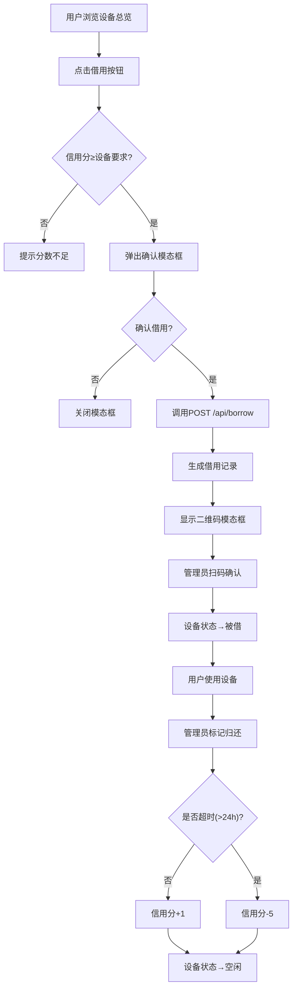

## 1. 产品概述

共享办公空间设备借用与信用评级应用，解决自由职业者临时借用显示器、耳机、投影仪等设备时因缺少统一登记系统导致设备找不到主人的问题。目标用户为共享办公空间的自由职业者和设备管理员。

- 核心问题：设备借还无追踪、信用无评估、超时无惩罚
- 产品价值：建立设备借还闭环、信用评级保障公平使用、扫码确认提升效率

## 2. 核心功能

### 2.1 用户角色

| 角色 | 注册方式 | 核心权限 |
|------|----------|----------|
| 普通用户 | 系统预设账号 | 浏览设备、发起借用、查看个人档案与信用分 |
| 设备管理员 | 系统预设管理员账号 | 管理设备清单、扫码确认借还、处理超时归还 |

### 2.2 功能模块

1. **设备总览页**：网格展示所有可借设备卡片，支持借用操作
2. **设备详情页**：设备大图、技术参数、历史借用记录、借用按钮
3. **用户档案页**：头像、信用评分圆形进度条、借用历史表格
4. **管理面板页**：所有借用记录列表、标记归还操作

### 2.3 页面详情

| 页面名称 | 模块名称 | 功能描述 |
|----------|----------|----------|
| 设备总览页 | 设备网格 | 以4/3/2列响应式网格展示设备卡片，每卡片含缩略图、名称、类型标签、状态徽章、借用按钮 |
| 设备总览页 | 借用确认模态框 | 点击借用后弹出确认框，确认后显示二维码模态框 |
| 设备总览页 | 二维码模态框 | 半透明背景居中显示，含借用记录ID的二维码256px，关闭按钮右上角 |
| 设备详情页 | 设备信息 | 大图、完整技术参数、当前状态、最低信用分要求 |
| 设备详情页 | 历史借用记录 | 每行显示用户名首字母、借用时间、归还时间 |
| 设备详情页 | 借用按钮 | 底部固定，状态与卡片按钮相同逻辑 |
| 用户档案页 | 用户信息 | 圆形头像60px，信用评分圆形进度条0-100（红→绿渐变） |
| 用户档案页 | 借用历史表格 | 设备名称、借用时间、归还时间、状态色块（绿#22c55e/黄#eab308/红#ef4444） |
| 管理面板页 | 记录管理 | 所有借用记录列表，标记归还操作按钮 |

## 3. 核心流程

**借用流程**：用户浏览设备总览 → 点击设备卡片借用按钮 → 弹出确认模态框 → 确认借用 → 调用后端API生成借用记录 → 前端显示二维码模态框 → 管理员扫码确认 → 设备状态变为"被借"

**归还流程**：管理员在管理面板查看未归还记录 → 点击标记归还 → 系统计算是否超时 → 更新用户信用分 → 设备状态变为"空闲"

**信用评分规则**：初始100分 → 按时归还+1分 → 超时（>24h）-5分 → 低于80分无法借用信用要求≥80的设备

## 4. 用户界面设计

### 4.1 设计风格

- 主色：深蓝 #1e293b，辅色：灰白 #f8fafc
- 卡片背景：白色 #ffffff，阴影：0 2px 8px rgba(0,0,0,0.08)
- 按钮：主色深蓝，禁用态 #94a3b8，悬浮色变深
- 字体：系统字体栈，标题加粗，正文常规
- 布局：顶部固定导航栏60px深色#1e293b，内容区网格布局
- 状态徽章：绿色#22c55e空闲/黄色#eab308被借/红色#ef4444维修

### 4.2 页面设计概览

| 页面名称 | 模块名称 | UI元素 |
|----------|----------|--------|
| 通用 | 顶部导航栏 | 高度60px，背景#1e293b，左侧Logo"设备共享站"，右侧导航链接，当前页下划线渐变蓝#3b82f6 |
| 设备总览页 | 设备网格 | 响应式4/3/2列，卡片宽240px高320px，圆角12px，悬浮上移4px阴影加深，间距24px |
| 设备总览页 | 设备卡片 | 缩略图、名称、类型标签、状态徽章（绿/黄/红），借用按钮 |
| 设备总览页 | 确认模态框 | 居中，深蓝按钮，灰色取消按钮 |
| 设备总览页 | 二维码模态框 | 半透明#00000080背景，居中白色框圆角12px，二维码256px，周围留白16px，右上角关闭按钮 |
| 设备详情页 | 设备信息区 | 大图宽100%圆角8px，技术参数列表，借用记录列表 |
| 设备详情页 | 借用按钮 | 底部固定，深蓝主色，信用不足红色提示+禁用 |
| 用户档案页 | 信用进度条 | 圆形进度条，0-100分，颜色从#ef4444渐变到#22c55e |
| 用户档案页 | 头像 | 圆形60px，边框2px solid #e5e7eb |
| 用户档案页 | 借用历史表格 | 列：设备名称、借用时间、归还时间、状态色块 |
| 管理面板页 | 记录表格 | 所有记录列表，归还操作按钮 |

### 4.3 响应式设计

- 大屏幕（≥1024px）：每行4张卡片
- 中屏幕（768-1023px）：每行3张卡片
- 小屏幕（<768px）：每行2张卡片，宽100%高度自适应
- 桌面优先设计，移动端触摸优化

### 4.4 动效设计

- 卡片悬浮：上移4px，阴影加深至0 8px 24px rgba(0,0,0,0.15)，过渡0.3s ease-in-out
- 按钮悬浮：色变深，微动反馈
- 页面切换：0.3s ease-out过渡
- 模态框：淡入淡出0.3s
