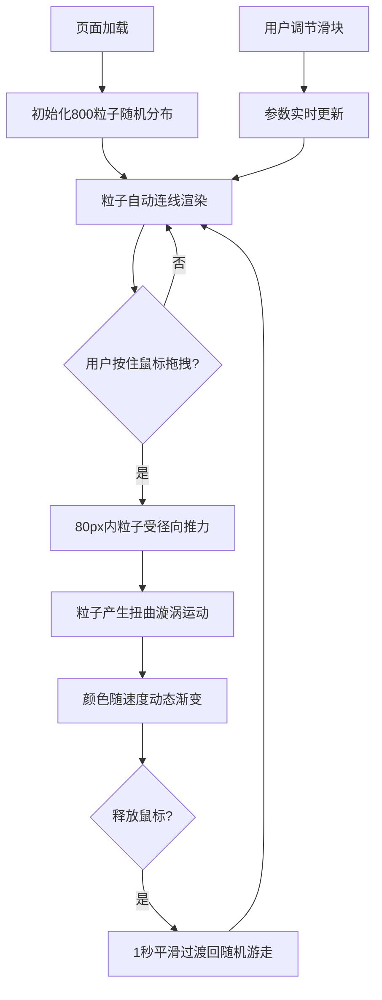

## 1. 产品概述

实时流体粒子扭曲特效展示项目，通过WebGL技术实现高性能粒子流场交互。用户可通过鼠标拖拽影响粒子运动轨迹，产生扭曲和漩涡视觉效果，适用于前端技术展示、交互艺术及视觉特效演示场景。

## 2. 核心功能

### 2.1 用户角色
| 角色 | 注册方式 | 核心权限 |
|------|----------|----------|
| 访客用户 | 无需注册 | 体验粒子交互效果，调整可视化参数 |

### 2.2 功能模块
1. **粒子场渲染系统**：800个粒子的实时位置、速度、颜色渲染
2. **鼠标交互系统**：拖拽产生径向推力场，影响粒子运动轨迹
3. **参数控制面板**：实时调节推力强度、粒子大小、连线阈值
4. **粒子连线系统**：近距离粒子间自动连线，形成流体网络视觉

### 2.3 页面详情
| 页面名称 | 模块名称 | 功能描述 |
|----------|----------|----------|
| 主页面 | 粒子画布 | 全屏500x500粒子场区域，Three.js实时渲染，支持鼠标拖拽交互 |
| 主页面 | 控制面板 | 左侧悬浮控制面板，三个滑块参数调节，带毛玻璃效果 |
| 主页面 | 粒子连线 | 自动计算粒子距离并绘制半透明连线网络 |

## 3. 核心流程

用户打开页面→800个粒子随机分布在画布上，粒子间自动连线→用户按住鼠标左键拖拽→半径80px内粒子受径向推力产生运动扭曲→粒子颜色随速度从深蓝→青色→亮黄动态渐变→用户释放鼠标→粒子逐渐过渡回随机游走状态→用户可通过左侧滑块实时调节推力强度/粒子大小/连线阈值。

## 4. 用户界面设计

### 4.1 设计风格
- 主色调：黑色背景（#000000），粒子渐变从深蓝#1565c0 → 青色#00bcd4 → 亮黄#fdd835
- 控制面板：rgba(10,10,20,0.7)半透明深色背景，16px圆角，毛玻璃模糊效果
- 滑块样式：细高4px条形，滑块圆点直径14px，亮黄色#fdd835
- 视觉风格：科技感、沉浸式、极简暗色调

### 4.2 页面设计概述
| 页面名称 | 模块名称 | UI元素 |
|----------|----------|--------|
| 主页面 | 粒子画布 | 500x500渲染区域，圆形粒子带径向渐变发光，半透明白色连线网络 |
| 主页面 | 控制面板 | 宽220px左侧悬浮面板，三个带数值显示的自定义滑块，标题文字 |
| 主页面 | 鼠标交互 | 拖拽时产生无形推力场视觉效果 |

### 4.3 响应式
- 桌面端优先设计，canvas自适应窗口尺寸
- 控制面板固定左侧，不随窗口滚动
- 滑块控件支持鼠标点击和拖拽调节

### 4.4 3D场景指导
- 渲染引擎：Three.js via @react-three/fiber
- 粒子系统：Points + BufferGeometry高性能渲染
- 粒子着色：自定义ShaderMaterial，根据速度动态着色
- 连线渲染：使用自定义ShaderMaterial绘制线段
- 性能目标：稳定50FPS以上
- 相机设置：正交相机，正对画布平面
