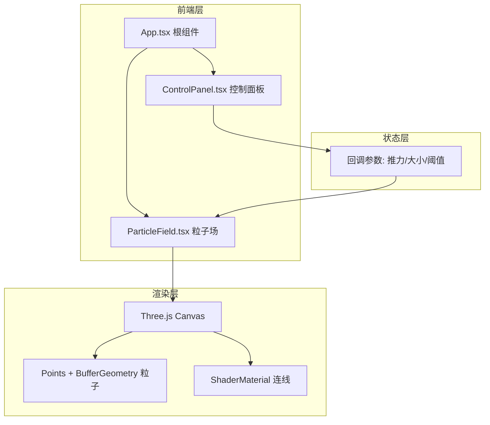

# 实时流体粒子扭曲特效展示 - 技术架构文档

## 1. 架构设计



## 2. 技术说明
- 前端：React 18 + TypeScript + Vite
- 3D 渲染：three + @react-three/fiber + @react-three/drei
- 初始化工具：Vite（端口 3000）
- 后端：无
- 数据库：无

### 2.1 依赖清单 (package.json)
| 依赖 | 用途 |
|------|------|
| react / react-dom | UI 框架 |
| three | WebGL 渲染引擎 |
| @react-three/fiber | React 绑定 Three.js |
| @react-three/drei | Three.js 辅助工具 |
| typescript | 类型系统 |
| vite + @vitejs/plugin-react | 构建与开发服务器 |
| @types/react / @types/react-dom / @types/three | 类型定义 |

### 2.2 文件结构
```
project-root/
├── package.json
├── vite.config.js
├── tsconfig.json
├── index.html
└── src/
    ├── App.tsx          # 根组件，组合粒子场与控制面板，处理 canvas 自适应
    ├── ParticleField.tsx  # 粒子场核心，管理 800 粒子位置/速度/渲染/鼠标交互
    └── ControlPanel.tsx  # 左侧毛玻璃控制面板，三个自定义滑块
```

## 3. 路由定义
本项目为单页可视化展示，无路由。

| 路由 | 用途 |
|------|------|
| / | 全屏粒子特效展示页（Vite 开发服务器根路径） |

## 4. API 定义
无后端，无 API。

## 5. 服务器架构
无后端服务。

## 6. 数据模型

### 6.1 粒子数据模型
本项目无持久化数据，所有状态在内存中由 Three.js BufferGeometry 的 attribute 管理：

| 属性 | 类型 | 说明 |
|------|------|------|
| position | Float32Array (N×3) | 粒子位置 (x, y, z) |
| velocity | Float32Array (N×2) | 粒子速度 (vx, vy) |
| color | Float32Array (N×3) | 粒子颜色 RGB，按速度动态计算 |
| size | Float32Array (N) | 粒子点大小 |

### 6.2 控制参数模型
| 参数 | 类型 | 范围 | 默认值 |
|------|------|------|--------|
| thrustStrength | number | 0.5 - 3.0 (步长0.1) | 1.5 |
| particleSize | number | 1 - 6 (步长1) | 3 |
| connectionThreshold | number | 10 - 60 (步长5) | 30 |

### 6.3 鼠标交互状态模型
| 状态 | 类型 | 说明 |
|------|------|------|
| isDragging | boolean | 鼠标左键是否按下 |
| mousePos | {x, y} | 鼠标在粒子坐标系中的位置 |
| releaseTime | number | 松手时间戳，用于 1 秒平滑恢复 |
