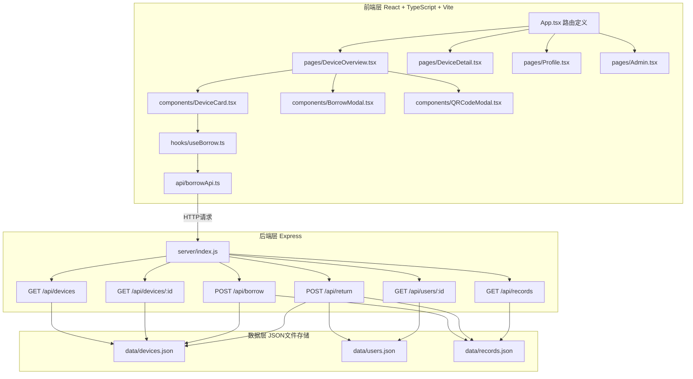
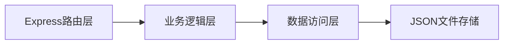
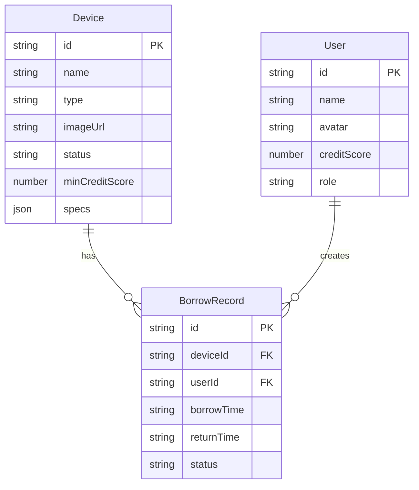

## 1. 架构设计



## 2. 技术说明

- 前端：React@18 + TypeScript + Vite（开发端口3000）
- 状态管理：Zustand
- 样式：Tailwind CSS
- 路由：react-router-dom
- 图标：lucide-react
- 二维码：qrcode.react
- 初始化工具：vite-init (react-express-ts模板)
- 后端：Express@4 + CORS
- 数据库：JSON文件存储（devices.json、users.json、records.json）
- 日期处理：dayjs
- ID生成：uuid

## 3. 路由定义

| 路由 | 用途 |
|------|------|
| /overview | 设备总览页，网格展示所有可借设备 |
| /device/:id | 设备详情页，展示设备大图、参数、历史记录 |
| /profile | 用户档案页，头像、信用评分、借用历史 |
| /admin | 管理面板页，管理所有借用记录、标记归还 |

## 4. API定义

### 4.1 TypeScript类型定义

```typescript
interface Device {
  id: string;
  name: string;
  type: string;
  imageUrl: string;
  status: "available" | "borrowed" | "maintenance";
  minCreditScore: number;
  specs: Record<string, string>;
}

interface User {
  id: string;
  name: string;
  avatar: string;
  creditScore: number;
  role: "user" | "admin";
}

interface BorrowRecord {
  id: string;
  deviceId: string;
  userId: string;
  borrowTime: string;
  returnTime: string | null;
  status: "active" | "returned" | "overdue";
}
```

### 4.2 请求/响应模式

| 端点 | 方法 | 请求体 | 响应 |
|------|------|--------|------|
| /api/devices | GET | - | Device[] |
| /api/devices/:id | GET | - | Device |
| /api/borrow | POST | { deviceId, userId } | BorrowRecord |
| /api/return | POST | { recordId } | BorrowRecord |
| /api/users/:id | GET | - | User |
| /api/records | GET | - | BorrowRecord[] |

## 5. 服务器架构图



- 路由层：处理HTTP请求，参数校验
- 业务逻辑层：借用校验（信用分、设备状态）、信用分计算（按时+1/超时-5）、状态更新
- 数据访问层：读写JSON文件，使用uuid生成记录ID，dayjs处理时间

## 6. 数据模型

### 6.1 数据模型定义



### 6.2 初始数据

**devices.json** - 预设8个设备（显示器2、耳机2、投影仪2、键盘1、摄像头1），包含名称、类型、图片URL、状态（默认available）、最低信用分、技术参数

**users.json** - 预设3个用户（2普通用户+1管理员），包含姓名、头像首字母、信用分、角色

**records.json** - 预设3条历史借用记录，包含不同状态（按时归还、超时归还、未归还）

## 7. 文件结构与调用关系

```
├── package.json
├── vite.config.ts          → 构建配置，端口3000
├── tsconfig.json           → 严格模式，jsx: react-jsx
├── index.html              → 入口页面
├── src/
│   ├── App.tsx             → 路由定义，调用pages
│   ├── api/
│   │   └── borrowApi.ts    → HTTP请求封装，被hooks调用
│   ├── hooks/
│   │   └── useBorrow.ts    → 借用状态管理，调用borrowApi，被组件调用
│   ├── components/
│   │   ├── DeviceCard.tsx  → 设备卡片，调用useBorrow
│   │   ├── BorrowModal.tsx → 借用确认模态框
│   │   └── QRCodeModal.tsx → 二维码模态框，使用qrcode.react
│   ├── pages/
│   │   ├── DeviceOverview.tsx → 总览页，使用DeviceCard
│   │   ├── DeviceDetail.tsx   → 详情页，调用borrowApi
│   │   ├── Profile.tsx        → 档案页，调用borrowApi
│   │   └── Admin.tsx          → 管理页，调用borrowApi
│   ├── store/
│   │   └── useStore.ts     → Zustand全局状态（当前用户等）
│   └── types/
│       └── index.ts        → TypeScript类型定义
├── server/
│   └── index.js            → Express后端，RESTful API
└── data/
    ├── devices.json        → 设备数据
    ├── users.json          → 用户数据
    └── records.json        → 借用记录数据
```
