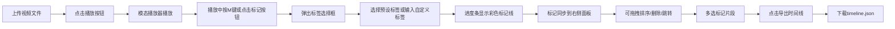

## 1. 产品概述

ClipMarker 是一款面向音视频创作者的素材标记与分类工具，解决大量原始视频素材检索困难、人工整理耗时的痛点问题。通过可视化标记和时间线导出功能，帮助创作者快速整理素材并生成剪辑草稿。

- 核心目标：提升视频素材整理效率，降低后期剪辑的前期准备工作
- 目标用户：Vlog博主、短视频创作者、纪录片剪辑师、多媒体制作人

## 2. 核心功能

### 2.1 功能模块

1. **视频上传区**：拖拽/点击上传视频文件，横向卡片列表展示
2. **模态播放器**：640x360播放器，含进度条、时间戳、播放控制
3. **标记系统**：M键/按钮添加标签，10种预设彩色标签，进度条可视化标记
4. **标记管理面板**：右侧边栏，按视频分组展示，支持跳转、拖拽排序、删除
5. **时间线导出**：多选标记片段，导出JSON格式剪辑草稿

### 2.3 页面详情

| 页面名称 | 模块名称 | 功能描述 |
|-----------|-------------|---------------------|
| 主页面 | 视频上传区 | 拖拽上传MP4/MOV（≤200MB），横向卡片320x180展示，圆角8px |
| 主页面 | 视频卡片 | 左侧缩略图+播放按钮(圆形36px,#ff5722)，右侧文件名/时长/大小 |
| 主页面 | 模态播放器 | 640x360尺寸，进度条+时间戳，M键/按钮添加标记 |
| 主页面 | 标签弹出框 | 输入框+10个预设标签(60x24px,圆角12px)，渐变色系 |
| 主页面 | 进度条标记 | 彩色竖线3px，悬停显示标签名和时间 |
| 主页面 | 标记面板 | 240px宽右侧边栏，#252526背景，12px内边距，分组排序展示 |
| 主页面 | 标记行 | 时间戳+标签名+缩略图32x32，跳转/拖拽/删除 |
| 主页面 | 导出功能 | 多选标记，导出timeline.json，含路径/起止帧/标签/排序 |

## 3. 核心流程

## 4. 用户界面设计

### 4.1 设计风格
- **整体主题**：暗色专业创作者风格
- **主背景**：#121212
- **卡片背景**：#1e1e1e
- **边栏背景**：#252526
- **主文字**：#e0e0e0
- **强调色**：#ff5722（橙红色）
- **预设标签渐变色**：#e53935 → #1e88e5（10个色值）
- **按钮交互**：点击时scale 0.95，0.2s过渡动画

### 4.2 页面设计概述

| 区域 | 模块 | UI要素 |
|-----------|-------------|-------------|
| 左侧75% | 上传区 | 虚线边框拖拽区，灰色提示文字，悬停变亮 |
| 左侧75% | 视频卡片网格 | 间距16px，卡片阴影hover过渡 |
| 左侧75% | 模态框 | 遮罩层rgba(0,0,0,0.8)，居中640x360播放区 |
| 左侧75% | 进度条 | 高度6px，#444背景，#ff5722进度色，标记线3px宽 |
| 右侧240px | 标记面板 | 固定定位，垂直滚动，分组标题加粗，标记行hover背景 |
| 右侧240px | 操作按钮 | 底部固定导出按钮，强调色，全宽 |

### 4.3 响应式设计
- **桌面端（≥768px）**：左右结构，左侧75%，右侧固定240px
- **移动端（<768px）**：单列上下布局，先视频区后边栏，全部滚动

### 4.4 性能指标
- 视频播放与标记拖拽 ≥30FPS
- 标记添加DOM操作 <50ms
- JSON导出 <100ms
