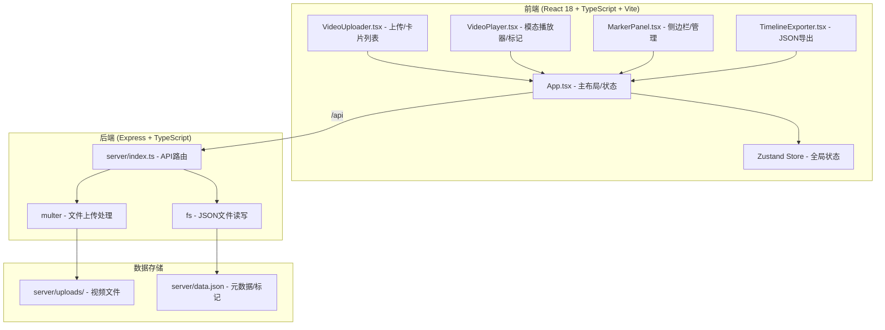
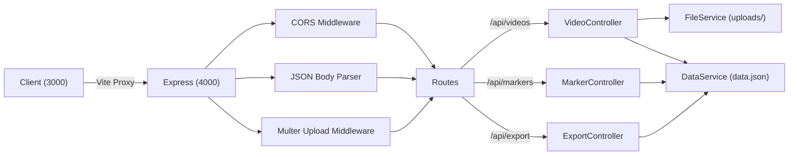
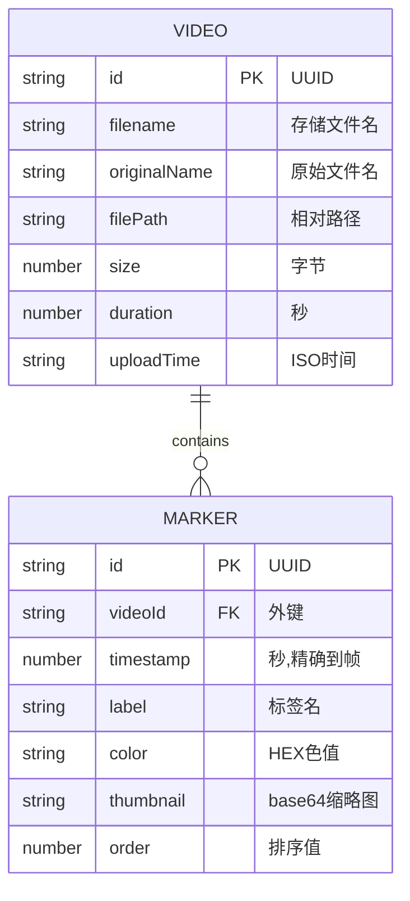

## 1. 架构设计



## 2. 技术说明

- **前端框架**：React 18 + TypeScript 5 (严格模式)
- **构建工具**：Vite 5，开发端口3000，代理/api到4000
- **状态管理**：Zustand 轻量全局store
- **样式方案**：原生CSS + CSS变量 (不使用Tailwind，保持自定义控制)
- **图标库**：lucide-react
- **后端框架**：Express 4 + TypeScript
- **文件上传**：Multer，限制200MB/文件，MP4/MOV类型
- **数据存储**：JSON文件持久化，UUID生成主键
- **跨域**：CORS中间件

## 3. 路由定义

| 路由 (前端) | 用途 |
|-------|---------|
| / | 主页面，单页应用全部功能 |

## 4. API 定义

```typescript
// 类型定义
interface Video {
  id: string;
  filename: string;
  originalName: string;
  filePath: string;
  size: number;
  duration: number; // 秒
  uploadTime: string;
  markers: Marker[];
}

interface Marker {
  id: string;
  videoId: string;
  timestamp: number; // 秒，精确到帧
  label: string;
  color: string;
  thumbnail?: string; // base64 dataURL
  order: number;
}

interface TimelineExport {
  version: string;
  exportedAt: string;
  clips: {
    videoPath: string;
    videoId: string;
    startTime: number;
    endTime: number;
    label: string;
    color: string;
    order: number;
    fps: number;
  }[];
}
```

### API端点

| 方法 | 路径 | 请求 | 响应 | 说明 |
|------|------|------|------|------|
| POST | /api/videos | multipart/form-data (file field) | Video | 上传视频文件 |
| GET | /api/videos | - | Video[] | 获取视频列表（含标记） |
| DELETE | /api/videos/:id | - | {success: true} | 删除视频及标记 |
| POST | /api/markers | {videoId, timestamp, label, color, thumbnail} | Marker | 添加标记 |
| PUT | /api/markers/:id | {label?, color?, order?} | Marker | 更新标记 |
| DELETE | /api/markers/:id | - | {success: true} | 删除标记 |
| GET | /api/export | query: markerIds (comma) | application/json | 导出时间线JSON |

## 5. 服务器架构图



## 6. 数据模型

### 6.1 数据模型定义



### 6.2 data.json 初始结构

```json
{
  "videos": [],
  "markers": []
}
```

## 7. 项目文件结构

```
├── package.json
├── vite.config.js
├── tsconfig.json
├── index.html
├── src/
│   ├── App.tsx          # 主组件
│   ├── VideoUploader.tsx # 上传+卡片列表
│   ├── VideoPlayer.tsx   # 模态播放器
│   ├── MarkerPanel.tsx   # 侧边栏
│   ├── TimelineExporter.tsx # 导出工具
│   ├── store.ts          # Zustand状态
│   └── types.ts          # 类型定义
└── server/
    ├── index.ts          # Express入口
    ├── data.json         # 数据存储
    └── uploads/          # 上传目录 (自动创建)
```
