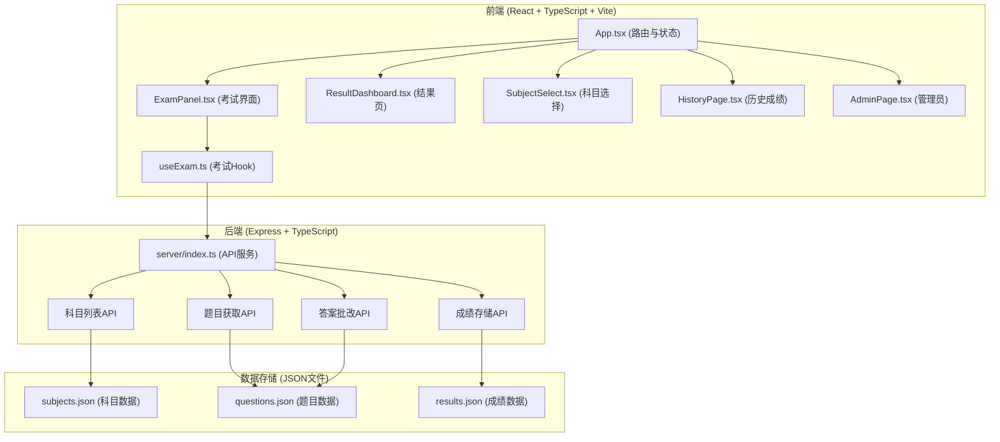
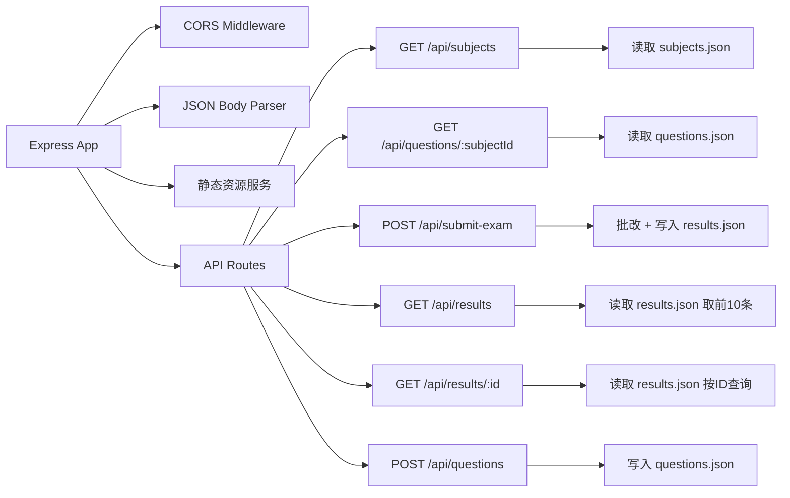
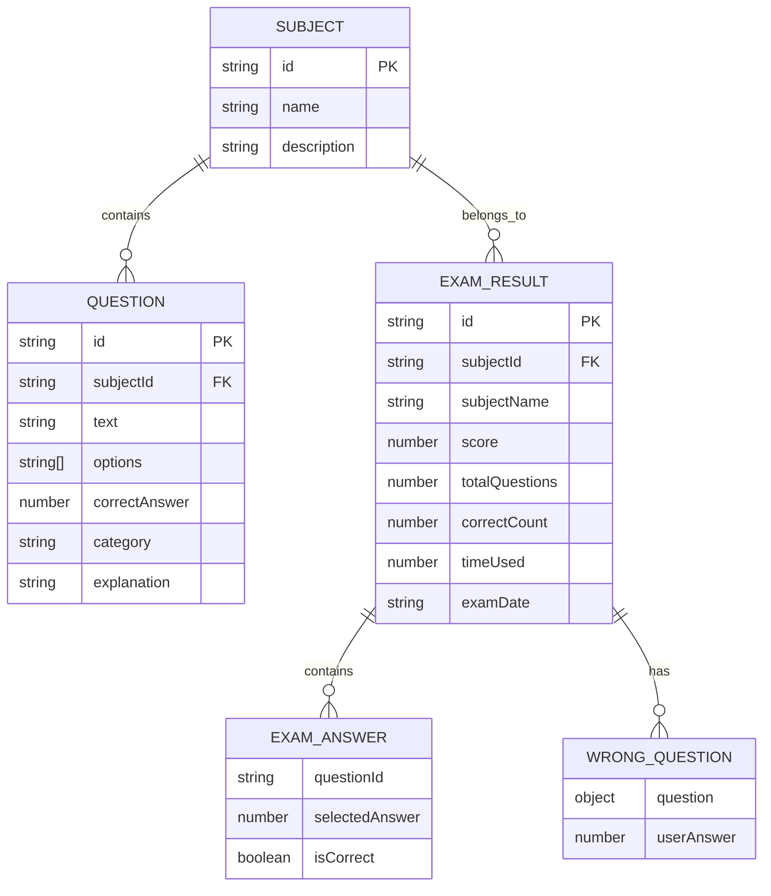

## 1. 架构设计



## 2. 技术说明

- **前端框架**：React 18 + TypeScript
- **构建工具**：Vite
- **路由管理**：react-router-dom
- **自定义Hook**：useExam 管理考试流程状态、计时逻辑与答案提交
- **后端框架**：Express 4
- **跨域支持**：cors
- **ID生成**：uuid
- **日期处理**：dayjs
- **数据存储**：JSON文件（subjects.json, questions.json, results.json）
- **图表渲染**：Canvas原生API绘制环形进度图和雷达图

## 3. 路由定义

| 路由 | 页面组件 | 说明 |
|------|----------|------|
| `/` | SubjectSelect | 首页-科目选择 |
| `/exam/:subjectId` | ExamPanel | 考试界面 |
| `/result/:examId` | ResultDashboard | 成绩结果页 |
| `/history` | HistoryPage | 历史成绩 |
| `/admin` | AdminPage | 管理员后台 |

## 4. API定义

### 4.1 类型定义

```typescript
interface Subject {
  id: string;
  name: string;
  description: string;
  icon: string;
}

interface Question {
  id: string;
  subjectId: string;
  text: string;
  options: string[];
  correctAnswer: number;
  category: '基础知识' | '逻辑分析' | '代码理解' | '安全规范' | '项目管理';
  explanation: string;
}

interface ExamAnswer {
  questionId: string;
  selectedAnswer: number;
  isCorrect: boolean;
}

interface ExamResult {
  id: string;
  subjectId: string;
  subjectName: string;
  score: number;
  totalQuestions: number;
  correctCount: number;
  timeUsed: number;
  answers: ExamAnswer[];
  wrongQuestions: {
    question: Question;
    userAnswer: number;
  }[];
  dimensionScores: {
    基础知识: number;
    逻辑分析: number;
    代码理解: number;
    安全规范: number;
    项目管理: number;
  };
  suggestions: string[];
  examDate: string;
}
```

### 4.2 API接口

| 方法 | 路径 | 说明 | 请求体 | 响应 |
|------|------|------|--------|------|
| GET | `/api/subjects` | 获取科目列表 | - | `Subject[]` |
| GET | `/api/questions/:subjectId` | 获取指定科目题目 | - | `Question[]` |
| POST | `/api/submit-exam` | 提交考试并批改 | `{ answers, subjectId, timeUsed }` | `ExamResult` |
| GET | `/api/results` | 获取所有成绩记录 | - | `ExamResult[]` |
| GET | `/api/results/:id` | 获取单条成绩详情 | - | `ExamResult` |
| POST | `/api/questions` | 添加新题目（管理员） | `Question` | `{ success: boolean }` |

## 5. 服务器架构



## 6. 数据模型

### 6.1 实体关系



### 6.2 数据文件结构

**subjects.json**
```json
[
  {
    "id": "java",
    "name": "Java基础",
    "description": "Java语言基础、面向对象、集合框架等",
    "icon": "☕"
  }
]
```

**questions.json**
```json
[
  {
    "id": "q1",
    "subjectId": "java",
    "text": "Java中哪个关键字用于定义常量？",
    "options": ["static", "final", "const", "immutable"],
    "correctAnswer": 1,
    "category": "基础知识",
    "explanation": "final关键字用于定义不可修改的常量。"
  }
]
```

**results.json**
```json
[
  {
    "id": "r1",
    "subjectId": "java",
    "subjectName": "Java基础",
    "score": 85,
    "totalQuestions": 20,
    "correctCount": 17,
    "timeUsed": 2400,
    "answers": [],
    "wrongQuestions": [],
    "dimensionScores": {
      "基础知识": 90,
      "逻辑分析": 80,
      "代码理解": 85,
      "安全规范": 75,
      "项目管理": 0
    },
    "suggestions": [],
    "examDate": "2026-06-17T10:30:00.000Z"
  }
]
```
