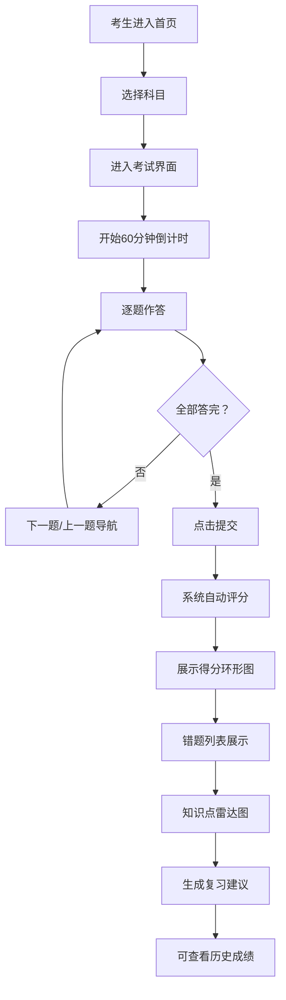

## 1. 产品概述

职业资格在线模拟考试系统，为考生提供多科目限时模拟答题、自动评分、错题分析与历史成绩追踪功能，同时提供管理员端进行题目管理。

- 主要目标：帮助考生通过模拟考试熟悉题型、发现知识薄弱点，提升考试通过率
- 核心价值：即时反馈、智能分析、个性化复习建议

## 2. 核心功能

### 2.1 用户角色

| 角色 | 访问方式 | 核心权限 |
|------|----------|----------|
| 考生 | 默认入口 | 选择科目、参加考试、查看成绩、错题分析、历史记录 |
| 管理员 | `/admin` 路径 | 查看成绩汇总、添加新题目 |

### 2.2 功能模块

1. **首页/科目选择**：展示可选科目列表，点击进入考试
2. **考试界面**：限时答题、题目导航、选项交互、提交答案
3. **成绩结果页**：得分展示（环形图）、错题列表、知识点雷达图、复习建议
4. **历史成绩页**：展示最近10次考试记录
5. **管理员后台**：成绩汇总表格、题目添加表单

### 2.3 页面详情

| 页面名称 | 模块名称 | 功能描述 |
|----------|----------|----------|
| 首页 | 科目选择卡片 | 展示Java基础、项目管理、网络安全等科目，点击进入对应考试 |
| 考试界面 | 顶部状态栏 | 显示题目序号（如3/30）、倒计时（60分钟，精确到秒，红色monospace字体） |
| 考试界面 | 题目展示区 | 题目文本 + 四个选项按钮（圆角8px，选中时蓝色背景白字，过渡0.2s） |
| 考试界面 | 底部导航 | 上一题/下一题按钮（边界置灰禁用），全部答完显示提交按钮 |
| 结果页 | 得分环形图 | 居中显示分数，圆弧红到绿渐变，1.5s ease-out动画 |
| 结果页 | 错题列表 | 浅红背景(#fff5f5)展示错题、正确选项和解析 |
| 结果页 | 雷达图 | Canvas五边形雷达图（5个维度），线宽2px蓝色，填充透明度0.2 |
| 结果页 | 复习建议 | 基于错题分析自动生成3条复习建议 |
| 历史页 | 成绩卡片 | 横向卡片(320×80px)，悬停上浮4px阴影加深 |
| 管理员页 | 成绩表格 | 展示所有考生成绩汇总 |
| 管理员页 | 题目表单 | 添加题目文本、四个选项、正确答案、所属科目 |

## 3. 核心流程

### 3.1 考生考试流程

考生进入系统 → 选择科目 → 进入考试界面（开始60分钟倒计时）→ 逐题作答 → 全部答完提交 → 系统自动评分 → 展示得分与错题分析 → 可查看历史成绩

### 3.2 管理员流程

访问 `/admin` → 查看成绩汇总表格 → 或填写题目表单 → 添加新题目到题库

### 3.3 流程图

## 4. 用户界面设计

### 4.1 设计风格

- **主题色**：蓝色 `#3182ce`、青色 `#00b5d8`
- **背景色**：浅蓝灰 `#f7fafc`
- **卡片样式**：白色背景，轻阴影 `0 2px 8px rgba(0,0,0,0.08)`，圆角12px
- **按钮交互**：点击时缩放 `scale(0.97)` 再恢复，过渡0.1s
- **字体**：倒计时使用 `monospace` 字体，红色 `#e53e3e`
- **选项按钮**：圆角8px，宽100%高48px，白色背景，选中时 `#3182ce` 背景白字，过渡0.2s ease

### 4.2 页面布局

| 页面名称 | 布局方式 | 说明 |
|----------|----------|------|
| 考试界面 | 单栏居中 | 最大宽度800px |
| 结果页面 | 两栏布局 | 左侧：得分 + 雷达图；右侧：错题列表 |
| 历史成绩 | 卡片网格 | 自适应排列 |
| 管理员页 | 垂直布局 | 成绩表格在上，题目表单在下 |

### 4.3 响应式设计

- **桌面优先**：默认两栏布局
- **移动端（<768px）**：两栏变单栏堆叠，卡片和按钮自适应宽度
- **触摸优化**：按钮高度≥48px，确保易点击

### 4.4 动效细节

- **得分环形图**：1.5s ease-out 动画，圆弧颜色从红渐变到绿
- **按钮点击**：scale(0.97) → scale(1)，0.1s过渡
- **选项选中**：背景色过渡0.2s ease
- **卡片悬停**：上浮4px，阴影加深
