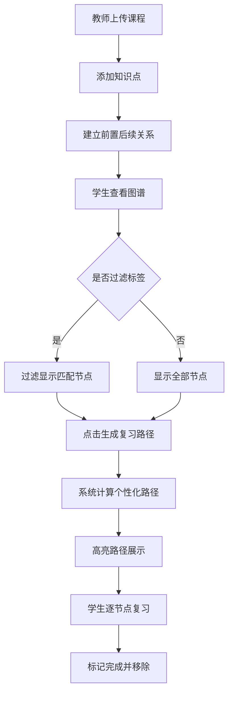

## 1. 产品概述
基于知识图谱的课程知识点关联与复习路径推荐系统，帮助在线教育平台的学员将松散知识点串联形成知识体系，通过个性化复习路径提升学习效果。目标用户包括教师（内容创作）和学生（复习学习）。

## 2. 核心功能

### 2.1 用户角色
| 角色 | 核心权限 |
|------|----------|
| 教师 | 上传课程、添加/管理知识点、在图谱上建立知识点关联关系 |
| 学生 | 查看知识图谱、标签过滤、生成个性化复习路径、按路径复习知识点 |

### 2.2 功能模块
1. **知识图谱页面 (MapPage)**: 图谱可视化、节点拖拽、标签过滤、复习路径高亮
2. **用户页面 (UserPage)**: 用户角色切换、测评得分管理
3. **知识图谱组件 (KnowledgeGraph)**: Canvas绘制节点与连线、拖拽交互、详情弹窗

### 2.3 页面详情
| 页面名称 | 模块名称 | 功能描述 |
|-----------|-------------|---------------------|
| 知识图谱页面 | 顶部导航栏 | 课程名称展示、标签过滤下拉框 |
| 知识图谱页面 | 图谱画布区域(70%) | Canvas渲染知识节点(圆形)、关系连线(贝塞尔曲线带箭头)、支持拖拽移动节点、拖拽创建关系 |
| 知识图谱页面 | 信息面板(30%) | 推荐路径列表、"生成复习路径"按钮、知识点详情弹窗 |
| 知识图谱页面 | 详情弹窗 | 标题、难度标签、详情文本、标签列表、"完成复习"按钮 |
| 用户页面 | 用户管理 | 角色切换(教师/学生)、测评得分录入 |

## 3. 核心流程
教师上传课程→添加知识点→在图谱上建立"前置-后续"关系
学生选择课程→查看知识图谱→可按标签过滤→点击"生成复习路径"→系统基于薄弱点(得分<60)和依赖关系计算路径(≤5节点)→高亮展示路径→学生依次点击复习→标记已完成并从路径移除

## 4. 用户界面设计

### 4.1 设计风格
- 主色调: 深蓝 #1a237e
- 辅助色: 青蓝 #00bcd4
- 节点颜色: 初级#81c784，中级#ffb74d，高级#e57373
- 连线颜色: 普通#bdbdbd，已存在关系#1976d2，复习路径#f44336(红色虚线)
- 文本色: 深灰 #212121
- 面板背景: 浅灰 #f5f5f5
- 布局风格: 卡片式，左70%图谱右30%信息面板
- 顶部导航: 固定高度56px，白底，底部1px实线#e0e0e0

### 4.2 页面设计概述
| 页面名称 | 模块名称 | UI元素 |
|-----------|-------------|-------------|
| 知识图谱页面 | 导航栏 | 课程标题居左、标签下拉居右、高度56px |
| 知识图谱页面 | 图谱画布 | Canvas全屏、节点圆形(半径18px)、悬停放大1.2倍带投影(0.2s过渡)、贝塞尔曲线带箭头 |
| 知识图谱页面 | 信息面板 | 浅灰背景#f5f5f5、圆角8px、推荐路径列表、操作按钮 |
| 知识图谱页面 | 详情弹窗 | 宽380px、圆角12px、白底、阴影0 8px 32px rgba(0,0,0,0.15)、右侧滑入(0.3s ease-out) |

### 4.3 响应式设计
- 桌面端(≥1024px): 左右布局(图谱70% + 面板30%)
- 平板端(768px-1024px): 上下堆叠布局，画布高度60vh

### 4.4 动效细节
- 节点悬停: 放大至1.2倍 + 轻微投影(0.2s过渡)
- 标签过滤: 未匹配节点变灰半透明(#9e9e9e, 0.3透明度)，0.3s ease动画
- 复习路径节点边框: 金色闪烁动画
- 详情弹窗: 从右侧滑入(0.3s ease-out)
