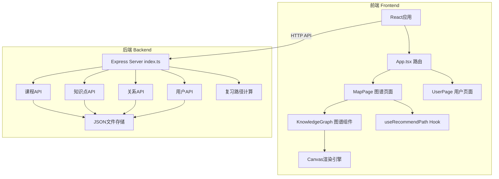
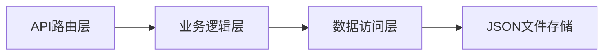
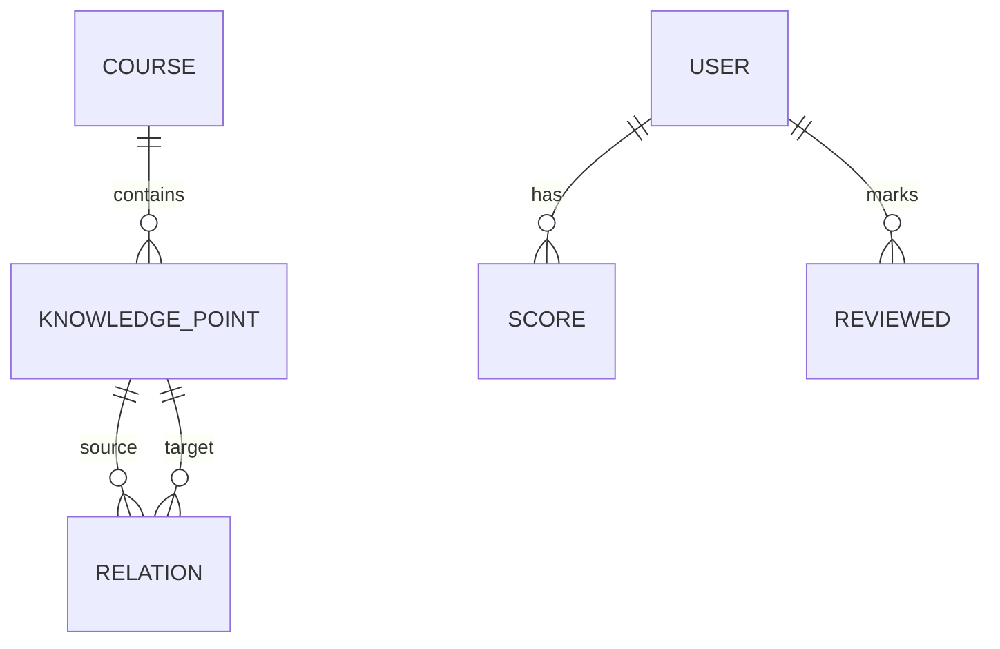

## 1. 架构设计



## 2. 技术描述
- 前端: React 18 + TypeScript + Vite
- 路由: react-router-dom v6
- 后端: Express 4 + TypeScript
- 数据存储: server/data/ 目录下JSON文件
- 状态管理: React useState/useReducer (轻量级场景)
- 图谱渲染: 原生Canvas 2D API
- HTTP通信: fetch API
- 开发服务器端口: 3000，代理 /api 到后端

## 3. 路由定义
| 路由 | 用途 |
|-------|---------|
| / | 首页，重定向到图谱页 |
| /map | 知识图谱查看与复习页面 |
| /users | 用户管理与角色切换页面 |

## 4. API定义

```typescript
// 数据类型定义
interface Course {
  id: string;
  title: string;
  description: string;
  coverUrl: string;
}

interface KnowledgePoint {
  id: string;
  courseId: string;
  title: string;
  description: string;
  difficulty: '初级' | '中级' | '高级';
  tags: string[];
  x: number;
  y: number;
}

interface Relation {
  id: string;
  sourceId: string;
  targetId: string;
  type: 'prerequisite'; // 前置-后续关系
}

interface User {
  id: string;
  name: string;
  role: 'teacher' | 'student';
  scores: Record<string, number>; // knowledgePointId -> 0-100分
  reviewed: string[]; // 已复习知识点ID
}

// API端点
// GET    /api/courses              获取课程列表
// POST   /api/courses              创建课程
// PUT    /api/courses/:id          更新课程
// DELETE /api/courses/:id          删除课程

// GET    /api/courses/:id/points   获取某课程的知识点
// POST   /api/points               创建知识点
// PUT    /api/points/:id           更新知识点(含位置)
// DELETE /api/points/:id           删除知识点

// GET    /api/courses/:id/relations 获取某课程的关系
// POST   /api/relations            创建关系
// DELETE /api/relations/:id        删除关系

// GET    /api/users                获取用户列表
// POST   /api/users                创建用户
// PUT    /api/users/:id            更新用户(含得分、已复习)

// POST   /api/recommend-path       生成复习路径
// Request: { userId, courseId }
// Response: { path: string[] } // 知识点ID数组
```

## 5. 服务器架构图



- **API路由层** (server/index.ts): Express路由，处理HTTP请求响应，参数校验
- **业务逻辑层**: 路径推荐算法(DFS拓扑排序+薄弱点筛选)、CRUD业务校验
- **数据访问层**: 封装JSON文件读写操作
- **JSON文件存储**: server/data/courses.json, points.json, relations.json, users.json

## 6. 数据模型

### 6.1 实体关系图



### 6.2 JSON数据结构

```json
// server/data/courses.json
{
  "courses": [
    { "id": "uuid", "title": "课程名", "description": "简介", "coverUrl": "..." }
  ]
}

// server/data/points.json
{
  "points": [
    { "id": "uuid", "courseId": "uuid", "title": "知识点", "description": "...",
      "difficulty": "初级", "tags": ["tag1", "tag2"], "x": 200, "y": 150 }
  ]
}

// server/data/relations.json
{
  "relations": [
    { "id": "uuid", "sourceId": "uuid", "targetId": "uuid", "type": "prerequisite" }
  ]
}

// server/data/users.json
{
  "users": [
    { "id": "uuid", "name": "用户名", "role": "student",
      "scores": { "pointId": 85 }, "reviewed": ["pointId"] }
  ]
}
```

## 7. 文件结构与调用关系

```
项目根/
├── package.json              # 前后端统一依赖与脚本
├── vite.config.js            # Vite构建配置(端口3000, /api代理)
├── tsconfig.json             # TypeScript配置(严格模式, react-jsx)
├── index.html                # HTML入口
├── server/
│   ├── index.ts             # Express后端入口 ← API路由
│   └── data/
│       ├── courses.json     # 课程数据
│       ├── points.json      # 知识点数据
│       ├── relations.json   # 关系数据
│       └── users.json       # 用户数据
└── src/
    ├── App.tsx              # 根组件, React Router
    ├── components/
    │   └── KnowledgeGraph.tsx  # 图谱可视化组件(Canvas)
    ├── hooks/
    │   └── useRecommendPath.ts # 复习路径计算Hook
    └── pages/
        ├── MapPage.tsx      # 图谱与复习页面
        └── UserPage.tsx     # 用户管理页面
```

**数据流向**:
1. 用户操作 → src/pages/MapPage.tsx → src/components/KnowledgeGraph.tsx (Canvas渲染)
2. 图谱页面交互 → fetch API → server/index.ts → 读写 server/data/*.json
3. 生成复习路径: MapPage → useRecommendPath Hook (或调用 /api/recommend-path) → 返回路径ID数组 → KnowledgeGraph高亮渲染
4. 用户/得分数据: UserPage.tsx → API → server/index.ts → users.json
