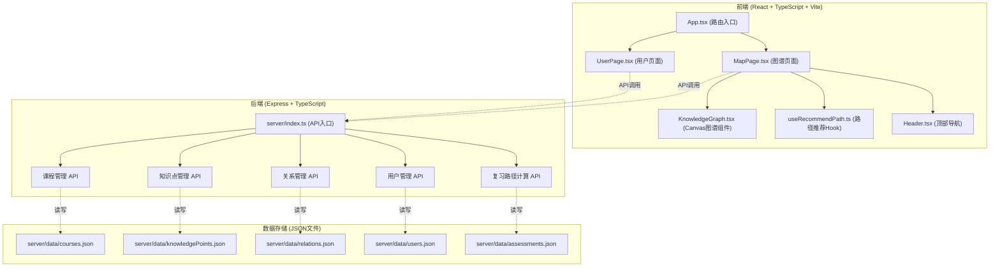
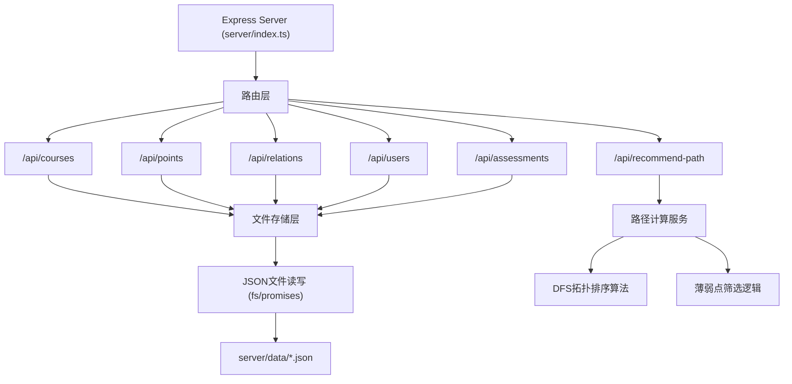
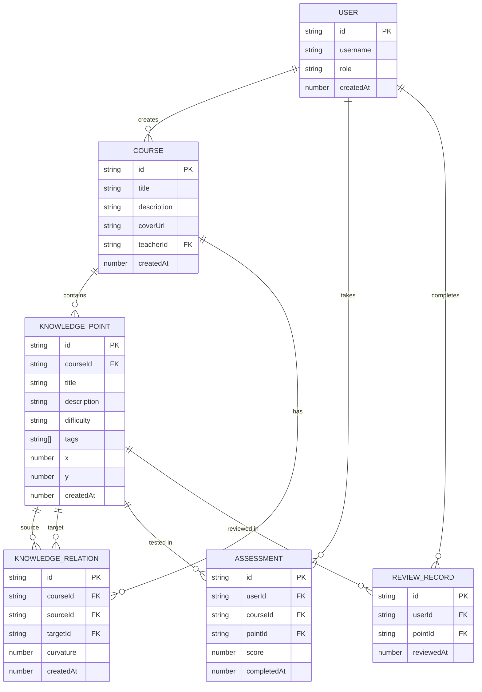

## 1. 架构设计



## 2. 技术描述

- **前端框架**：React@18 + React DOM@18 + React Router DOM@6
- **开发构建**：Vite@5 + @vitejs/plugin-react@4
- **类型系统**：TypeScript@5（严格模式）
- **后端框架**：Express@4 + CORS@2
- **数据存储**：JSON文件（server/data/目录）
- **工具库**：uuid@9（ID生成）
- **端口配置**：前端开发服务器3000端口，代理/api到后端

## 3. 路由定义

| 路由 | 页面 | 用途 |
|------|------|------|
| `/` | MapPage | 知识图谱浏览与复习页面（默认首页） |
| `/user` | UserPage | 用户登录注册、角色选择、课程管理 |

## 4. API 定义

### 4.1 TypeScript 类型定义

```typescript
// 难度等级
type Difficulty = '初级' | '中级' | '高级';

// 用户角色
type UserRole = 'teacher' | 'student';

// 知识点
interface KnowledgePoint {
  id: string;
  courseId: string;
  title: string;
  description: string;
  difficulty: Difficulty;
  tags: string[];
  x: number;
  y: number;
  createdAt: number;
}

// 知识点关系（前置-后续）
interface KnowledgeRelation {
  id: string;
  courseId: string;
  sourceId: string;
  targetId: string;
  curvature: number;
  createdAt: number;
}

// 课程
interface Course {
  id: string;
  title: string;
  description: string;
  coverUrl: string;
  teacherId: string;
  createdAt: number;
}

// 用户
interface User {
  id: string;
  username: string;
  role: UserRole;
  createdAt: number;
}

// 测评得分
interface Assessment {
  id: string;
  userId: string;
  courseId: string;
  pointId: string;
  score: number;
  completedAt: number;
}

// 复习节点记录
interface ReviewRecord {
  id: string;
  userId: string;
  pointId: string;
  reviewedAt: number;
}
```

### 4.2 API 接口

| 方法 | 路径 | 描述 | 请求体 | 响应 |
|------|------|------|--------|------|
| GET | `/api/courses` | 获取课程列表 | - | `Course[]` |
| GET | `/api/courses/:id` | 获取单门课程 | - | `Course` |
| POST | `/api/courses` | 创建课程 | `{title, description, coverUrl, teacherId}` | `Course` |
| GET | `/api/courses/:id/points` | 获取课程知识点 | - | `KnowledgePoint[]` |
| POST | `/api/points` | 创建知识点 | `{courseId, title, description, difficulty, tags, x, y}` | `KnowledgePoint` |
| PUT | `/api/points/:id` | 更新知识点 | `Partial<KnowledgePoint>` | `KnowledgePoint` |
| DELETE | `/api/points/:id` | 删除知识点 | - | `{success: boolean}` |
| GET | `/api/courses/:id/relations` | 获取课程关系 | - | `KnowledgeRelation[]` |
| POST | `/api/relations` | 创建关系 | `{courseId, sourceId, targetId, curvature}` | `KnowledgeRelation` |
| PUT | `/api/relations/:id` | 更新关系曲率 | `{curvature}` | `KnowledgeRelation` |
| DELETE | `/api/relations/:id` | 删除关系 | - | `{success: boolean}` |
| POST | `/api/users/login` | 用户登录 | `{username, role}` | `User` |
| GET | `/api/users/:id/assessments` | 获取用户测评 | - | `Assessment[]` |
| POST | `/api/assessments` | 提交测评 | `{userId, courseId, pointId, score}` | `Assessment` |
| POST | `/api/recommend-path` | 生成复习路径 | `{userId, courseId, maxNodes?: 5}` | `{path: string[]}` |
| POST | `/api/reviews` | 标记复习完成 | `{userId, pointId}` | `ReviewRecord` |
| GET | `/api/users/:id/reviews` | 获取复习记录 | - | `ReviewRecord[]` |

## 5. 服务端架构



## 6. 数据模型

### 6.1 ER 图



### 6.2 数据流向说明

1. **教师创建课程**：UserPage → POST /api/courses → server/index.ts → server/data/courses.json
2. **添加知识点**：MapPage → POST /api/points → server/index.ts → server/data/knowledgePoints.json
3. **建立关系**：KnowledgeGraph拖拽 → POST /api/relations → server/index.ts → server/data/relations.json
4. **学生测评**：UserPage → POST /api/assessments → server/index.ts → server/data/assessments.json
5. **生成复习路径**：MapPage点击按钮 → POST /api/recommend-path → DFS拓扑排序 + 薄弱点筛选 → 返回path数组
6. **标记复习完成**：详情弹窗 → POST /api/reviews → server/index.ts → server/data/reviews.json

### 6.3 核心算法说明

**复习路径生成算法（useRecommendPath）**：
1. 收集用户测评得分，筛选得分 < 60 的薄弱知识点
2. 构建有向无环图（DAG），边为"前置→后续"关系
3. 从薄弱点出发进行DFS拓扑排序，确保路径满足依赖顺序
4. 优先选择包含最多薄弱点的路径分支
5. 限制路径长度不超过5个节点
6. 返回知识点ID数组用于图谱高亮

### 6.4 性能优化

- Canvas使用 requestAnimationFrame 进行渲染，确保50节点150连线时稳定40FPS+
- 节点拖拽使用离屏坐标计算，避免频繁重绘整个画布
- 标签过滤使用CSS属性过渡动画，0.3s平滑切换
- 复习路径高亮使用缓存的路径数据，避免重复计算
