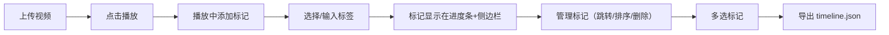

## 1. 产品概述

ClipMarker 是一款面向音视频创作者的视频素材标记与分类工具，帮助用户快速标记视频片段、添加分类标签，并导出剪辑时间线草稿，解决大量原始素材难以检索和人工整理耗时的问题。

## 2. 核心功能

### 2.1 用户角色
无需用户注册，单一创作者角色，直接使用。

### 2.2 功能模块
1. **视频上传区**：拖拽/点击上传视频、视频卡片列表展示
2. **视频播放器**：模态播放器、进度条、时间戳标记、标签弹出框
3. **标记侧边栏**：按视频分组的标记列表、拖拽排序、删除、跳转播放
4. **时间线导出**：多选标记、导出JSON格式剪辑草稿

### 2.3 页面详情

| 页面名称 | 模块名称 | 功能描述 |
|-----------|-------------|---------------------|
| 主页面 | 视频上传区 | 支持拖拽/点击上传MP4/MOV格式视频（单个≤200MB），横向卡片展示（320×180px，圆角8px，背景#1e1e1e），右侧显示文件名、时长(mm:ss)、文件大小，左下角播放按钮（圆形36px，背景#ff5722，白色三角） |
| 主页面 | 模态播放器 | 宽640×高360px，含进度条与时间戳标记，支持M键或按钮添加标记 |
| 主页面 | 标签弹出框 | 输入框+10个预设标签（60×24px，圆角12px，颜色从#e53935到#1e88e5渐变），标签包括：A-Roll、B-Roll、采访、空镜、特效、转场、字幕、音乐、旁白、素材 |
| 主页面 | 进度条标记 | 彩色竖线（线宽3px）标注在进度条上方，悬停显示标签名称和时间 |
| 主页面 | 标记侧边栏 | 宽240px，背景#252525，内边距12px，按视频分组、按时间排序，每行含时间戳、标签名、32×32px缩略图，支持点击跳转、拖拽排序、删除 |
| 主页面 | 时间线导出 | 多选标记片段，生成JSON文件（含视频路径、起止时间帧精度、标签、排序），自动下载timeline.json |

## 3. 核心流程

用户上传视频 → 点击播放 → 播放中按M键/点击按钮添加标记 → 选择/输入标签 → 标记显示在进度条和侧边栏 → 可在侧边栏管理标记（跳转/排序/删除） → 选择多个标记 → 导出时间线JSON

## 4. 用户界面设计

### 4.1 设计风格
- **主色**：背景#121212，主文字#e0e0e0，强调色#ff5722
- **按钮**：圆角设计，点击时0.2s按压缩放效果（scale 0.95）
- **字体**：现代无衬线字体，清晰可读
- **布局**：左右结构（左侧75%，右侧240px固定边栏），<768px自动切换为上下滚动单列
- **图标**：Lucide React图标库

### 4.2 页面设计概览

| 页面名称 | 模块名称 | UI元素 |
|-----------|-------------|-------------|
| 主页面 | 整体布局 | 暗色主题、左右分栏、响应式、平滑过渡动画 |
| 主页面 | 视频卡片 | 深灰背景、圆角8px、悬停高亮、播放按钮动画 |
| 主页面 | 模态播放器 | 居中弹窗、进度条标记、时间显示、键盘快捷键 |
| 主页面 | 标签弹出框 | 预设标签彩色渐变、输入框、自动定位 |
| 主页面 | 侧边栏 | 固定宽度、按视频分组、拖拽排序视觉反馈 |
| 主页面 | 导出功能 | 多选checkbox、JSON下载、状态提示 |

### 4.3 响应式
- 桌面端：左右布局，左侧75%视频区，右侧240px边栏
- 移动端（<768px）：上下单列滚动布局，边栏移至下方
- 触控优化：拖拽、点击目标区域足够大

### 4.4 性能要求
- 视频播放与标记拖拽操作 ≥30FPS
- 进度条标记渲染流畅
