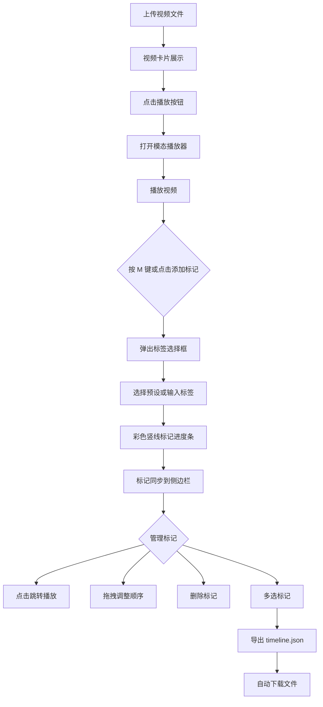

# ClipMarker 产品需求文档（PRD）

## 1. 产品概述

ClipMarker 是一款面向音视频创作者的素材标记与剪辑草稿工具，解决大量原始素材难以检索、人工整理耗时的问题。用户可上传视频、在播放过程中打标签标记时间点、在侧边栏管理标记片段，并一键导出 JSON 格式的剪辑时间线草稿，供后续剪辑软件导入使用。

- **目标用户**：音视频创作者、剪辑师、内容运营人员
- **市场价值**：将"看素材→记录时间点→整理片段"的传统人工流程数字化，预计单条视频整理时间缩短 60% 以上

## 2. 核心功能

### 2.1 用户角色

| 角色 | 使用方式 | 核心权限 |
|------|----------|----------|
| 创作者 | 本地启动应用 | 上传视频、打标记、管理标记、导出时间线 |

### 2.2 功能模块

1. **素材工作台（主页面）**：左侧视频上传区与播放器，右侧标记管理边栏
2. **模态播放器**：视频播放、进度条、时间戳标记、标签弹出框
3. **标记管理面板**：标记列表展示、跳转、拖拽排序、删除
4. **时间线导出**：多选标记、生成 JSON 草稿、自动下载

### 2.3 页面详情

| 页面名称 | 模块名称 | 功能描述 |
|----------|----------|----------|
| 素材工作台 | 视频上传区 | 支持拖拽/点击上传 MP4/MOV（≤200MB），上传后以横向卡片展示，点击播放按钮打开模态播放器 |
| 素材工作台 | 视频卡片 | 320×180px 横向卡片，圆角 8px，背景 #1e1e1e，右侧显示文件名、时长（mm:ss）、文件大小，左下圆形播放按钮 |
| 素材工作台 | 模态播放器 | 640×360px 播放器，进度条带时间戳标记，支持 M 键添加标记，标签弹出框含输入框与 10 个预设标签 |
| 素材工作台 | 标记边栏 | 240px 宽侧边栏，按视频分组、按时间排序展示标记行（时间戳、标签名、32×32px 缩略图），支持点击跳转、拖拽排序、删除 |
| 素材工作台 | 时间线导出 | 多选标记后生成 timeline.json，包含视频路径、片段起止时间（精确到帧）、标签信息、排序 |

## 3. 核心流程

### 3.1 素材标记流程

用户上传视频 → 视频以卡片展示 → 点击播放按钮打开模态播放器 → 播放过程中按 M 键或点击"添加标记" → 弹出标签选择框 → 选择预设标签或输入自定义标签 → 标记以彩色竖线显示在进度条上方 → 标记同步到右侧边栏

### 3.2 标记管理流程

右侧边栏按视频分组展示标记 → 用户可点击标记跳转播放、拖拽调整顺序、删除标记 → 多选标记后点击"导出时间线" → 生成 timeline.json 自动下载

## 4. 用户界面设计

### 4.1 设计风格

- **主题**：暗色专业工具风，参考专业剪辑软件的深色界面
- **主色**：背景 #121212，卡片背景 #1e1e1e，边栏背景 #252525
- **文字**：主文字 #e0e0e0，次要文字 #9e9e9e
- **强调色**：#ff5722（播放按钮、强调元素）
- **标签色**：10 个预设标签，颜色从 #e53935 渐变到 #1e88e5
- **按钮风格**：圆角矩形，点击时 scale 0.95 压缩效果（0.2s 过渡）
- **字体**：使用简洁的无衬线字体，标题加粗，正文常规
- **布局**：左右结构，左侧 75% 宽度（上传区+播放器），右侧固定 240px 边栏
- **圆角**：卡片 8px，标签 12px，按钮适度圆角

### 4.2 页面设计概览

| 页面名称 | 模块名称 | UI 元素 |
|----------|----------|----------|
| 素材工作台 | 顶部导航 | 应用标题 ClipMarker、导出按钮，背景 #1e1e1e |
| 素材工作台 | 视频上传区 | 拖拽虚线框 + 点击上传按钮，支持多文件 |
| 素材工作台 | 视频卡片网格 | 横向卡片 320×180px，圆角 8px，深灰背景，左下圆形播放按钮（36px，#ff5722，白色三角） |
| 素材工作台 | 模态播放器 | 640×360px 视频区，底部进度条（含彩色标记竖线），时间戳显示，添加标记按钮 |
| 素材工作台 | 标签弹出框 | 输入框 + 10 个预设标签（60×24px，圆角 12px，渐变色） |
| 素材工作台 | 标记边栏 | 240px 宽，#252525 背景，内边距 12px，按视频分组的标记行（缩略图+时间+标签） |
| 素材工作台 | 导出区域 | 多选复选框 + 导出时间线按钮 |

### 4.3 响应式

- **桌面优先**：宽度 ≥768px 时左右分栏布局，左侧 75%、右侧 240px
- **移动适配**：宽度 <768px 时切换为上下单列滚动布局，标记边栏移至底部
- **触摸优化**：播放按钮、标签、标记行增大点击区域，拖拽操作适配触摸事件

### 4.4 性能要求

- 视频播放与标记拖拽操作保持 ≥30FPS 刷新
- 大量标记时使用虚拟列表或分批渲染避免卡顿
- 上传文件流式处理，避免内存峰值
