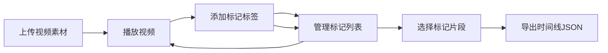

# ClipMarker 产品需求文档

## 1. 产品概述

ClipMarker 是一款面向音视频创作者的素材标记与分类工具，帮助创作者快速标记视频素材中的精彩片段，并导出剪辑时间线草稿，解决大量原始素材难以检索和人工整理耗时的问题。

- 核心目标：提升视频素材整理效率，降低人工标记和分类的时间成本
- 目标用户：短视频创作者、视频剪辑师、内容生产团队

## 2. 核心功能

### 2.1 用户角色

| 角色 | 注册方式 | 核心权限 |
|------|---------|---------|
| 创作者用户 | 无需注册，本地使用 | 上传视频、添加标记、管理标记、导出时间线 |

### 2.2 功能模块

1. **视频上传模块**：支持拖拽和点击上传 MP4/MOV 格式视频，展示视频卡片列表
2. **视频播放模块**：模态播放器，支持进度条拖动、时间戳显示、播放控制
3. **标记管理模块**：在播放过程中添加标签标记，支持预设标签和自定义标签
4. **标记列表面板**：右侧边栏展示所有标记，按视频分组、按时间排序
5. **时间线导出模块**：选择多个标记片段，导出 JSON 格式的剪辑时间线草稿

### 2.3 功能详情

| 模块名称 | 功能点 | 功能描述 |
|---------|--------|---------|
| 视频上传 | 文件上传 | 支持拖拽和点击上传，限制 MP4/MOV 格式，单个文件不超过 200MB |
| 视频上传 | 卡片展示 | 视频以横向卡片展示（320x180px），显示文件名、时长、文件大小 |
| 视频播放 | 模态播放器 | 点击播放按钮弹出模态播放器（640x360px），带进度条和时间戳 |
| 标记添加 | 快捷键添加 | 播放中按 M 键或点击按钮在当前时间戳添加标签 |
| 标记添加 | 标签弹出框 | 包含输入框和 10 个预设彩色标签，支持自定义输入 |
| 标记显示 | 进度条标记 | 彩色竖线（3px）标记在进度条上方，悬停显示标签名称和时间 |
| 标记面板 | 列表展示 | 右侧边栏（240px）按视频分组、按时间排序展示标记 |
| 标记面板 | 交互操作 | 点击跳转播放、拖拽调整顺序、删除标记 |
| 时间线导出 | JSON 导出 | 选择多个标记，导出包含视频路径、起止时间、标签信息的 JSON 文件 |

## 3. 核心流程

用户上传视频素材 → 点击播放查看视频 → 在关键时间点添加标签标记 → 在标记面板管理和筛选标记 → 选择需要的标记片段 → 导出剪辑时间线 JSON

## 4. 用户界面设计

### 4.1 设计风格

- **主题**：暗色专业剪辑风格，适合长时间使用
- **主色调**：背景 #121212，主文字 #e0e0e0，强调色 #ff5722
- **卡片背景**：#1e1e1e，边栏背景 #252525
- **按钮风格**：圆形播放按钮，强调色背景，按压缩放效果（0.2s，scale 0.95）
- **标签风格**：圆角胶囊形，10 种渐变颜色（#e53935 到 #1e88e5）
- **字体**：现代无衬线字体，清晰可读
- **布局**：左右分栏布局，左侧 75% 内容区，右侧 240px 固定边栏

### 4.2 页面设计概览

| 页面/组件 | 模块名称 | UI 元素 |
|----------|---------|---------|
| 主页面 | 顶部标题区 | Logo、应用名称、导出按钮 |
| 主页面 | 视频上传区 | 拖拽上传区域、视频卡片网格 |
| 主页面 | 右侧边栏 | 标记列表、分组标题、筛选操作 |
| 模态播放器 | 视频播放区 | 视频画面、播放控制按钮 |
| 模态播放器 | 进度条 | 时间刻度、标记竖线、悬停提示 |
| 标签弹出框 | 标签选择 | 预设标签网格、自定义输入框、确认按钮 |

### 4.3 响应式设计

- 桌面端（≥768px）：左右结构布局，左侧 75% + 右侧 240px 边栏
- 移动端（<768px）：上下滚动单列布局，边栏移至底部
- 触控优化：按钮最小尺寸 44x44px，支持触摸滑动操作

### 4.4 动效与交互

- 所有可点击元素添加 0.2s 按压缩放效果（scale 0.95）
- 模态框弹出/关闭有平滑过渡动画
- 标记拖拽时有视觉反馈
- 进度条标记悬停显示 Tooltip
