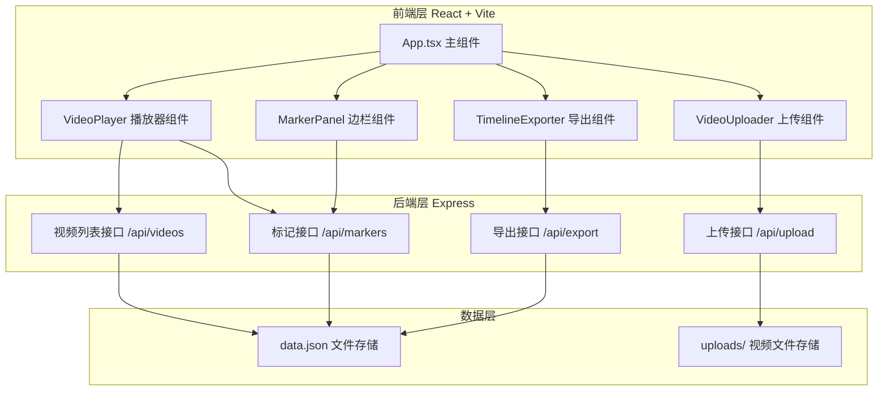
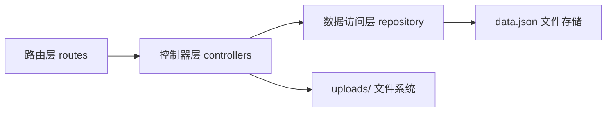
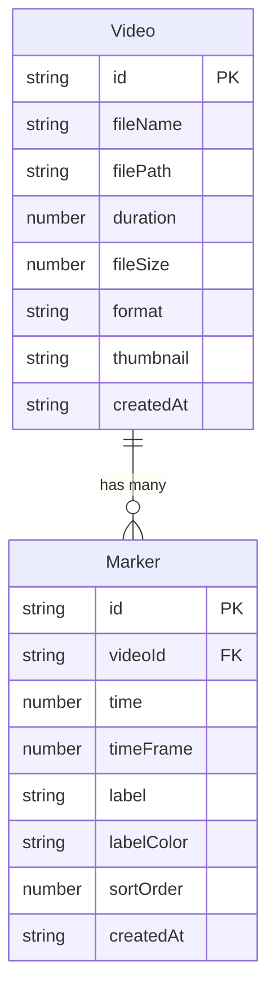

# ClipMarker 技术架构文档

## 1. 架构设计



## 2. 技术说明

- **前端**：React@18 + TypeScript + Vite，使用原生 CSS（暗色主题变量）
- **初始化工具**：Vite + react-ts 模板
- **后端**：Express@4 + TypeScript（ts-node 运行），multer 处理文件上传
- **数据存储**：JSON 文件存储（data.json），视频文件存于 uploads/ 目录
- **状态管理**：使用 zustand 管理前端全局状态
- **图标库**：lucide-react
- **唯一标识**：uuid 生成视频与标记 ID

## 3. 路由定义

| 路由 | 用途 |
|------|------|
| / | 素材工作台主页面（上传、播放、标记、导出） |

## 4. API 定义

### 4.1 类型定义

```typescript
// 视频元数据
interface Video {
  id: string;
  fileName: string;
  filePath: string;
  duration: number;      // 秒
  fileSize: number;      // 字节
  format: 'mp4' | 'mov';
  thumbnail?: string;    // 缩略图 base64
  createdAt: string;
}

// 标记
interface Marker {
  id: string;
  videoId: string;
  time: number;          // 秒
  timeFrame: number;     // 帧数
  label: string;
  labelColor: string;
  sortOrder: number;
  createdAt: string;
}

// 预设标签
interface PresetLabel {
  name: string;
  color: string;
}

// 导出时间线
interface TimelineExport {
  version: string;
  exportedAt: string;
  clips: Array<{
    videoId: string;
    videoPath: string;
    fileName: string;
    startTime: number;
    endTime: number;
    startFrame: number;
    endFrame: number;
    label: string;
    labelColor: string;
    sortOrder: number;
  }>;
}
```

### 4.2 接口列表

| 方法 | 路径 | 请求 | 响应 |
|------|------|------|------|
| POST | /api/upload | multipart/form-data (file) | `{ video: Video }` |
| GET | /api/videos | - | `{ videos: Video[] }` |
| GET | /api/videos/:id | - | `{ video: Video }` |
| DELETE | /api/videos/:id | - | `{ success: boolean }` |
| GET | /api/markers | - | `{ markers: Marker[] }` |
| GET | /api/markers/:videoId | - | `{ markers: Marker[] }` |
| POST | /api/markers | `{ videoId, time, label, labelColor }` | `{ marker: Marker }` |
| PUT | /api/markers/:id | `{ time?, label?, labelColor?, sortOrder? }` | `{ marker: Marker }` |
| DELETE | /api/markers/:id | - | `{ success: boolean }` |
| POST | /api/export | `{ markerIds: string[] }` | `{ timeline: TimelineExport }` |

## 5. 服务端架构



### 5.1 预设标签定义

```typescript
const PRESET_LABELS: PresetLabel[] = [
  { name: 'A-Roll', color: '#e53935' },
  { name: 'B-Roll', color: '#fb8c00' },
  { name: '采访', color: '#fdd835' },
  { name: '空镜', color: '#c0ca33' },
  { name: '特效', color: '#43a047' },
  { name: '转场', color: '#00897b' },
  { name: '音乐', color: '#00acc1' },
  { name: '字幕', color: '#1e88e5' },
  { name: '高光', color: '#5e35b1' },
  { name: '待删', color: '#8e24aa' },
];
```

## 6. 数据模型

### 6.1 数据模型定义



### 6.2 数据定义

#### data.json 初始结构

```json
{
  "videos": [],
  "markers": []
}
```

#### 帧率换算说明

- 默认帧率 30fps，`timeFrame = Math.round(time * 30)`
- 导出时起止时间为相邻标记或视频边界
- 视频时长通过前端 video 元素 `duration` 属性获取后回传后端
