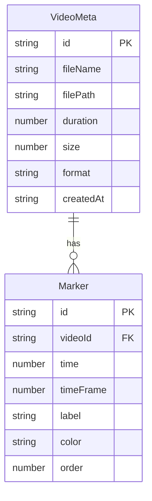

# ClipMarker 技术架构文档

## 1. 架构设计

```mermaid
flowchart TD
    subgraph "前端 (端口 3000)"
        "A[App.tsx 主组件]" --> "B[VideoUploader]"
        "A" --> "C[VideoPlayer 模态]"
        "A" --> "D[MarkerPanel 侧边栏]"
        "A" --> "E[TimelineExporter]"
    end
    subgraph "后端 (端口 4000)"
        "F[Express Server]" --> "G[上传接口 multer]"
        "F" --> "H[视频列表接口]"
        "F" --> "I[标记增删接口]"
        "F" --> "J[静态文件服务]"
    end
    subgraph "数据层"
        "K[data.json 元数据+标记]"
        "L[uploads/ 视频文件]"
    end
    "B" -- "上传文件" --> "G"
    "B" -- "获取列表" --> "H"
    "C" -- "添加标记" --> "I"
    "D" -- "拖拽/删除" --> "I"
    "G" --> "K"
    "G" --> "L"
    "H" --> "K"
    "I" --> "K"
    "J" --> "L"
```

## 2. 技术说明

- **前端**：React 18 + TypeScript + Vite 5，纯 CSS 样式（不使用 Tailwind，按用户指定文件结构）
- **初始化工具**：手动创建项目结构（用户指定了精确文件清单与依赖）
- **后端**：Express 4 + multer（文件上传）+ cors
- **存储**：JSON 文件存储（`server/data.json`）+ 本地文件系统（`uploads/`）
- **工具库**：uuid（生成唯一 ID）

## 3. 路由定义

| 路由 | 用途 |
|------|------|
| `/` | 主工作区（上传区+视频卡片列表+播放器模态+侧边栏） |
| `/play/:videoId` | （可选）独立播放视图，本项目以模态实现 |

## 4. API 定义

### 4.1 类型定义

```typescript
// 视频元数据
interface VideoMeta {
  id: string;
  fileName: string;
  filePath: string;       // 相对路径 /uploads/xxx.mp4
  duration: number;        // 秒
  size: number;            // 字节
  format: 'mp4' | 'mov';
  thumbnail?: string;      // 缩略图路径（可选，首帧）
  createdAt: string;
}

// 标记
interface Marker {
  id: string;
  videoId: string;
  time: number;            // 秒
  timeFrame: number;       // 帧号（基于 30fps 推算）
  label: string;
  color: string;           // 标签颜色
  order: number;            // 排序
  thumbnail?: string;
}

// 导出的时间线草稿
interface TimelineDraft {
  exportedAt: string;
  segments: Array<{
    videoId: string;
    filePath: string;
    startTime: number;
    endTime: number;
    startFrame: number;
    endFrame: number;
    label: string;
    color: string;
    order: number;
  }>;
}
```

### 4.2 接口列表

| 方法 | 路径 | 用途 | 请求 | 响应 |
|------|------|------|------|------|
| POST | `/api/videos/upload` | 上传视频 | multipart/form-data file | `{ video: VideoMeta }` |
| GET | `/api/videos` | 获取视频列表 | - | `{ videos: VideoMeta[] }` |
| GET | `/api/videos/:id` | 获取单个视频 | - | `{ video: VideoMeta }` |
| DELETE | `/api/videos/:id` | 删除视频 | - | `{ success: true }` |
| GET | `/api/markers` | 获取所有标记 | - | `{ markers: Marker[] }` |
| GET | `/api/markers?videoId=` | 按视频获取标记 | - | `{ markers: Marker[] }` |
| POST | `/api/markers` | 添加标记 | `Marker` 部分 | `{ marker: Marker }` |
| PATCH | `/api/markers/:id` | 更新标记（拖拽排序） | `{ order, time }` | `{ marker: Marker }` |
| DELETE | `/api/markers/:id` | 删除标记 | - | `{ success: true }` |

## 5. 服务器架构图

```mermaid
flowchart LR
    "A[Express Router]" --> "B[上传中间件 multer]"
    "A" --> "C[JSON Body Parser]"
    "B" --> "D[VideoController]"
    "C" --> "E[MarkerController]"
    "D" --> "F[DataStore 读写 data.json]"
    "E" --> "F"
    "F" --> "G[fs 文件系统]"
    "D" --> "H[uploads/ 目录]"
```

## 6. 数据模型

### 6.1 数据模型定义



### 6.2 数据定义语言（JSON Schema）

```json
{
  "videos": [],
  "markers": []
}
```

`server/data.json` 初始化为空数据结构：
- `videos`：VideoMeta 数组
- `markers`：Marker 数组

## 7. 预设标签色板

| 序号 | 标签名 | 颜色 | 用途 |
|------|--------|------|------|
| 1 | A-Roll | #e53935 | 主镜头 |
| 2 | B-Roll | #ef5350 | 补充镜头 |
| 3 | 采访 | #f4511e | 采访片段 |
| 4 | 空镜 | #f57c00 | 空镜头 |
| 5 | 特效 | #ffa000 | 特效镜头 |
| 6 | 转场 | #c0ca33 | 转场点 |
| 7 | 字幕 | #9ccc65 | 字幕点 |
| 8 | 音乐 | #66bb6a | 音乐点 |
| 9 | 高光 | #26c6da | 高光时刻 |
| 10 | 待删 | #1e88e5 | 待删除 |

## 8. 文件结构

```
clipmarker/
├── package.json
├── vite.config.js
├── tsconfig.json
├── tsconfig.server.json
├── index.html
├── src/
│   ├── App.tsx
│   ├── App.css
│   ├── VideoUploader.tsx
│   ├── VideoPlayer.tsx
│   ├── MarkerPanel.tsx
│   ├── TimelineExporter.tsx
│   ├── types.ts
│   └── constants.ts
└── server/
    ├── index.ts
    └── data.json
```
