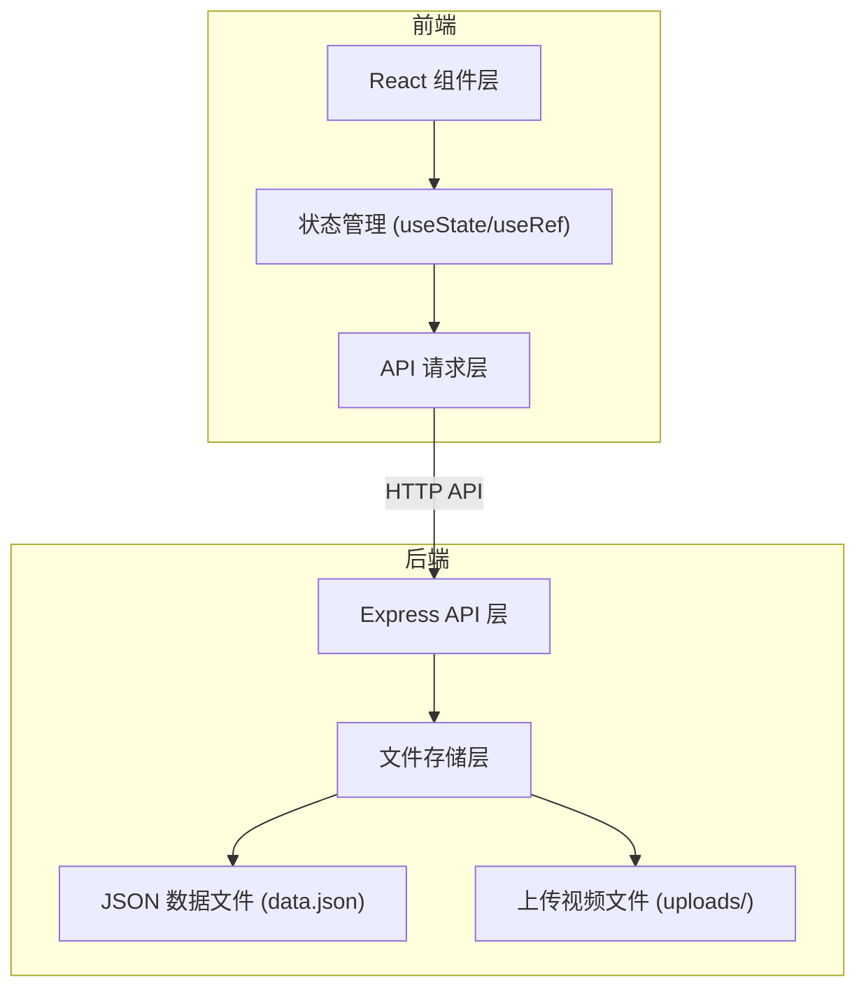
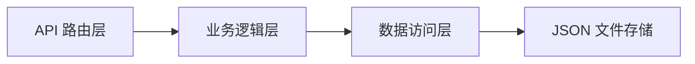
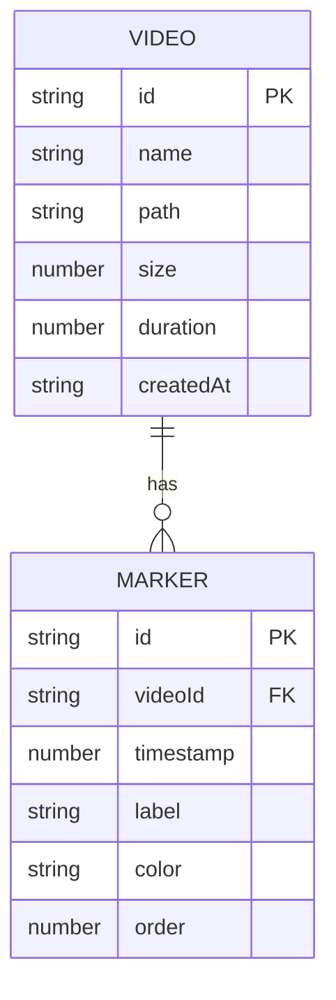

# ClipMarker 技术架构文档

## 1. 架构设计



## 2. 技术选型说明

- **前端**：React 18 + TypeScript + Vite
- **构建工具**：Vite 4
- **后端**：Express 4 + TypeScript
- **数据存储**：JSON 文件持久化
- **文件上传**：Multer 中间件
- **状态管理**：React Hooks（useState、useRef、useEffect）
- **样式方案**：原生 CSS + CSS 变量
- **图标**：Lucide React

## 3. 项目文件结构

```
├── package.json          # 项目依赖和脚本
├── vite.config.js        # Vite 构建配置
├── tsconfig.json         # TypeScript 配置
├── index.html            # 入口 HTML
├── src/
│   ├── App.tsx           # 主组件，布局管理
│   ├── VideoUploader.tsx # 视频上传和列表组件
│   ├── VideoPlayer.tsx   # 播放器组件
│   ├── MarkerPanel.tsx   # 标记列表面板
│   └── TimelineExporter.tsx # 时间线导出工具
├── server/
│   ├── index.ts          # Express 后端入口
│   └── data.json         # 数据存储文件
└── uploads/              # 上传视频存储目录
```

## 4. API 定义

### 4.1 视频相关 API

| 方法 | 路径 | 描述 |
|------|------|------|
| GET | /api/videos | 获取视频列表 |
| POST | /api/videos/upload | 上传视频文件 |
| DELETE | /api/videos/:id | 删除视频 |

### 4.2 标记相关 API

| 方法 | 路径 | 描述 |
|------|------|------|
| GET | /api/videos/:videoId/markers | 获取视频的所有标记 |
| POST | /api/videos/:videoId/markers | 添加标记 |
| PUT | /api/markers/:id | 更新标记 |
| DELETE | /api/markers/:id | 删除标记 |
| PUT | /api/markers/reorder | 重新排序标记 |

### 4.3 类型定义

```typescript
interface Video {
  id: string;
  name: string;
  path: string;
  size: number;
  duration: number;
  createdAt: string;
}

interface Marker {
  id: string;
  videoId: string;
  timestamp: number;
  label: string;
  color: string;
  order: number;
}

interface TimelineExport {
  version: string;
  exportedAt: string;
  clips: Array<{
    videoPath: string;
    videoName: string;
    startTime: number;
    endTime: number;
    label: string;
    color: string;
  }>;
}
```

## 5. 后端架构



- **路由层**：定义 API 端点，处理请求参数验证
- **业务逻辑层**：处理核心业务逻辑，如时间线组装
- **数据访问层**：封装 JSON 文件读写操作
- **文件存储**：上传的视频文件存储在 uploads/ 目录

## 6. 数据模型

### 6.1 数据结构定义



### 6.2 data.json 结构

```json
{
  "videos": [],
  "markers": []
}
```

## 7. 性能优化

- 视频播放使用原生 HTML5 Video 元素，保证 30+ FPS
- 标记渲染使用 CSS transform，避免重排重绘
- 拖拽操作使用 requestAnimationFrame 保证流畅
- 大文件上传使用流式处理，避免内存溢出
- 使用 useMemo/useCallback 优化 React 渲染性能
