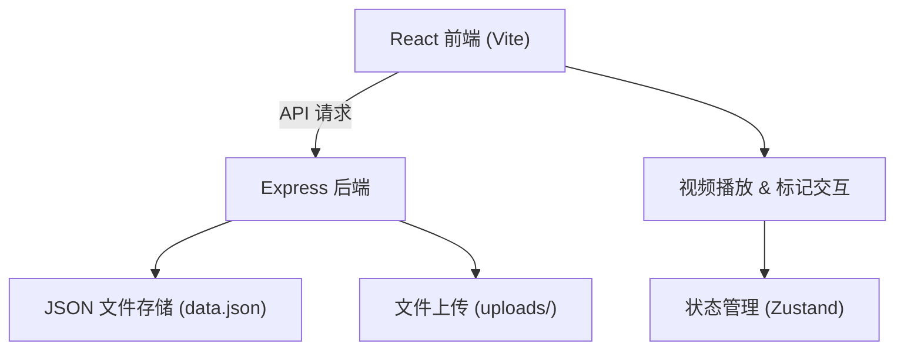
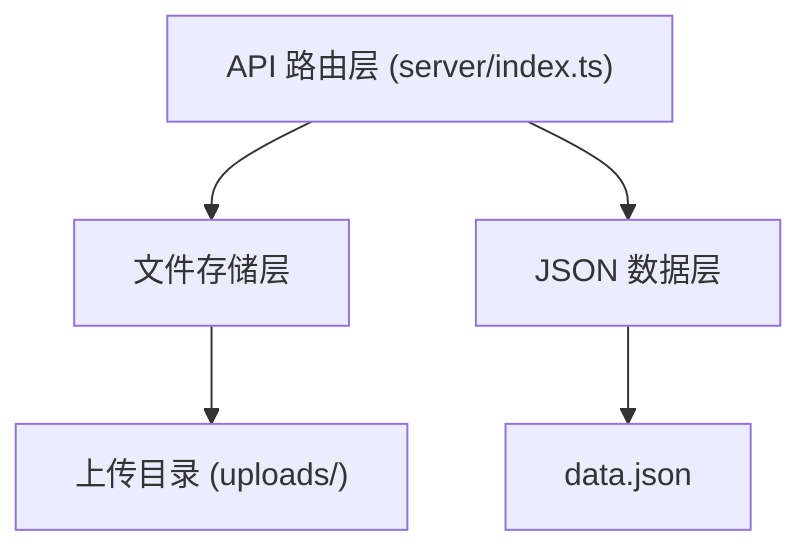
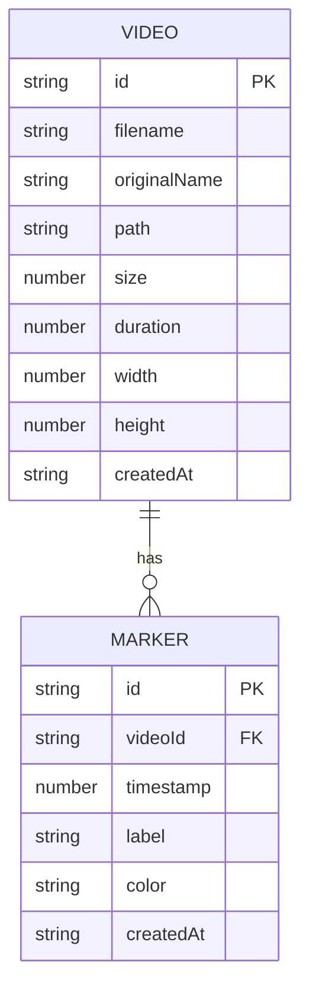

## 1. 架构设计



## 2. 技术描述
- **前端**：React@18 + TypeScript + Vite + Zustand
- **初始化工具**：vite-init
- **后端**：Express@4 + TypeScript
- **存储**：JSON 文件存储 + 本地文件系统
- **文件上传**：Multer
- **ID生成**：uuid

## 3. 路由定义

| 路由 | 用途 |
|-------|---------|
| / | 主页面（视频上传、播放器、标记管理） |

## 4. API 定义

### 类型定义
```typescript
interface Video {
  id: string;
  filename: string;
  originalName: string;
  path: string;
  size: number;
  duration: number;
  width: number;
  height: number;
  createdAt: string;
}

interface Marker {
  id: string;
  videoId: string;
  timestamp: number;
  label: string;
  color: string;
  createdAt: string;
}

interface TimelineExport {
  version: string;
  exportedAt: string;
  clips: {
    videoId: string;
    videoPath: string;
    startFrame: number;
    endFrame: number;
    startTime: number;
    endTime: number;
    label: string;
    color: string;
    order: number;
  }[];
}
```

### API 端点
| 方法 | 路径 | 描述 | 请求/响应 |
|------|------|------|----------|
| GET | /api/videos | 获取所有视频列表 | Response: Video[] |
| POST | /api/videos | 上传视频文件 (multipart/form-data, 字段名: video) | Response: Video |
| DELETE | /api/videos/:id | 删除视频 | Response: { success: boolean } |
| GET | /api/videos/:id/markers | 获取视频的所有标记 | Response: Marker[] |
| POST | /api/markers | 创建标记 | Request: { videoId, timestamp, label, color } Response: Marker |
| PUT | /api/markers/:id | 更新标记 | Request: { timestamp?, label?, color? } Response: Marker |
| DELETE | /api/markers/:id | 删除标记 | Response: { success: boolean } |
| POST | /api/markers/reorder | 批量更新标记顺序 | Request: { ids: string[] } Response: { success: boolean } |

## 5. 服务器架构图



## 6. 数据模型

### 6.1 数据模型定义



### 6.2 初始数据

```json
{
  "videos": [],
  "markers": []
}
```

## 7. 项目文件结构

```
├── package.json
├── vite.config.js
├── tsconfig.json
├── index.html
├── src/
│   ├── App.tsx
│   ├── VideoUploader.tsx
│   ├── VideoPlayer.tsx
│   ├── MarkerPanel.tsx
│   ├── TimelineExporter.tsx
│   ├── store.ts
│   ├── types.ts
│   └── api.ts
├── server/
│   ├── index.ts
│   └── data.json
└── uploads/
```

## 8. 预设标签颜色

| 标签名 | 颜色 |
|--------|------|
| A-Roll | #e53935 |
| B-Roll | #fb8c00 |
| 采访 | #fdd835 |
| 空镜 | #43a047 |
| 特效 | #00897b |
| 转场 | #1e88e5 |
| 字幕 | #8e24aa |
| 音乐 | #d81b60 |
| 旁白 | #546e7a |
| 素材 | #3949ab |
