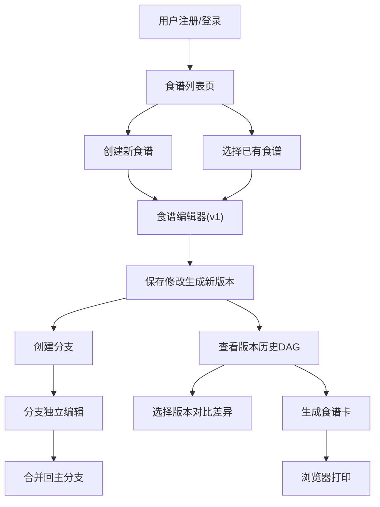

## 1. 产品概述
RecipeGit - 一款面向家庭厨师的在线协作食谱编辑与版本管理应用，让用户可以像程序员管理代码一样对食谱进行创建、分支、合并和回滚操作，最终生成精美的可打印食谱卡。
- 核心价值：将Git式的版本控制理念引入食谱管理，解决家庭食谱修改历史混乱、多人协作困难的痛点
- 目标用户：家庭厨师、烹饪爱好者、需要共享和迭代食谱的家庭或小团队

## 2. 核心功能

### 2.1 用户角色
| 角色 | 注册方式 | 核心权限 |
|------|----------|----------|
| 普通用户 | 用户名+密码注册登录 | 创建、编辑、分支、合并、回滚食谱，查看版本历史，生成打印食谱卡 |

### 2.2 功能模块
1. **认证模块**：用户注册、登录、登出
2. **食谱管理**：食谱列表展示、创建新食谱、删除食谱
3. **食谱编辑器**：双栏布局编辑食材和步骤，实时保存生成新版本
4. **版本控制系统**：版本递增、分支创建、分支合并、版本回滚
5. **版本历史图**：DAG有向无环图展示版本分支与合并关系
6. **版本差异对比**：并排diff展示食材和步骤的增删改变化
7. **食谱卡生成**：信用卡大小格式，支持浏览器打印

### 2.3 页面详情
| 页面名称 | 模块名称 | 功能描述 |
|----------|----------|----------|
| 登录/注册页 | 认证表单 | 用户输入用户名密码进行注册或登录 |
| 主应用页 | 顶部导航栏 | 显示用户信息、登出按钮、应用标题 |
| 主应用页 | 左侧食谱列表 | 展示用户所有食谱卡片，悬停高亮，点击选中编辑 |
| 主应用页 | 食谱编辑器 | 双栏布局：左栏食材列表，右栏步骤编辑，支持新增/删除/修改 |
| 主应用页 | 版本历史图 | 力导向DAG图，节点显示版本信息，连线显示分支合并关系 |
| 主应用页 | 版本差异对比 | 并排展示两个版本的食材和步骤差异，绿色高亮新增，红色高亮删除 |
| 食谱卡预览 | 可打印卡片 | 信用卡大小格式，暖白背景，含名称、食材表格、步骤、作者信息 |

## 3. 核心流程
用户注册登录 → 查看/创建食谱 → 编辑食材和步骤 → 保存自动生成新版本 → 从任意版本创建分支 → 分支独立编辑 → 合并分支回主分支 → 查看DAG版本历史 → 对比版本差异 → 选择版本生成可打印食谱卡

## 4. 用户界面设计
### 4.1 设计风格
- **主色调**：#f5deb3（小麦色）
- **辅助色**：#8b4513（棕色）
- **背景色**：#fdf5e6（浅米色）
- **节点颜色**：主分支#4caf50，分支#ff9800，合并节点#9c27b0
- **按钮风格**：圆角8px，悬停放大1.05倍+加深阴影，点击缩回，动画0.15s
- **字体**：使用温暖优雅的衬线字体展示食谱名称，无衬线字体用于正文
- **布局风格**：顶部固定导航栏 + 左侧粘性食谱列表 + 右侧主编辑区
- **图标风格**：使用lucide-react图标库，线条风格统一

### 4.2 页面设计概述
| 页面名称 | 模块名称 | UI元素 |
|----------|----------|--------|
| 主应用页 | 顶部导航栏 | 高度60px，白色背景，阴影0 2px 4px rgba(0,0,0,0.1)，左侧应用标题，右侧用户信息 |
| 主应用页 | 食谱列表 | 宽280px，圆角8px，粘性定位，卡片悬停背景#fff3e0，过渡0.2s |
| 主应用页 | 食谱编辑器 | 双栏布局，输入框聚焦边框#ffb74d，阴影淡出0.3s |
| 主应用页 | 版本历史图 | d3-force力导向图，圆形节点直径24px，灰色折线连线+SVG箭头，弹簧动画平滑 |
| 食谱卡 | 打印卡片 | 宽85mm高55mm，暖白#fff8e7背景，圆角4px，左侧竖排名称，中间食材表格，右侧编号步骤 |

### 4.3 响应式适配
- Desktop-first设计
- 屏幕宽度<768px时：左侧食谱列表变为可折叠抽屉（左侧滑入，0.3s缓动动画），编辑区域自动占满全宽
- 触摸优化：按钮和可点击元素确保足够的触摸面积（最小44x44px）

### 4.4 性能要求
- 版本图超过50个节点时，DAG布局计算在100ms内完成
- 动画帧率保持在50FPS以上
