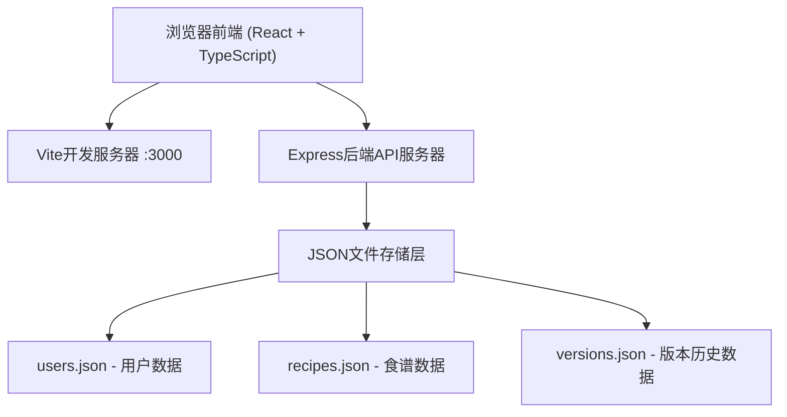
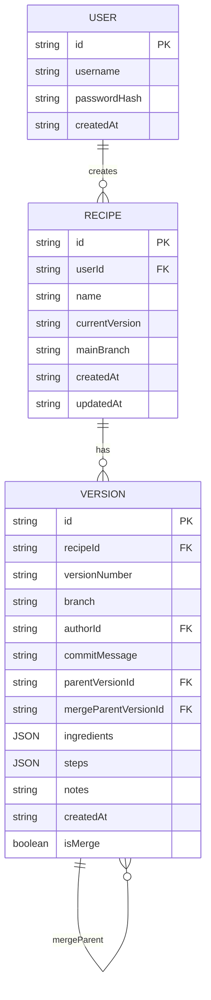

## 1. 架构设计



## 2. 技术描述
- **前端**: React 18 + TypeScript + Vite
- **状态管理**: React useState/useReducer + 自定义hooks
- **路由**: React Router DOM v6
- **后端**: Express.js
- **数据存储**: 本地JSON文件（users.json, recipes.json, versions.json）
- **UI库**: 自定义CSS（无UI框架，遵循设计规范）
- **图标**: lucide-react
- **日期处理**: dayjs
- **差异对比**: diff库
- **力导向图**: d3-force
- **HTTP客户端**: fetch API（自定义useApi hook封装）
- **构建工具**: Vite（开发端口3000）

## 3. 目录结构
```
project-root/
├── package.json
├── vite.config.js
├── tsconfig.json
├── index.html
├── server/
│   └── index.js          # Express后端服务
├── data/                 # JSON数据存储目录
│   ├── users.json
│   ├── recipes.json
│   └── versions.json
└── src/
    ├── types.ts          # TypeScript类型定义
    ├── App.tsx           # 主应用组件和路由
    ├── main.tsx          # 应用入口
    ├── index.css         # 全局样式
    ├── components/
    │   ├── RecipeEditor.tsx    # 食谱编辑器
    │   ├── VersionGraph.tsx    # 版本历史DAG图
    │   ├── RecipeCard.tsx      # 可打印食谱卡
    │   ├── RecipeList.tsx      # 食谱列表
    │   ├── DiffViewer.tsx      # 版本差异对比
    │   ├── AuthForm.tsx        # 登录注册表单
    │   └── Navbar.tsx          # 顶部导航栏
    └── hooks/
        └── useApi.ts           # API交互封装hook
```

## 4. 路由定义
| 路由 | 用途 |
|------|------|
| /login | 登录页面 |
| /register | 注册页面 |
| / | 主应用页（食谱列表+编辑器+版本图） |
| /recipe/:id | 指定食谱的编辑和版本历史页面 |
| /recipe/:id/card/:versionId | 指定版本的食谱卡打印预览 |

## 5. API定义

### 5.1 用户认证API
| 方法 | 路径 | 请求体 | 响应 | 用途 |
|------|------|--------|------|------|
| POST | /api/auth/register | { username, password } | { id, username, token } | 用户注册 |
| POST | /api/auth/login | { username, password } | { id, username, token } | 用户登录 |

### 5.2 食谱API
| 方法 | 路径 | 请求体 | 响应 | 用途 |
|------|------|--------|------|------|
| GET | /api/recipes | - | Recipe[] | 获取用户所有食谱 |
| GET | /api/recipes/:id | - | Recipe | 获取单个食谱详情 |
| POST | /api/recipes | { name, ingredients, steps, notes } | Recipe | 创建新食谱（自动生成v1） |
| PUT | /api/recipes/:id | { name, ingredients, steps, notes, commitMessage } | Version | 保存修改（生成新版本） |
| DELETE | /api/recipes/:id | - | { success: true } | 删除食谱 |

### 5.3 版本API
| 方法 | 路径 | 请求体 | 响应 | 用途 |
|------|------|--------|------|------|
| GET | /api/recipes/:id/versions | - | Version[] | 获取食谱所有版本历史 |
| GET | /api/recipes/:id/versions/:versionId | - | Version | 获取单个版本详情 |
| GET | /api/recipes/:id/diff?from=v1&to=v2 | - | { ingredientsDiff, stepsDiff } | 比较两个版本差异 |
| POST | /api/recipes/:id/versions/:versionId/branch | { branchName } | Version | 从指定版本创建分支 |
| POST | /api/recipes/:id/merge | { sourceBranch, targetBranch, commitMessage } | Version | 合并分支（简单覆盖策略） |
| POST | /api/recipes/:id/rollback/:versionId | - | Version | 回滚到指定版本 |

## 6. 数据模型

### 6.1 ER图


### 6.2 TypeScript类型定义
```typescript
interface User {
  id: string;
  username: string;
  passwordHash?: string;
  createdAt: string;
}

interface Ingredient {
  id: string;
  name: string;
  quantity: string;
  unit: string;
}

interface Step {
  id: string;
  order: number;
  description: string;
}

interface Recipe {
  id: string;
  userId: string;
  name: string;
  currentVersion: string;
  mainBranch: string;
  createdAt: string;
  updatedAt: string;
}

interface Version {
  id: string;
  recipeId: string;
  versionNumber: string;
  branch: string;
  authorId: string;
  authorName: string;
  commitMessage: string;
  parentVersionId: string | null;
  mergeParentVersionId: string | null;
  ingredients: Ingredient[];
  steps: Step[];
  notes: string;
  createdAt: string;
  isMerge: boolean;
}

interface DiffChange {
  type: 'added' | 'removed' | 'modified';
  value: string;
  oldValue?: string;
}

interface VersionDiff {
  ingredients: DiffChange[];
  steps: DiffChange[];
  notes: DiffChange[];
}
```

### 6.3 JSON文件初始化数据结构

**users.json:**
```json
{
  "users": []
}
```

**recipes.json:**
```json
{
  "recipes": []
}
```

**versions.json:**
```json
{
  "versions": []
}
```

## 7. 核心算法与业务逻辑

### 7.1 版本号生成规则
- 主分支版本：v1, v2, v3... 依次递增
- 分支版本：从v2创建分支名为feature，则为v2.1, v2.1.1...
- 合并版本：合并时在目标分支生成新版本号，如v4

### 7.2 合并策略
- 采用简单覆盖策略：后修改的内容覆盖先修改的内容
- 如果两个分支都修改了同一食材或步骤，以源分支（被合并的分支）的内容为准

### 7.3 DAG图布局算法
- 使用d3-force力导向布局
- 节点按时间顺序纵向排列
- 同一分支的节点尽量保持在同一列
- 使用弹簧模型确保节点间距均匀

### 7.4 差异对比算法
- 使用diff库进行文本级别的差异比较
- 食材按name字段匹配，识别新增、删除、修改
- 步骤按order字段匹配，识别新增、删除、修改
- 输出绿色（新增）、红色（删除）高亮显示
