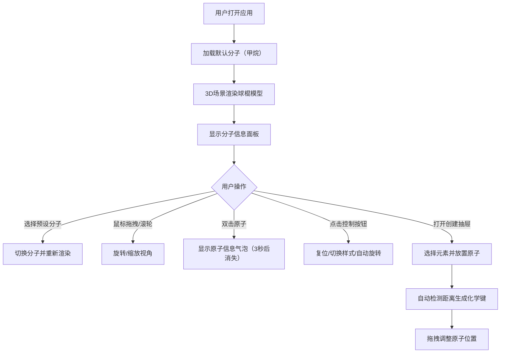

## 1. 产品概述

分子结构可视化与交互探索应用，帮助化学学习者和科研人员直观理解分子三维空间构型。通过交互式3D球棍模型，解决抽象化学概念难以具象化的问题。

- **目标用户**：化学学习者、科研人员、教育工作者
- **核心价值**：将抽象的分子三维结构转化为可交互、可旋转、可缩放的可视化模型，支持预设分子浏览和自定义分子创建

## 2. 核心功能

### 2.1 用户角色

| 角色 | 注册方式 | 核心权限 |
|------|----------|----------|
| 普通用户 | 无需注册 | 浏览预设分子库、交互式探索3D模型、自定义创建分子 |

### 2.2 功能模块

1. **主3D场景**：Three.js渲染的分子球棍模型，支持视角旋转、缩放、双击交互
2. **分子信息面板**：左上角常驻面板，显示分子名称、化学式、分子量、空间群、偶极矩、2D结构草图
3. **控制按钮组**：右下角3x2按钮网格，旋转复位、切换显示样式（球棍/空间填充/线框）、自动旋转开关
4. **自定义分子创建面板**：右侧抽屉式元素周期表，支持选择原子并在3D场景中放置，自动检测并生成化学键
5. **预设分子库**：内置甲烷、水、氨、苯、乙醇等常见分子

### 2.3 页面详情

| 页面名称 | 模块名称 | 功能描述 |
|-----------|-------------|---------------------|
| 主页面 | 3D分子场景 | Three.js渲染分子模型，支持鼠标拖拽旋转（阻尼0.1）、滚轮缩放（0.3-5倍）、双击原子显示信息气泡 |
| 主页面 | 分子信息面板 | 左上角固定，宽220px，深灰半透明背景，显示分子信息及Canvas绘制的2D结构 |
| 主页面 | 控制按钮组 | 右下角3x2网格，64x64px圆角按钮，旋转复位、样式切换、自动旋转 |
| 主页面 | 自定义创建抽屉 | 右侧滑入，宽280px，元素周期表选择，3D场景点击放置原子 |

## 3. 核心流程

## 4. 用户界面设计

### 4.1 设计风格

- **主色调**：纯黑背景 `#000000`，深灰辅助 `#1a1a1a`，按钮背景 `#2d2d2d`
- **强调色**：浅蓝 `#88ccff`，白色 `#ffffff`
- **原子颜色**：碳深灰 `#333333`、氧红 `#ff4444`、氮蓝 `#4488ff`、氢白 `#ffffff`
- **化学键颜色**：浅灰 `#aaaaaa`
- **元素分类颜色**：非金属绿 `#66bb6a`、金属蓝 `#42a5f5`、过渡金属橙 `#ffa726`
- **按钮样式**：圆角8px，背景 `#2d2d2d`，悬停变浅蓝 `#88ccff`，文字白色
- **材质**：原子球体 roughness 0.3，metalness 0.7，金属光泽反射效果

### 4.2 页面设计概述

| 页面名称 | 模块名称 | UI元素 |
|-----------|-------------|-------------|
| 主页面 | 3D场景 | 全屏Three.js渲染区，占主视口80%以上宽度，支持60fps流畅运行 |
| 主页面 | 分子信息面板 | 固定左上角，宽220px，圆角8px，深灰半透明 `#1a1a1acc`，白色文字，Canvas绘制2D结构 |
| 主页面 | 控制按钮组 | 右下角3x2网格，64x64px圆角8px按钮，悬停放大1.05倍+阴影（过渡0.2秒），带图标和文字标签 |
| 主页面 | 原子信息气泡 | 从原子位置弹出，半透明白色 `#ffffff` 背景，圆角8px，带阴影，持续3秒 |
| 主页面 | 自定义创建抽屉 | 右侧滑入（0.3秒动画），宽280px，背景 `#2d2d2d`，弹性网格布局（3-6列），原子卡片60x80px圆角6px |

### 4.3 响应式

- 桌面端优先设计，3D场景自适应窗口大小
- 信息面板固定定位，不随3D视角旋转
- 抽屉面板滑入滑出动画流畅

### 4.4 3D场景指南

- **环境光**：AmbientLight + DirectionalLight，营造金属光泽反射效果
- **相机设置**：PerspectiveCamera，初始距离适当，支持0.3-5倍缩放
- **控制器**：OrbitControls，阻尼系数0.1，平滑旋转
- **交互**：Raycaster检测鼠标与原子碰撞，双击触发信息气泡
- **动画**：requestAnimationFrame 60fps循环，放置原子脉冲动画0.2秒，复位过渡0.5秒 EaseOut，样式切换淡入淡出0.3秒，自动旋转0.002弧度/帧
