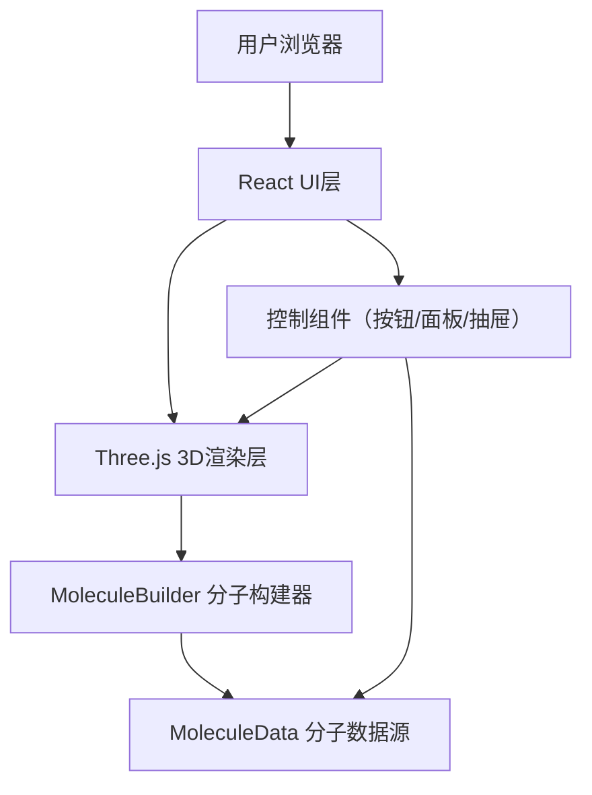

## 1. 架构设计



## 2. 技术说明

- **前端框架**：React@18 + TypeScript
- **构建工具**：Vite + @vitejs/plugin-react
- **3D渲染**：three.js + @types/three
- **状态管理**：React useState/useRef 轻量管理（应用单页，无需额外状态库）

## 3. 文件结构

```
src/
├── main.ts              # Three.js场景初始化、相机、控制器、动画循环
├── MoleculeBuilder.ts   # 原子球体、化学键圆柱体创建，显示样式切换
├── MoleculeData.ts      # 预设分子库数据、原子键信息、自定义分子操作
├── App.tsx              # React主组件，UI布局和交互逻辑
├── components/
│   ├── MoleculeInfoPanel.tsx    # 分子信息面板
│   ├── ControlButtons.tsx       # 控制按钮组
│   ├── AtomInfoBubble.tsx       # 原子信息气泡
│   ├── CustomMoleculeDrawer.tsx # 自定义分子创建抽屉
│   └── MoleculeSelector.tsx     # 预设分子选择器
└── index.css            # 全局样式
```

## 4. 数据模型

### 4.1 原子数据结构

```typescript
interface Atom {
  id: string;
  symbol: string;
  element: string;
  color: string;
  vanDerWaalsRadius: number; // 范德华半径（埃）
  hybridization: string;     // 杂化轨道类型
  category: 'nonmetal' | 'metal' | 'transition'; // 元素分类
  position: { x: number; y: number; z: number };
}
```

### 4.2 化学键数据结构

```typescript
interface Bond {
  id: string;
  atom1Id: string;
  atom2Id: string;
  type: 'single' | 'double' | 'triple';
  length: number; // 键长（埃）
}
```

### 4.3 分子数据结构

```typescript
interface Molecule {
  id: string;
  name: string;
  formula: string;
  molecularWeight: number;
  spaceGroup: string;
  dipoleMoment: number; // 偶极矩（德拜）
  atoms: Atom[];
  bonds: Bond[];
  bondAngles: { atom1: string; atom2: string; atom3: string; angle: number }[];
}
```

### 4.4 显示模式

```typescript
type DisplayMode = 'ball-and-stick' | 'space-filling' | 'wireframe';
```

## 5. 核心类与方法

### 5.1 MoleculeData

- `getPresetMolecules(): Molecule[]` - 获取所有预设分子
- `getMoleculeById(id: string): Molecule | undefined` - 根据ID获取分子
- `createCustomMolecule(): Molecule` - 创建空的自定义分子
- `addAtom(molecule: Molecule, atom: Atom): void` - 添加原子
- `removeAtom(molecule: Molecule, atomId: string): void` - 删除原子
- `updateAtomPosition(molecule: Molecule, atomId: string, pos: {x:number;y:number;z:number}): void` - 更新原子位置
- `autoDetectBonds(molecule: Molecule): Bond[]` - 自动检测并生成化学键

### 5.2 MoleculeBuilder

- `buildMolecule(molecule: Molecule, mode: DisplayMode): THREE.Group` - 构建分子3D对象
- `setDisplayMode(group: THREE.Group, mode: DisplayMode): void` - 切换显示模式
- `createAtomMesh(atom: Atom, mode: DisplayMode): THREE.Mesh` - 创建原子网格
- `createBondMesh(bond: Bond, atom1: Atom, atom2: Atom, mode: DisplayMode): THREE.Mesh` - 创建化学键网格
- `pulseAnimation(mesh: THREE.Mesh): void` - 原子放置脉冲动画
- `resetCamera(camera: THREE.PerspectiveCamera, controls: OrbitControls, duration: number): void` - 相机复位动画

## 6. 性能优化

- 使用 `requestAnimationFrame` 驱动60fps渲染循环
- 原子和键使用 `THREE.InstancedMesh` 优化大量对象渲染
- 材质复用，避免重复创建相同的 `MeshStandardMaterial`
- Raycaster 检测仅在必要时触发（鼠标点击/双击）
- 自动旋转和缓动动画使用增量时间计算，确保帧率独立
