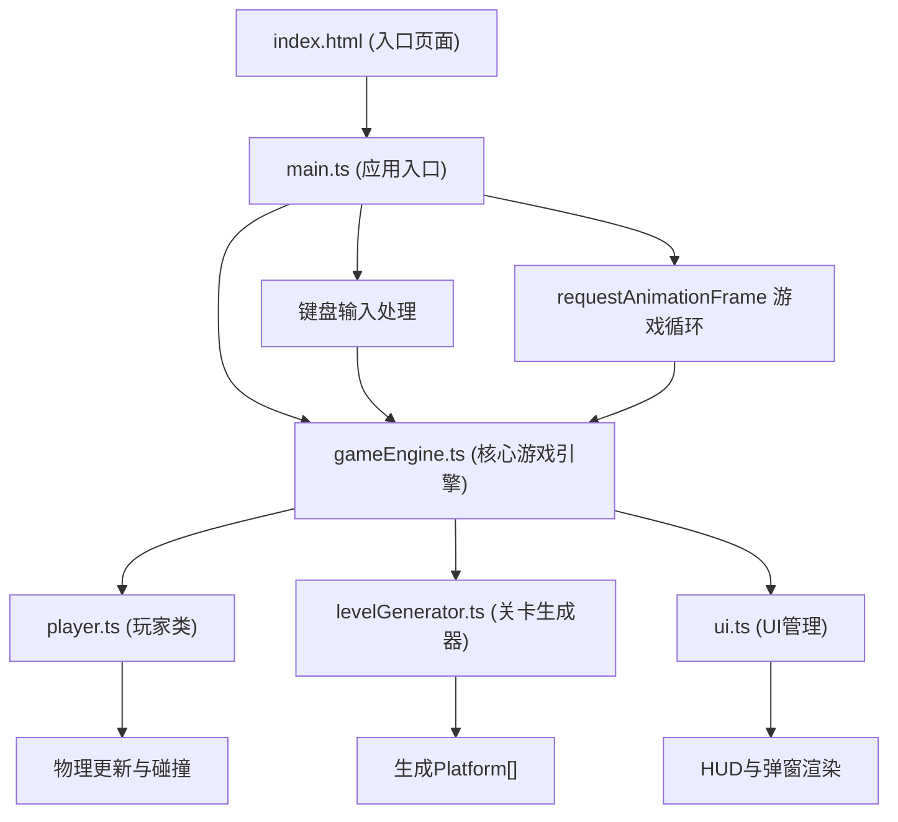

## 1. 架构设计



数据流向：
1. `index.html` 加载后执行 `main.ts`
2. `main.ts` 初始化 `GameEngine` 实例并启动游戏循环
3. 每帧 `main.ts` 调用 `engine.update(deltaTime)` 和 `engine.render(ctx)`
4. `gameEngine.ts` 调用 `player.update(input)` 处理玩家物理和碰撞
5. `gameEngine.ts` 调用 `levelGenerator.generateLevel()` 生成关卡
6. `gameEngine.ts` 调用 `ui.render(ctx, state)` 绘制界面

## 2. 技术描述
- 前端技术栈：TypeScript + HTML5 Canvas + Vite
- 构建工具：Vite 5.x
- 依赖：typescript, vite, @vitejs/plugin-basic-ssl, uuid
- 数据存储：localStorage（历史最佳时间记录）
- 无后端服务，纯前端运行

## 3. 项目文件结构与职责

```
auto16/
├── package.json              # 项目依赖与启动脚本
├── vite.config.js            # Vite构建配置
├── tsconfig.json             # TypeScript严格模式配置
├── index.html                # 入口页面，Canvas与UI容器
└── src/
    ├── main.ts               # 应用入口，游戏循环与键盘输入
    ├── gameEngine.ts         # 核心引擎，状态管理与调度
    ├── levelGenerator.ts     # Perlin噪声关卡生成器
    ├── player.ts             # 玩家类，物理与角色渲染
    └── ui.ts                 # UI层，HUD与通关弹窗
```

### 各文件职责与调用关系：

| 文件 | 导出/类 | 主要职责 | 被谁调用 | 调用谁 |
|------|---------|---------|---------|---------|
| `main.ts` | 无（IIFE入口） | 初始化场景、启动RAF循环、监听键盘、每帧调度update/render | index.html | GameEngine.update/render |
| `gameEngine.ts` | `GameEngine` 类 | 管理玩家、平台列表、金币、碰撞检测、游戏状态、相机跟随 | main.ts | levelGenerator.generateLevel, Player.update/render, UI.render |
| `levelGenerator.ts` | `generateLevel(w, h)` 函数 | 分层Perlin噪声生成地面和平台，保证可达性 | gameEngine.ts | 内部工具函数 |
| `player.ts` | `Player` 类 | 管理物理属性（重力/速度/跳跃）、位置、角色动画（压扁/闪烁）、碰撞反馈 | gameEngine.ts | 纯计算无外部依赖 |
| `ui.ts` | `UI` 类 | 绘制HUD（得分/时间/生命/关卡）、通关弹窗动画、心形/金币粒子 | gameEngine.ts | 纯渲染无外部依赖 |

## 4. 核心数据结构

```typescript
// 平台
interface Platform {
  x: number;
  y: number;
  width: number;
  height: number;
  color: string;
}

// 金币
interface Coin {
  x: number;
  y: number;
  collected: boolean;
  animTime: number;
}

// 粒子
interface Particle {
  x: number;
  y: number;
  vx: number;
  vy: number;
  life: number;
  maxLife: number;
  color: string;
  size: number;
}

// 玩家输入
interface InputState {
  left: boolean;
  right: boolean;
  jump: boolean;
  jumpPressed: boolean;
}

// 游戏状态
type GameState = 'ready' | 'playing' | 'won';

// 终点旗帜
interface Flag {
  x: number;
  y: number;
  animTime: number;
}
```

## 5. 物理与碰撞规则

- 重力加速度：1200 px/s²
- 玩家水平移动速度：300 px/s
- 跳跃初速度：500 px/s
- 跳跃蓄力最大：1秒（长按空格持续增加向上速度）
- 玩家尺寸：16x16 px
- 碰撞检测：AABB算法，单帧完整遍历一次所有平台
- 碰撞响应：
  - 顶部碰撞：停止下落，重置跳跃计数
  - 侧面/底部碰撞：水平弹开 + 扣减1点生命
- 生命：初始3条，耗尽可重开
