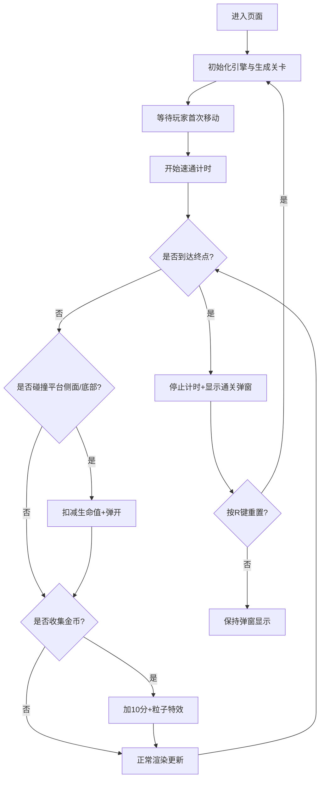

## 1. 产品概述
2D平台跳跃关卡自动生成与速通验证工具，面向独立游戏开发者，解决手动设计关卡耗时、测试效率低的痛点。产品自动生成可通关的20屏宽度关卡，支持玩家速通挑战与数据记录，提供即时视觉反馈和复古像素风格体验。

## 2. 核心功能

### 2.1 功能模块
1. **主游戏场景**：Canvas画布渲染、键盘输入处理、游戏主循环
2. **关卡生成系统**：基于分层Perlin噪声的程序化关卡生成、平台布局、可达性保证
3. **玩家控制系统**：物理引擎、跳跃蓄力、碰撞响应、角色动画
4. **收集物系统**：金币随机生成、动画效果、得分计算、粒子特效
5. **UI与计时系统**：HUD显示、速通计时、通关弹窗、历史记录存储

### 2.2 页面详情
| 页面名称 | 模块名称 | 功能描述 |
|-----------|-------------|---------------------|
| 游戏主界面 | 场景渲染 | 800x400 Canvas画布居中，深灰背景填充，渐变天空背景+视差滚动 |
| 游戏主界面 | HUD | 左上角白色16px等宽字体显示得分/时间/生命，右上角显示关卡编号 |
| 游戏主界面 | 通关弹窗 | 半透明黑色背景，白色24px文字显示当前时间与最佳记录，0.3s淡入动画 |
| 游戏主界面 | 重置控制 | 按R键重新生成关卡并重置游戏状态 |

## 3. 核心流程
玩家打开页面后自动生成第1关，使用方向键控制角色移动、空格键跳跃，收集金币增加得分。首次移动时开始计时，到达终点旗帜后停止计时并显示通关弹窗，记录历史最佳时间。按R键可随时重置关卡，重新生成新的随机关卡。

## 4. 用户界面设计

### 4.1 设计风格
- 主色调：天空渐变（浅蓝#b3e5fc → 淡紫#e1bee7），深灰#263238填充
- 平台色：棕色渐变（#8d6e63 → #a1887f）
- 玩家色：蓝色#42a5f5身体，白色#ffffff眼睛
- 金币色：金色#ffd54f带闪光粒子
- 旗帜色：绿色#4caf50终点标记
- 生命色：红色心形图标带缩放动画
- 字体：等宽像素风格字体
- 整体风格：复古像素风，即时微动画反馈

### 4.2 页面设计概述
| 页面名称 | 模块名称 | UI元素 |
|-----------|-------------|-------------|
| 游戏主界面 | Canvas区域 | 800x400画布居中，#263238外侧填充，渐变天空背景，视差云朵山丘 |
| 游戏主界面 | 玩家角色 | 16x16像素蓝白角色，跳跃时压扁80%，落地恢复，收集金币时白边闪烁 |
| 游戏主界面 | 平台元素 | 宽度30-120px，高度20px棕色渐变平台，最大高度差150px |
| 游戏主界面 | 金币元素 | 半径8px金色圆形，0.5s旋转缩放循环，收集时闪光粒子 |
| 游戏主界面 | 终点旗帜 | 20x60px绿色，带飘动动画 |
| 游戏主界面 | HUD层 | 左上角得分/时间/生命心形，右上角关卡编号 |
| 游戏主界面 | 通关弹窗 | 半透明黑色背景淡入缩放，白色24px显示当前/最佳时间 |

### 4.3 响应式
- 桌面优先设计，画布固定800x400居中显示
- 浏览器宽度变化时，外侧自动填充#263238深色背景
- 不支持移动端触屏操作，纯键盘交互

## 5. 性能约束
- 稳定60FPS，每帧渲染≤16ms
- 粒子效果上限50个
- 碰撞检测每帧单次完整遍历
